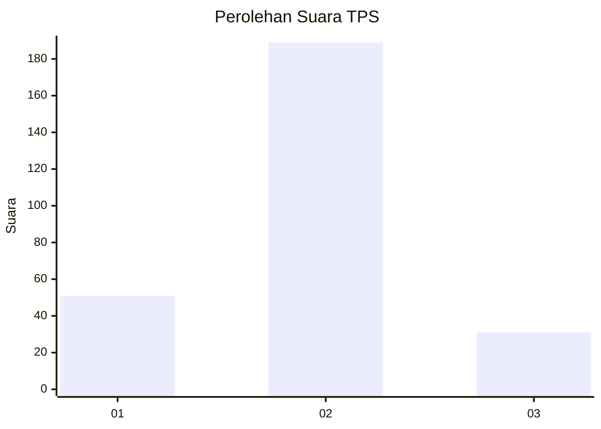
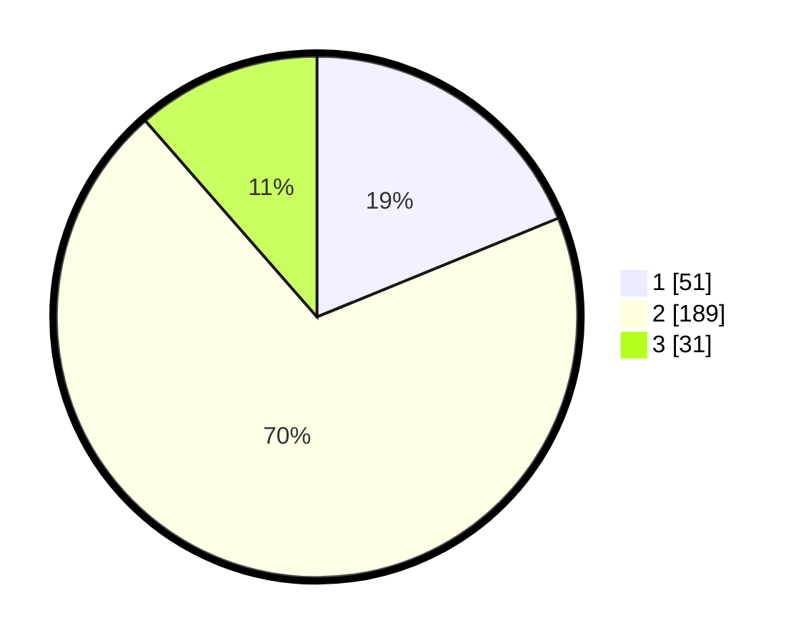

# Hasil

## Grafik

## Tabel

| No. | Nama Paslon    | Suara | Suara (raw) | Persentase |
|:--- |:-------------- | -----:| -----------:| ----------:|
| 1   | ANIES MUHAIMIN | 51    | [51][p-1]   | 18,82      |
| 2   | PRABOWO GIBRAN | 189   | [189][p-2]  | 69,74      |
| 3   | GANJAR MAHFUD  | 31    | [31][p-3]   | 11,44      |

[p-1]: https://github.com/gigit-pemilu/pemilu-2024/blob/main/pilpres/hitung-suara/sub/35-jawa-timur/sub/26-bangkalan/sub/04-kamal/sub/2007-pendabah/sub/009-tps/sub/paslon-1.txt
[p-2]: https://github.com/gigit-pemilu/pemilu-2024/blob/main/pilpres/hitung-suara/sub/35-jawa-timur/sub/26-bangkalan/sub/04-kamal/sub/2007-pendabah/sub/009-tps/sub/paslon-2.txt
[p-3]: https://github.com/gigit-pemilu/pemilu-2024/blob/main/pilpres/hitung-suara/sub/35-jawa-timur/sub/26-bangkalan/sub/04-kamal/sub/2007-pendabah/sub/009-tps/sub/paslon-3.txt

## Foto C Plano

https://sirekap-obj-formc.kpu.go.id/6ce3/pemilu/ppwp/35/26/04/20/07/3526042007009-20240215-031533--cb932b29-7cac-4d69-baad-d6853ef4f46a.jpg

https://sirekap-obj-formc.kpu.go.id/6ce3/pemilu/ppwp/35/26/04/20/07/3526042007009-20240215-031730--1859eb70-3066-4f90-9bd8-4f6aad1681e6.jpg

https://sirekap-obj-formc.kpu.go.id/6ce3/pemilu/ppwp/35/26/04/20/07/3526042007009-20240215-031842--c3fc6c15-29c1-4939-aceb-de482711a664.jpg

## Metadata

| Key        | Value               |
| ---------- | ------------------- |
| Time Stamp | 2024-02-19 06:16:00 |

