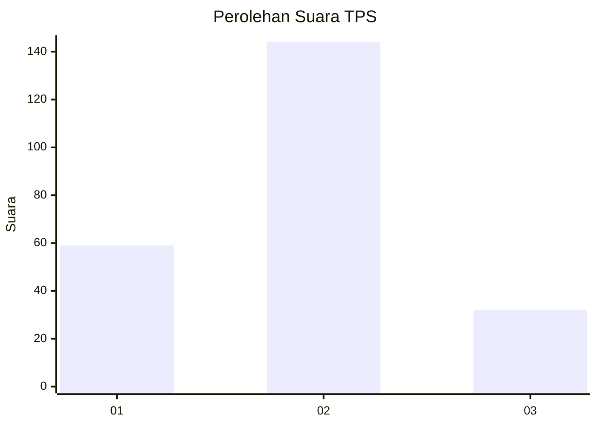
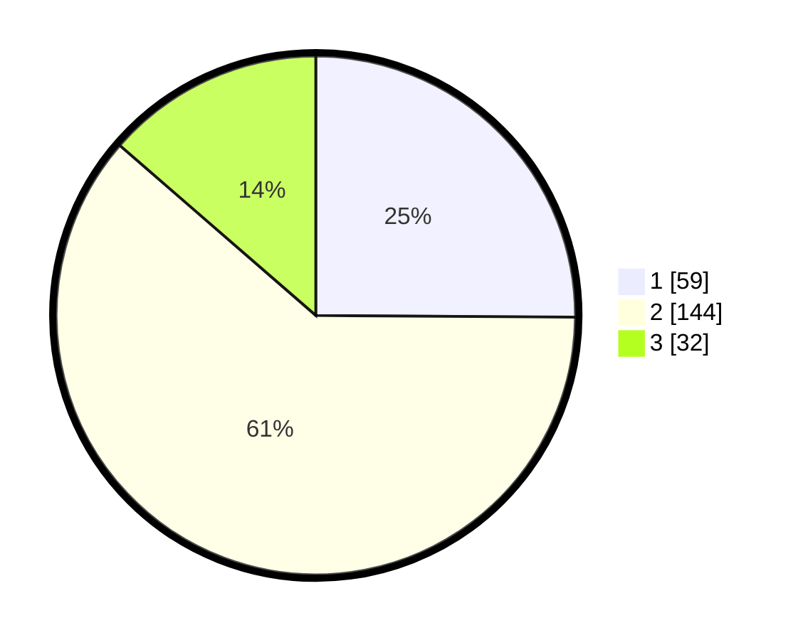

# Hasil

## Grafik

## Tabel

| No. | Nama Paslon    | Suara | Suara (raw) | Persentase |
|:--- |:-------------- | -----:| -----------:| ----------:|
| 1   | ANIES MUHAIMIN | 59    | [59][p-1]   | 25,11      |
| 2   | PRABOWO GIBRAN | 144   | [144][p-2]  | 61,28      |
| 3   | GANJAR MAHFUD  | 32    | [32][p-3]   | 13,62      |

[p-1]: https://github.com/gigit-pemilu/pemilu-2024-35-jawa-timur/blob/main/pilpres/hitung-suara/sub/35-jawa-timur/sub/26-bangkalan/sub/05-arosbaya/sub/2001-arosbaya/sub/001-tps/sub/paslon-1.txt
[p-2]: https://github.com/gigit-pemilu/pemilu-2024-35-jawa-timur/blob/main/pilpres/hitung-suara/sub/35-jawa-timur/sub/26-bangkalan/sub/05-arosbaya/sub/2001-arosbaya/sub/001-tps/sub/paslon-2.txt
[p-3]: https://github.com/gigit-pemilu/pemilu-2024-35-jawa-timur/blob/main/pilpres/hitung-suara/sub/35-jawa-timur/sub/26-bangkalan/sub/05-arosbaya/sub/2001-arosbaya/sub/001-tps/sub/paslon-3.txt

## Foto C Plano

https://sirekap-obj-formc.kpu.go.id/9152/pemilu/ppwp/35/26/05/20/01/3526052001001-20240215-045713--46ab27d5-fa33-4477-ba88-7583577f4f3b.jpg

https://sirekap-obj-formc.kpu.go.id/9152/pemilu/ppwp/35/26/05/20/01/3526052001001-20240215-010606--225bdb0c-a471-4385-845b-b451103cc23e.jpg

https://sirekap-obj-formc.kpu.go.id/9152/pemilu/ppwp/35/26/05/20/01/3526052001001-20240215-010809--415f822a-b8cb-4b19-8154-16f68f0bcdae.jpg

## Metadata

| Key        | Value               |
| ---------- | ------------------- |
| Time Stamp | 2024-02-21 16:00:00 |

