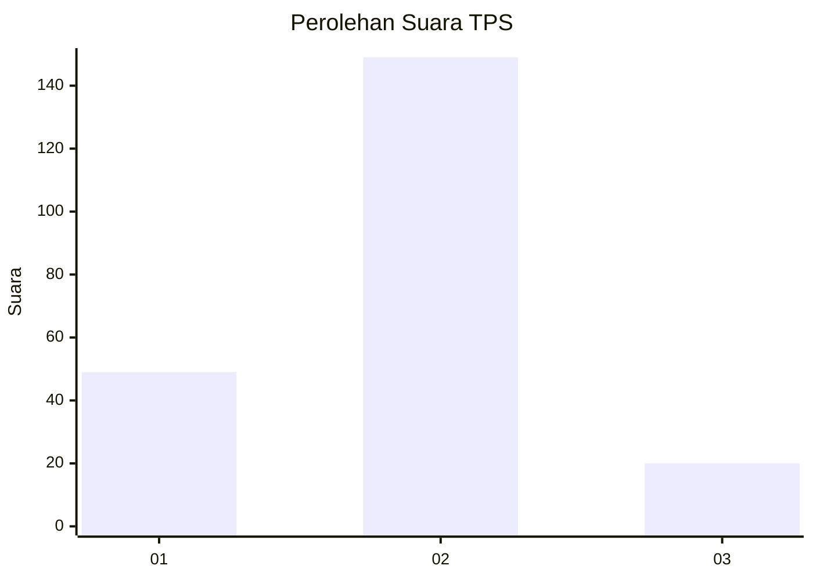

# Hasil

## Grafik

## Tabel

| No. | Nama Paslon    | Suara | Suara (raw) | Persentase |
|:--- |:-------------- | -----:| -----------:| ----------:|
| 1   | ANIES MUHAIMIN | 49    | [49][p-1]   | 22,48      |
| 2   | PRABOWO GIBRAN | 149   | [149][p-2]  | 68,35      |
| 3   | GANJAR MAHFUD  | 20    | [20][p-3]   | 9,17       |

[p-1]: https://github.com/gigit-pemilu/pemilu-2024-35-jawa-timur/blob/main/pilpres/hitung-suara/sub/35-jawa-timur/sub/26-bangkalan/sub/05-arosbaya/sub/2001-arosbaya/sub/003-tps/sub/paslon-1.txt
[p-2]: https://github.com/gigit-pemilu/pemilu-2024-35-jawa-timur/blob/main/pilpres/hitung-suara/sub/35-jawa-timur/sub/26-bangkalan/sub/05-arosbaya/sub/2001-arosbaya/sub/003-tps/sub/paslon-2.txt
[p-3]: https://github.com/gigit-pemilu/pemilu-2024-35-jawa-timur/blob/main/pilpres/hitung-suara/sub/35-jawa-timur/sub/26-bangkalan/sub/05-arosbaya/sub/2001-arosbaya/sub/003-tps/sub/paslon-3.txt

## Foto C Plano

https://sirekap-obj-formc.kpu.go.id/ffa4/pemilu/ppwp/35/26/05/20/01/3526052001003-20240215-010839--cb2bb8c1-33af-409d-a4ad-df297d88d837.jpg

https://sirekap-obj-formc.kpu.go.id/ffa4/pemilu/ppwp/35/26/05/20/01/3526052001003-20240215-011001--6ba94cf8-c22e-45a6-b1a8-341853082519.jpg

https://sirekap-obj-formc.kpu.go.id/ffa4/pemilu/ppwp/35/26/05/20/01/3526052001003-20240215-011119--49e5368d-0159-46d5-b498-5f427dced97f.jpg

## Metadata

| Key        | Value               |
| ---------- | ------------------- |
| Time Stamp | 2024-02-21 21:00:04 |

