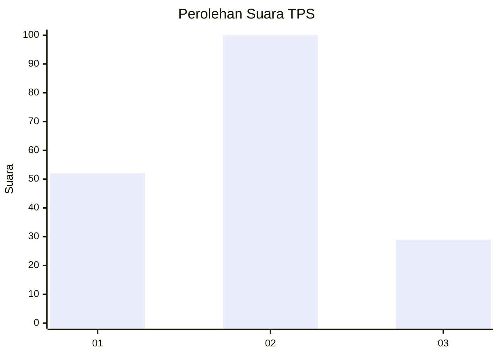
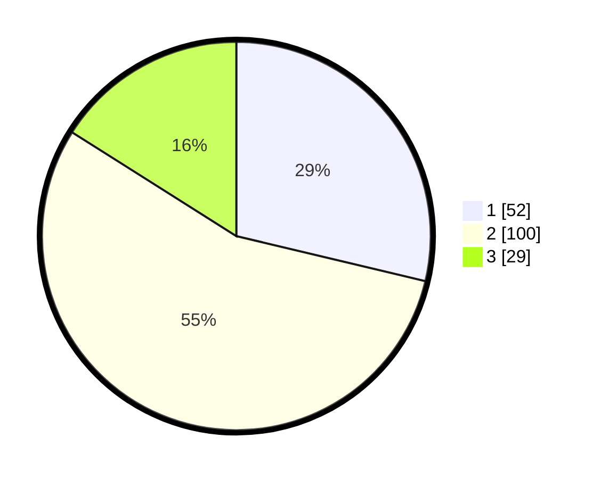

# Hasil

## Grafik

## Tabel

| No. | Nama Paslon    | Suara | Suara (raw) | Persentase |
|:--- |:-------------- | -----:| -----------:| ----------:|
| 1   | ANIES MUHAIMIN | 52    | [52][p-1]   | 28,73      |
| 2   | PRABOWO GIBRAN | 100   | [100][p-2]  | 55,25      |
| 3   | GANJAR MAHFUD  | 29    | [29][p-3]   | 16,02      |

[p-1]: https://github.com/gigit-pemilu/pemilu-2024/blob/main/pilpres/hitung-suara/sub/35-jawa-timur/sub/26-bangkalan/sub/05-arosbaya/sub/2001-arosbaya/sub/007-tps/sub/paslon-1.txt
[p-2]: https://github.com/gigit-pemilu/pemilu-2024/blob/main/pilpres/hitung-suara/sub/35-jawa-timur/sub/26-bangkalan/sub/05-arosbaya/sub/2001-arosbaya/sub/007-tps/sub/paslon-2.txt
[p-3]: https://github.com/gigit-pemilu/pemilu-2024/blob/main/pilpres/hitung-suara/sub/35-jawa-timur/sub/26-bangkalan/sub/05-arosbaya/sub/2001-arosbaya/sub/007-tps/sub/paslon-3.txt

## Foto C Plano

https://sirekap-obj-formc.kpu.go.id/224b/pemilu/ppwp/35/26/05/20/01/3526052001007-20240215-043538--9ed4f47f-b6a8-4e3b-8286-bb17533af178.jpg

https://sirekap-obj-formc.kpu.go.id/224b/pemilu/ppwp/35/26/05/20/01/3526052001007-20240215-043656--2e04e101-34af-404a-b954-1bb9ab548331.jpg

https://sirekap-obj-formc.kpu.go.id/224b/pemilu/ppwp/35/26/05/20/01/3526052001007-20240215-043810--2d6d8e3a-cdc1-448c-b842-ab288d62b389.jpg

## Metadata

| Key        | Value               |
| ---------- | ------------------- |
| Time Stamp | 2024-02-21 21:00:04 |

