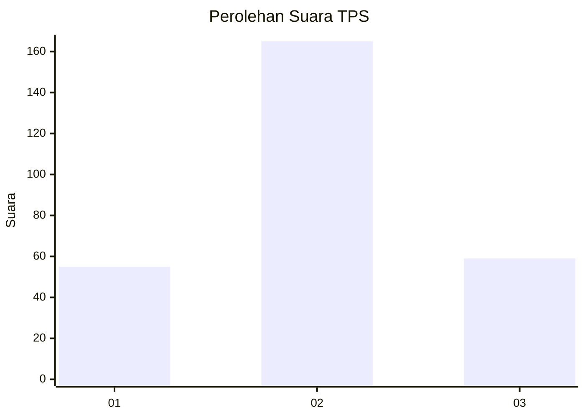
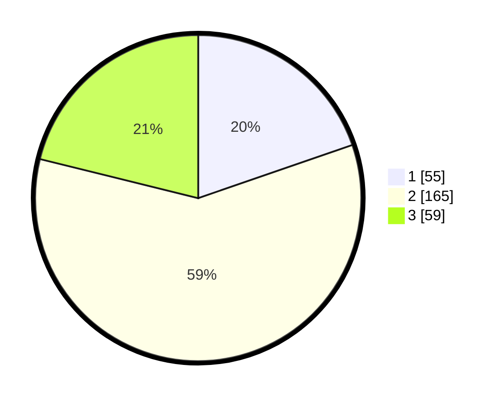

# Hasil

## Grafik

## Tabel

| No. | Nama Paslon    | Suara | Suara (raw) | Persentase |
|:--- |:-------------- | -----:| -----------:| ----------:|
| 1   | ANIES MUHAIMIN | 55    | [55][p-1]   | 19,71      |
| 2   | PRABOWO GIBRAN | 165   | [165][p-2]  | 59,14      |
| 3   | GANJAR MAHFUD  | 59    | [59][p-3]   | 21,15      |

[p-1]: https://github.com/gigit-pemilu/pemilu-2024/blob/main/pilpres/hitung-suara/sub/35-jawa-timur/sub/26-bangkalan/sub/05-arosbaya/sub/2001-arosbaya/sub/009-tps/sub/paslon-1.txt
[p-2]: https://github.com/gigit-pemilu/pemilu-2024/blob/main/pilpres/hitung-suara/sub/35-jawa-timur/sub/26-bangkalan/sub/05-arosbaya/sub/2001-arosbaya/sub/009-tps/sub/paslon-2.txt
[p-3]: https://github.com/gigit-pemilu/pemilu-2024/blob/main/pilpres/hitung-suara/sub/35-jawa-timur/sub/26-bangkalan/sub/05-arosbaya/sub/2001-arosbaya/sub/009-tps/sub/paslon-3.txt

## Foto C Plano

https://sirekap-obj-formc.kpu.go.id/adc6/pemilu/ppwp/35/26/05/20/01/3526052001009-20240215-002848--cc65b189-7ec3-444b-bb41-1259b1db384b.jpg

https://sirekap-obj-formc.kpu.go.id/adc6/pemilu/ppwp/35/26/05/20/01/3526052001009-20240215-002957--d1715fa6-2efb-4783-9ff1-85c1339a160a.jpg

https://sirekap-obj-formc.kpu.go.id/adc6/pemilu/ppwp/35/26/05/20/01/3526052001009-20240215-003115--8f9dd4a6-b307-4985-93b6-884911d669b8.jpg

## Metadata

| Key        | Value               |
| ---------- | ------------------- |
| Time Stamp | 2024-02-19 06:16:00 |

