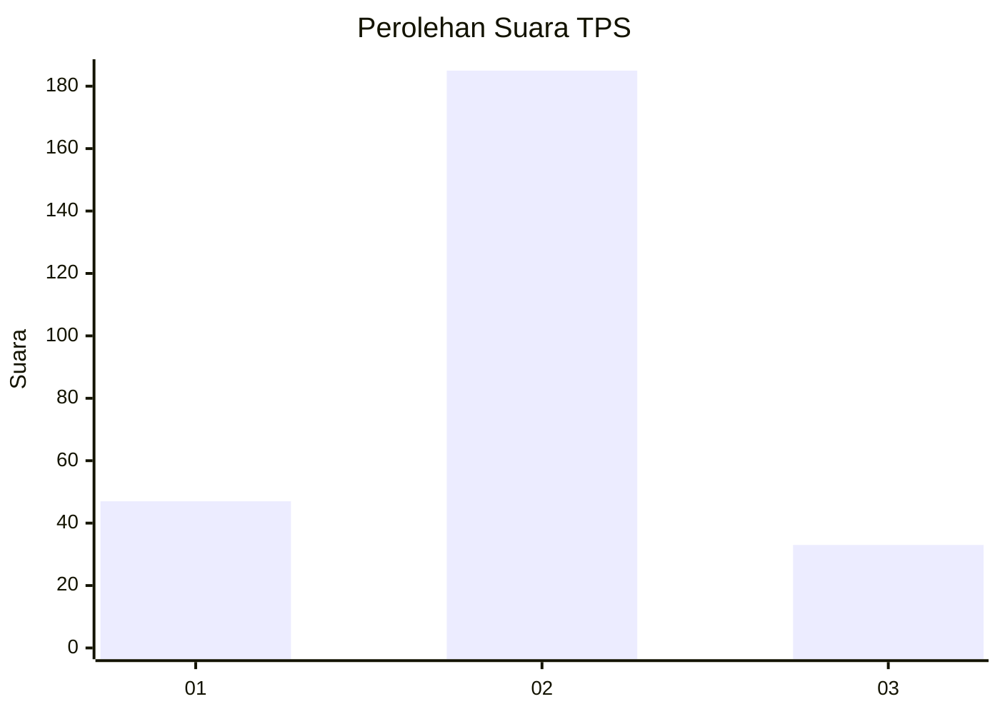
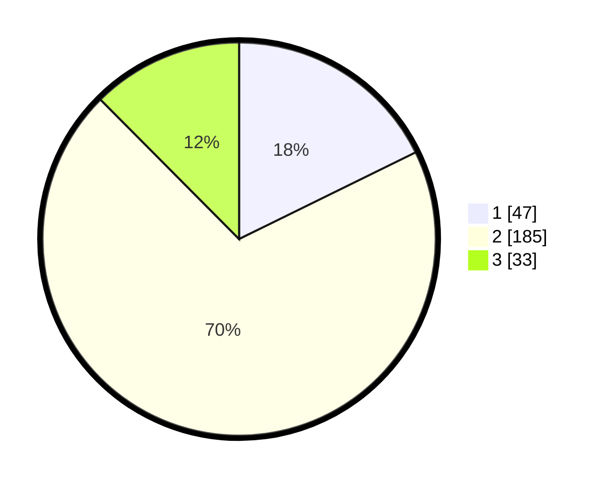

# Hasil

## Grafik

## Tabel

| No. | Nama Paslon    | Suara | Suara (raw) | Persentase |
|:--- |:-------------- | -----:| -----------:| ----------:|
| 1   | ANIES MUHAIMIN | 47    | [47][p-1]   | 17,74      |
| 2   | PRABOWO GIBRAN | 185   | [185][p-2]  | 69,81      |
| 3   | GANJAR MAHFUD  | 33    | [33][p-3]   | 12,45      |

[p-1]: https://github.com/gigit-pemilu/pemilu-2024-35-jawa-timur/blob/main/pilpres/hitung-suara/sub/35-jawa-timur/sub/26-bangkalan/sub/05-arosbaya/sub/2001-arosbaya/sub/012-tps/sub/paslon-1.txt
[p-2]: https://github.com/gigit-pemilu/pemilu-2024-35-jawa-timur/blob/main/pilpres/hitung-suara/sub/35-jawa-timur/sub/26-bangkalan/sub/05-arosbaya/sub/2001-arosbaya/sub/012-tps/sub/paslon-2.txt
[p-3]: https://github.com/gigit-pemilu/pemilu-2024-35-jawa-timur/blob/main/pilpres/hitung-suara/sub/35-jawa-timur/sub/26-bangkalan/sub/05-arosbaya/sub/2001-arosbaya/sub/012-tps/sub/paslon-3.txt

## Foto C Plano

https://sirekap-obj-formc.kpu.go.id/2d4d/pemilu/ppwp/35/26/05/20/01/3526052001012-20240214-215329--6e2cbe8f-36a8-42cf-afa6-172cbf20fad0.jpg

https://sirekap-obj-formc.kpu.go.id/2d4d/pemilu/ppwp/35/26/05/20/01/3526052001012-20240214-213442--f0e72c5a-c9d0-4201-9cf2-23d7af2fda62.jpg

https://sirekap-obj-formc.kpu.go.id/2d4d/pemilu/ppwp/35/26/05/20/01/3526052001012-20240214-215454--b897a044-6f60-4729-bd47-1c63bfbe16a7.jpg

## Metadata

| Key        | Value               |
| ---------- | ------------------- |
| Time Stamp | 2024-02-19 06:16:00 |

