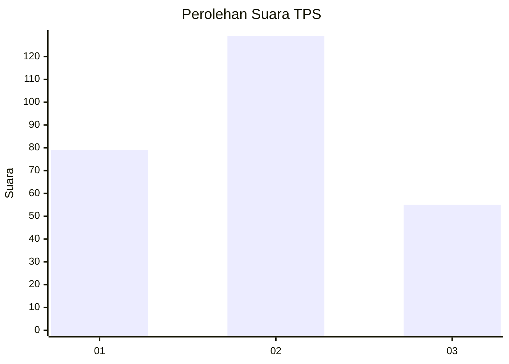
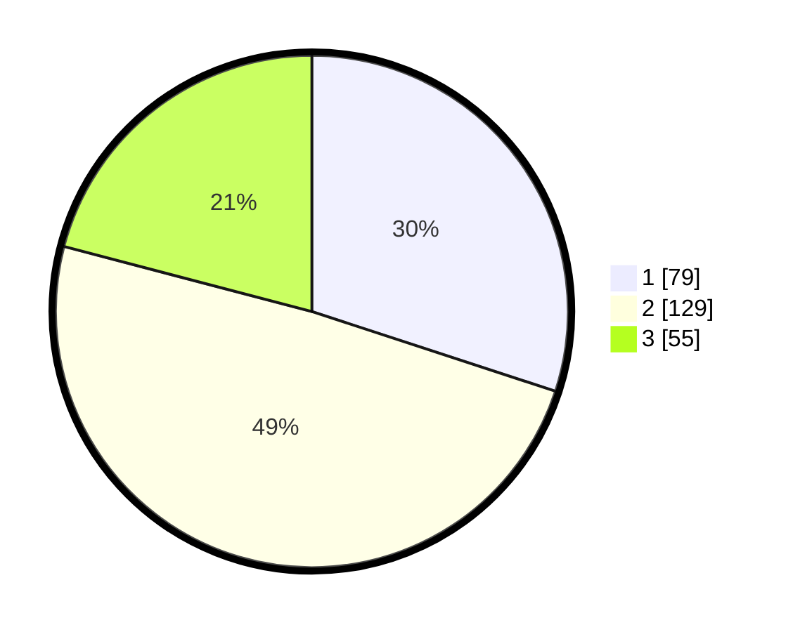

# Hasil

## Grafik

## Tabel

| No. | Nama Paslon    | Suara | Suara (raw) | Persentase |
|:--- |:-------------- | -----:| -----------:| ----------:|
| 1   | ANIES MUHAIMIN | 79    | [79][p-1]   | 30,04      |
| 2   | PRABOWO GIBRAN | 129   | [129][p-2]  | 49,05      |
| 3   | GANJAR MAHFUD  | 55    | [55][p-3]   | 20,91      |

[p-1]: https://github.com/gigit-pemilu/pemilu-2024-35-jawa-timur/blob/main/pilpres/hitung-suara/sub/35-jawa-timur/sub/26-bangkalan/sub/05-arosbaya/sub/2001-arosbaya/sub/014-tps/sub/paslon-1.txt
[p-2]: https://github.com/gigit-pemilu/pemilu-2024-35-jawa-timur/blob/main/pilpres/hitung-suara/sub/35-jawa-timur/sub/26-bangkalan/sub/05-arosbaya/sub/2001-arosbaya/sub/014-tps/sub/paslon-2.txt
[p-3]: https://github.com/gigit-pemilu/pemilu-2024-35-jawa-timur/blob/main/pilpres/hitung-suara/sub/35-jawa-timur/sub/26-bangkalan/sub/05-arosbaya/sub/2001-arosbaya/sub/014-tps/sub/paslon-3.txt

## Foto C Plano

https://sirekap-obj-formc.kpu.go.id/b918/pemilu/ppwp/35/26/05/20/01/3526052001014-20240215-002733--8f2bf009-b026-4e68-b852-a6576b4f01cc.jpg

https://sirekap-obj-formc.kpu.go.id/b918/pemilu/ppwp/35/26/05/20/01/3526052001014-20240215-002834--bbf01a44-5c0b-4e5b-b9f5-914be366e4dd.jpg

https://sirekap-obj-formc.kpu.go.id/b918/pemilu/ppwp/35/26/05/20/01/3526052001014-20240215-002857--5955a35b-4d26-4814-a756-e26dc4a8876f.jpg

## Metadata

| Key        | Value               |
| ---------- | ------------------- |
| Time Stamp | 2024-02-21 16:00:00 |

