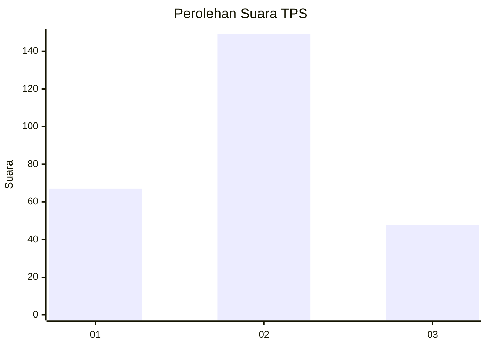
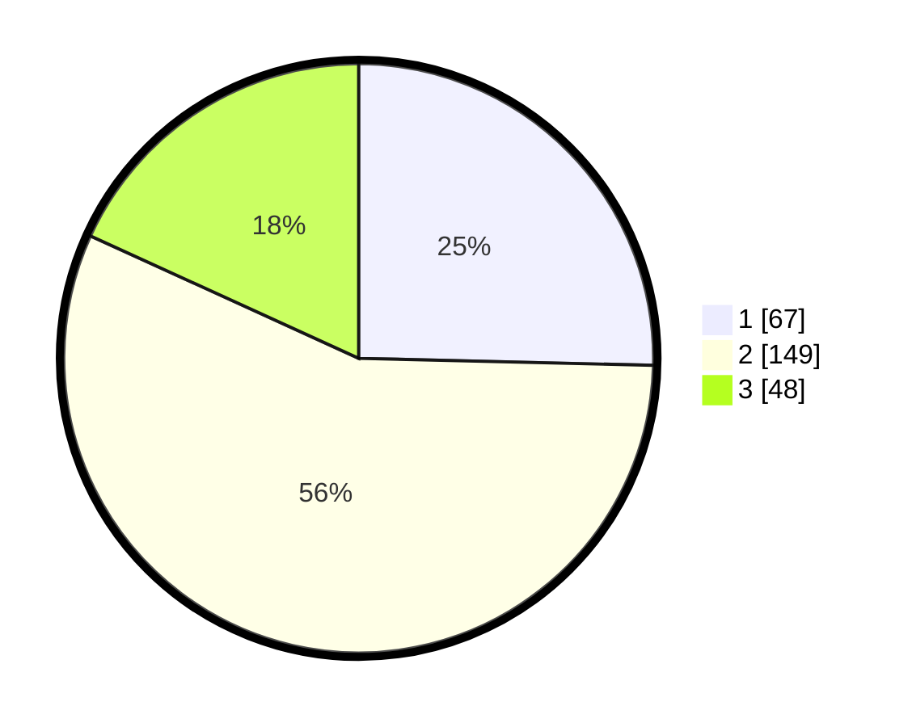

# Hasil

## Grafik

## Tabel

| No. | Nama Paslon    | Suara | Suara (raw) | Persentase |
|:--- |:-------------- | -----:| -----------:| ----------:|
| 1   | ANIES MUHAIMIN | 67    | [67][p-1]   | 25,38      |
| 2   | PRABOWO GIBRAN | 149   | [149][p-2]  | 56,44      |
| 3   | GANJAR MAHFUD  | 48    | [48][p-3]   | 18,18      |

[p-1]: https://github.com/gigit-pemilu/pemilu-2024-35-jawa-timur/blob/main/pilpres/hitung-suara/sub/35-jawa-timur/sub/26-bangkalan/sub/05-arosbaya/sub/2001-arosbaya/sub/015-tps/sub/paslon-1.txt
[p-2]: https://github.com/gigit-pemilu/pemilu-2024-35-jawa-timur/blob/main/pilpres/hitung-suara/sub/35-jawa-timur/sub/26-bangkalan/sub/05-arosbaya/sub/2001-arosbaya/sub/015-tps/sub/paslon-2.txt
[p-3]: https://github.com/gigit-pemilu/pemilu-2024-35-jawa-timur/blob/main/pilpres/hitung-suara/sub/35-jawa-timur/sub/26-bangkalan/sub/05-arosbaya/sub/2001-arosbaya/sub/015-tps/sub/paslon-3.txt

## Foto C Plano

https://sirekap-obj-formc.kpu.go.id/3ce5/pemilu/ppwp/35/26/05/20/01/3526052001015-20240214-221900--3b82994b-7a76-4554-aeb9-ccc23f5e1b7b.jpg

https://sirekap-obj-formc.kpu.go.id/3ce5/pemilu/ppwp/35/26/05/20/01/3526052001015-20240214-222521--eb957b22-22f2-418e-92f5-81536dcb0bf4.jpg

https://sirekap-obj-formc.kpu.go.id/3ce5/pemilu/ppwp/35/26/05/20/01/3526052001015-20240214-222633--445978fe-e344-48bf-b5b5-40564b4de2a2.jpg

## Metadata

| Key        | Value               |
| ---------- | ------------------- |
| Time Stamp | 2024-02-21 16:00:00 |

