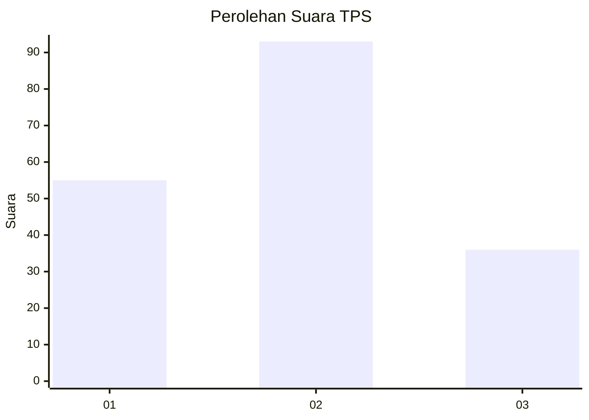
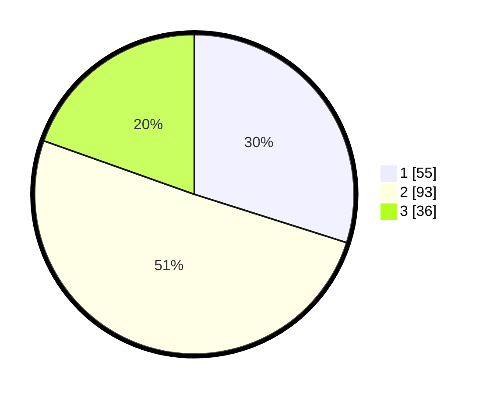

# Hasil

## Grafik

## Tabel

| No. | Nama Paslon    | Suara | Suara (raw) | Persentase |
|:--- |:-------------- | -----:| -----------:| ----------:|
| 1   | ANIES MUHAIMIN | 55    | [55][p-1]   | 29,89      |
| 2   | PRABOWO GIBRAN | 93    | [93][p-2]   | 50,54      |
| 3   | GANJAR MAHFUD  | 36    | [36][p-3]   | 19,57      |

[p-1]: https://github.com/gigit-pemilu/pemilu-2024/blob/main/pilpres/hitung-suara/sub/35-jawa-timur/sub/26-bangkalan/sub/05-arosbaya/sub/2002-tengket/sub/014-tps/sub/paslon-1.txt
[p-2]: https://github.com/gigit-pemilu/pemilu-2024/blob/main/pilpres/hitung-suara/sub/35-jawa-timur/sub/26-bangkalan/sub/05-arosbaya/sub/2002-tengket/sub/014-tps/sub/paslon-2.txt
[p-3]: https://github.com/gigit-pemilu/pemilu-2024/blob/main/pilpres/hitung-suara/sub/35-jawa-timur/sub/26-bangkalan/sub/05-arosbaya/sub/2002-tengket/sub/014-tps/sub/paslon-3.txt

## Foto C Plano

https://sirekap-obj-formc.kpu.go.id/5367/pemilu/ppwp/35/26/05/20/02/3526052002014-20240214-223047--b61c8b39-173e-47ba-8fc9-6e318d81a218.jpg

https://sirekap-obj-formc.kpu.go.id/5367/pemilu/ppwp/35/26/05/20/02/3526052002014-20240214-223127--00ed6d1a-fa3b-42ba-82c0-4c8d6f7cc6ab.jpg

https://sirekap-obj-formc.kpu.go.id/5367/pemilu/ppwp/35/26/05/20/02/3526052002014-20240214-223220--f0acde1f-8ae7-4996-9bb2-0a503a92addb.jpg

## Metadata

| Key        | Value               |
| ---------- | ------------------- |
| Time Stamp | 2024-02-19 06:16:00 |

