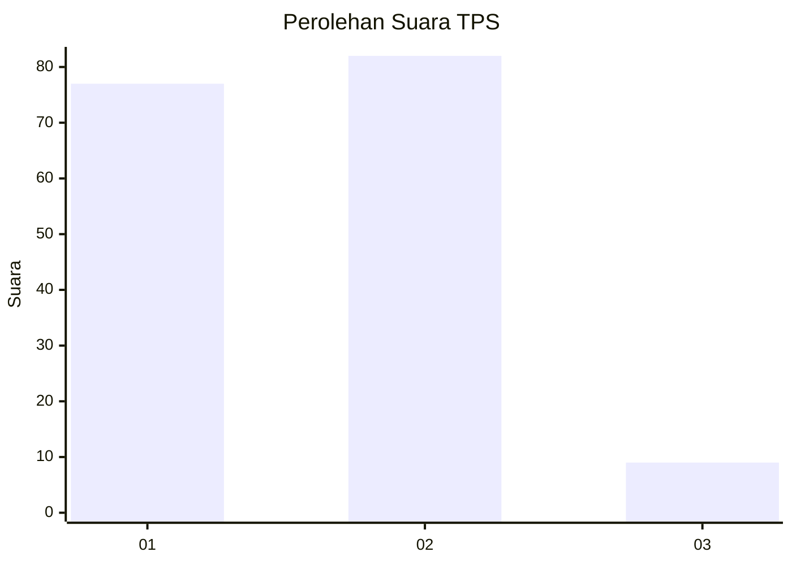
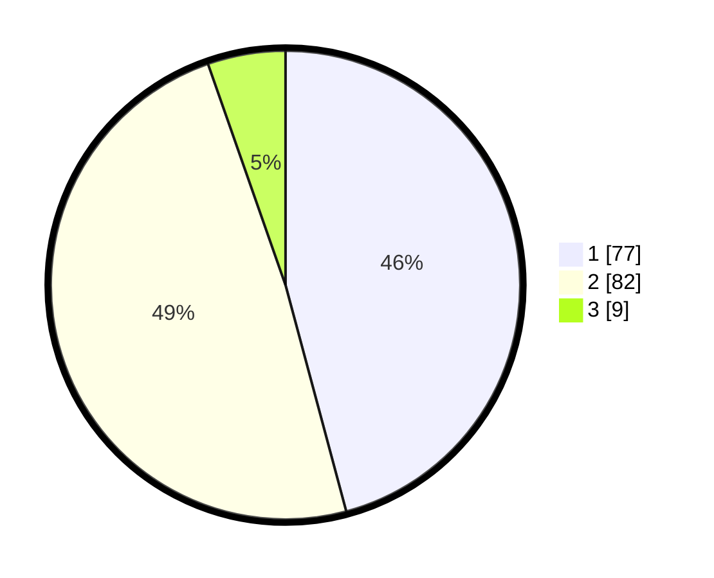

# Hasil

## Grafik

## Tabel

| No. | Nama Paslon    | Suara | Suara (raw) | Persentase |
|:--- |:-------------- | -----:| -----------:| ----------:|
| 1   | ANIES MUHAIMIN | 77    | [77][p-1]   | 45,83      |
| 2   | PRABOWO GIBRAN | 82    | [82][p-2]   | 48,81      |
| 3   | GANJAR MAHFUD  | 9     | [9][p-3]    | 5,36       |

[p-1]: https://github.com/gigit-pemilu/pemilu-2024/blob/main/pilpres/hitung-suara/sub/35-jawa-timur/sub/26-bangkalan/sub/05-arosbaya/sub/2003-lajing/sub/001-tps/sub/paslon-1.txt
[p-2]: https://github.com/gigit-pemilu/pemilu-2024/blob/main/pilpres/hitung-suara/sub/35-jawa-timur/sub/26-bangkalan/sub/05-arosbaya/sub/2003-lajing/sub/001-tps/sub/paslon-2.txt
[p-3]: https://github.com/gigit-pemilu/pemilu-2024/blob/main/pilpres/hitung-suara/sub/35-jawa-timur/sub/26-bangkalan/sub/05-arosbaya/sub/2003-lajing/sub/001-tps/sub/paslon-3.txt

## Foto C Plano

https://sirekap-obj-formc.kpu.go.id/e003/pemilu/ppwp/35/26/05/20/03/3526052003001-20240214-213333--039262b2-a4b1-416e-ab87-8391cd5eb97c.jpg

https://sirekap-obj-formc.kpu.go.id/e003/pemilu/ppwp/35/26/05/20/03/3526052003001-20240214-213447--d6ea0b60-bc7f-4930-9523-b4598c5a999e.jpg

https://sirekap-obj-formc.kpu.go.id/e003/pemilu/ppwp/35/26/05/20/03/3526052003001-20240214-213240--e5771c25-31d8-4469-89f4-d3ee93bd1674.jpg

## Metadata

| Key        | Value               |
| ---------- | ------------------- |
| Time Stamp | 2024-02-19 06:16:00 |

