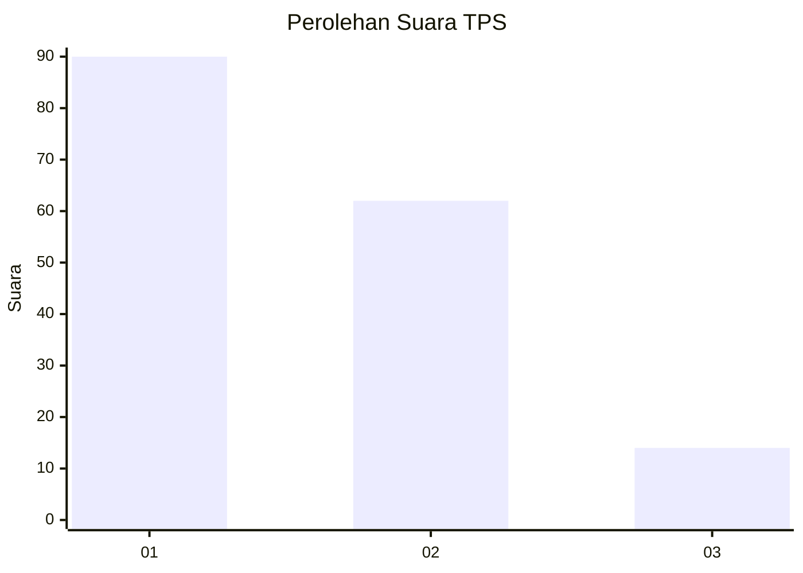
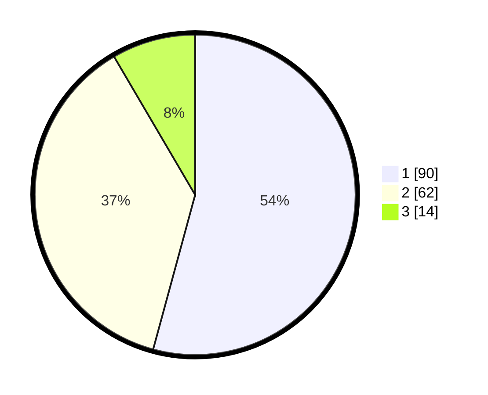

# Hasil

## Grafik

## Tabel

| No. | Nama Paslon    | Suara | Suara (raw) | Persentase |
|:--- |:-------------- | -----:| -----------:| ----------:|
| 1   | ANIES MUHAIMIN | 90    | [90][p-1]   | 54,22      |
| 2   | PRABOWO GIBRAN | 62    | [62][p-2]   | 37,35      |
| 3   | GANJAR MAHFUD  | 14    | [14][p-3]   | 8,43       |

[p-1]: https://github.com/gigit-pemilu/pemilu-2024-35-jawa-timur/blob/main/pilpres/hitung-suara/sub/35-jawa-timur/sub/26-bangkalan/sub/05-arosbaya/sub/2003-lajing/sub/010-tps/sub/paslon-1.txt
[p-2]: https://github.com/gigit-pemilu/pemilu-2024-35-jawa-timur/blob/main/pilpres/hitung-suara/sub/35-jawa-timur/sub/26-bangkalan/sub/05-arosbaya/sub/2003-lajing/sub/010-tps/sub/paslon-2.txt
[p-3]: https://github.com/gigit-pemilu/pemilu-2024-35-jawa-timur/blob/main/pilpres/hitung-suara/sub/35-jawa-timur/sub/26-bangkalan/sub/05-arosbaya/sub/2003-lajing/sub/010-tps/sub/paslon-3.txt

## Foto C Plano

https://sirekap-obj-formc.kpu.go.id/9f07/pemilu/ppwp/35/26/05/20/03/3526052003010-20240215-061706--7eef2178-0d8f-48d8-b820-952e40a47203.jpg

https://sirekap-obj-formc.kpu.go.id/9f07/pemilu/ppwp/35/26/05/20/03/3526052003010-20240215-061930--1eb1a44c-d72c-4742-a144-b89f4dfff270.jpg

https://sirekap-obj-formc.kpu.go.id/9f07/pemilu/ppwp/35/26/05/20/03/3526052003010-20240215-062140--c0ee3eba-aa19-4582-87ad-f95779a4af80.jpg

## Metadata

| Key        | Value               |
| ---------- | ------------------- |
| Time Stamp | 2024-02-19 06:16:00 |

