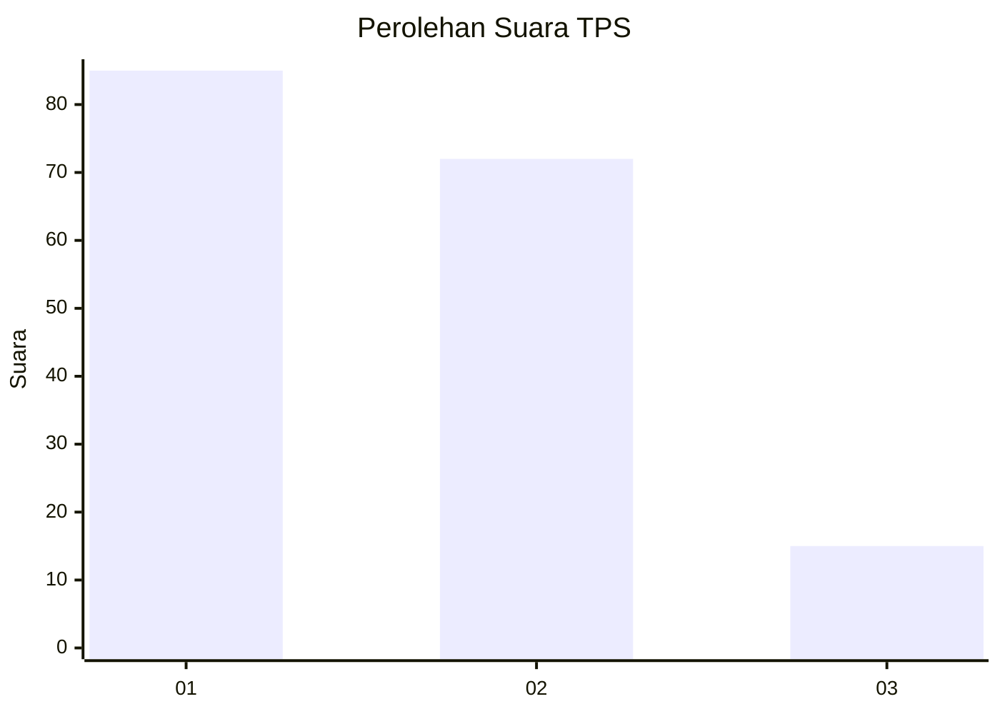
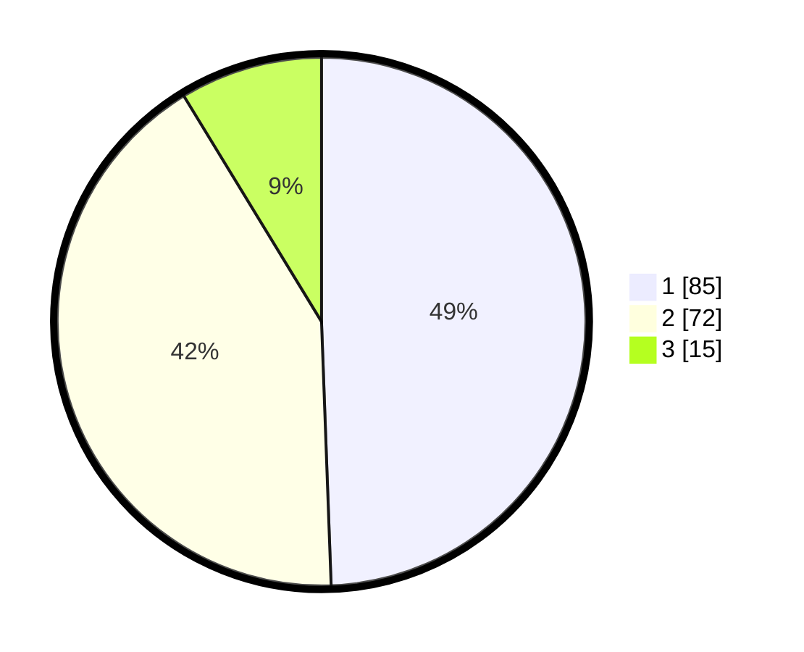

# Hasil

## Grafik

## Tabel

| No. | Nama Paslon    | Suara | Suara (raw) | Persentase |
|:--- |:-------------- | -----:| -----------:| ----------:|
| 1   | ANIES MUHAIMIN | 85    | [85][p-1]   | 49,42      |
| 2   | PRABOWO GIBRAN | 72    | [72][p-2]   | 41,86      |
| 3   | GANJAR MAHFUD  | 15    | [15][p-3]   | 8,72       |

[p-1]: https://github.com/gigit-pemilu/pemilu-2024-35-jawa-timur/blob/main/pilpres/hitung-suara/sub/35-jawa-timur/sub/26-bangkalan/sub/05-arosbaya/sub/2003-lajing/sub/024-tps/sub/paslon-1.txt
[p-2]: https://github.com/gigit-pemilu/pemilu-2024-35-jawa-timur/blob/main/pilpres/hitung-suara/sub/35-jawa-timur/sub/26-bangkalan/sub/05-arosbaya/sub/2003-lajing/sub/024-tps/sub/paslon-2.txt
[p-3]: https://github.com/gigit-pemilu/pemilu-2024-35-jawa-timur/blob/main/pilpres/hitung-suara/sub/35-jawa-timur/sub/26-bangkalan/sub/05-arosbaya/sub/2003-lajing/sub/024-tps/sub/paslon-3.txt

## Foto C Plano

https://sirekap-obj-formc.kpu.go.id/6429/pemilu/ppwp/35/26/05/20/03/3526052003024-20240214-201459--30b6da10-fd6e-4fea-9bb9-779e35333a46.jpg

https://sirekap-obj-formc.kpu.go.id/6429/pemilu/ppwp/35/26/05/20/03/3526052003024-20240214-202645--6e573528-4ac4-4742-885e-bf3ab376b0ca.jpg

https://sirekap-obj-formc.kpu.go.id/6429/pemilu/ppwp/35/26/05/20/03/3526052003024-20240214-203742--191b2b9e-6b78-4ed8-b3c4-ce7e5336ba97.jpg

## Metadata

| Key        | Value               |
| ---------- | ------------------- |
| Time Stamp | 2024-02-19 06:16:00 |

