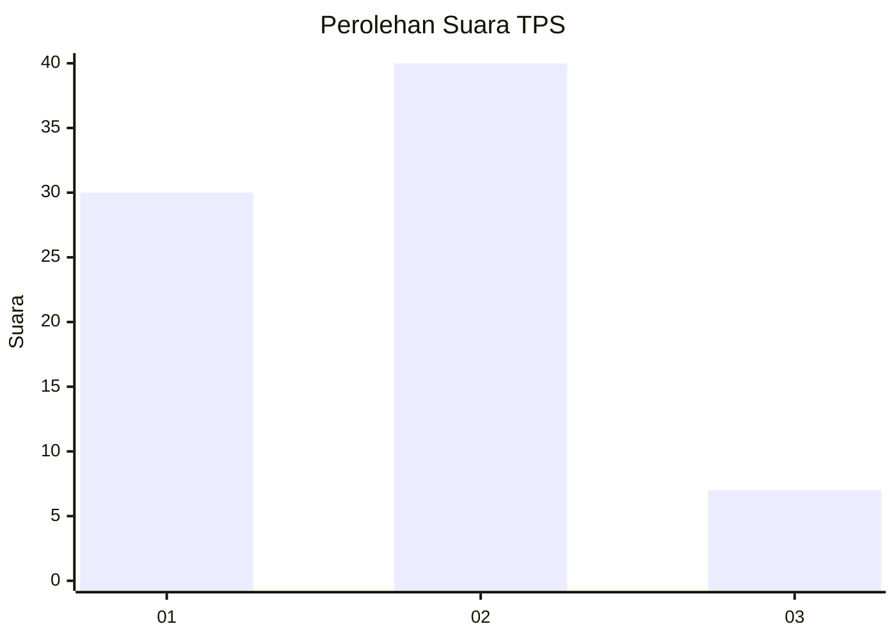
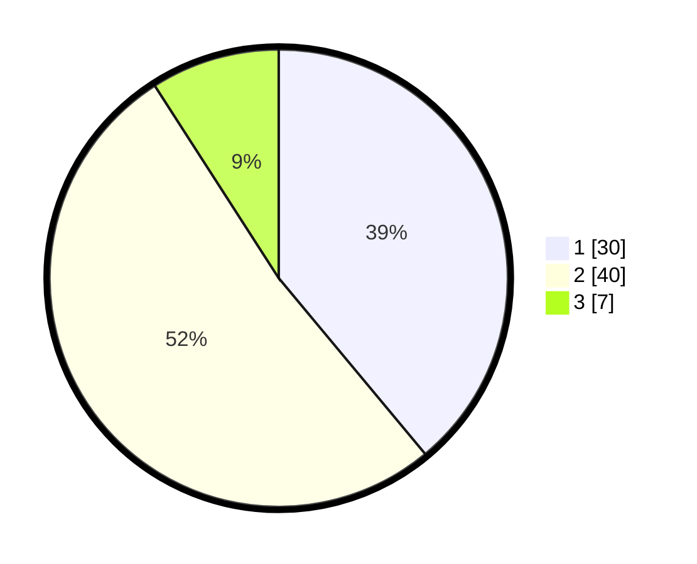

# Hasil

## Grafik

## Tabel

| No. | Nama Paslon    | Suara | Suara (raw) | Persentase |
|:--- |:-------------- | -----:| -----------:| ----------:|
| 1   | ANIES MUHAIMIN | 30    | [30][p-1]   | 38,96      |
| 2   | PRABOWO GIBRAN | 40    | [40][p-2]   | 51,95      |
| 3   | GANJAR MAHFUD  | 7     | [7][p-3]    | 9,09       |

[p-1]: https://github.com/gigit-pemilu/pemilu-2024/blob/main/pilpres/hitung-suara/sub/35-jawa-timur/sub/26-bangkalan/sub/05-arosbaya/sub/2005-glagga/sub/001-tps/sub/paslon-1.txt
[p-2]: https://github.com/gigit-pemilu/pemilu-2024/blob/main/pilpres/hitung-suara/sub/35-jawa-timur/sub/26-bangkalan/sub/05-arosbaya/sub/2005-glagga/sub/001-tps/sub/paslon-2.txt
[p-3]: https://github.com/gigit-pemilu/pemilu-2024/blob/main/pilpres/hitung-suara/sub/35-jawa-timur/sub/26-bangkalan/sub/05-arosbaya/sub/2005-glagga/sub/001-tps/sub/paslon-3.txt

## Foto C Plano

https://sirekap-obj-formc.kpu.go.id/efb7/pemilu/ppwp/35/26/05/20/05/3526052005001-20240214-202328--0f94a1ce-49e9-4933-9b3d-01182a7fc58c.jpg

https://sirekap-obj-formc.kpu.go.id/efb7/pemilu/ppwp/35/26/05/20/05/3526052005001-20240214-195002--777718b6-14bc-4ab9-b1f9-109ba2379a4b.jpg

https://sirekap-obj-formc.kpu.go.id/efb7/pemilu/ppwp/35/26/05/20/05/3526052005001-20240214-195204--37850eee-2434-46e7-8c94-c1cc57ba5c7a.jpg

## Metadata

| Key        | Value               |
| ---------- | ------------------- |
| Time Stamp | 2024-02-21 21:00:04 |

