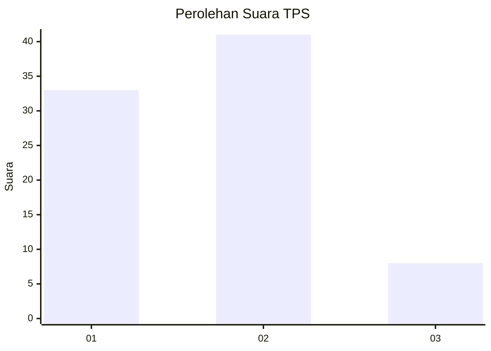
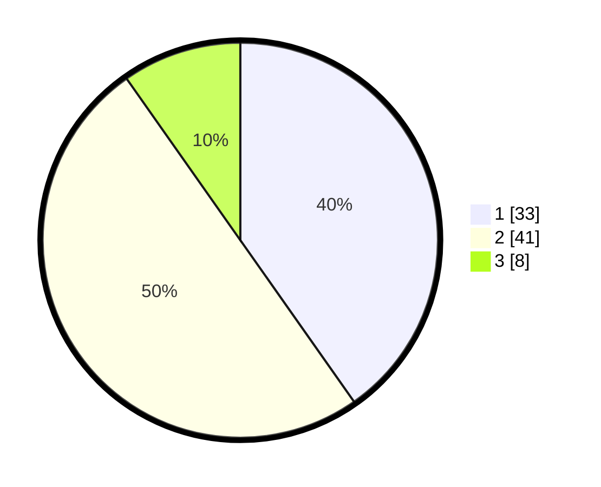

# Hasil

## Grafik

## Tabel

| No. | Nama Paslon    | Suara | Suara (raw) | Persentase |
|:--- |:-------------- | -----:| -----------:| ----------:|
| 1   | ANIES MUHAIMIN | 33    | [33][p-1]   | 40,24      |
| 2   | PRABOWO GIBRAN | 41    | [41][p-2]   | 50,00      |
| 3   | GANJAR MAHFUD  | 8     | [8][p-3]    | 9,76       |

[p-1]: https://github.com/gigit-pemilu/pemilu-2024/blob/main/pilpres/hitung-suara/sub/35-jawa-timur/sub/26-bangkalan/sub/05-arosbaya/sub/2005-glagga/sub/003-tps/sub/paslon-1.txt
[p-2]: https://github.com/gigit-pemilu/pemilu-2024/blob/main/pilpres/hitung-suara/sub/35-jawa-timur/sub/26-bangkalan/sub/05-arosbaya/sub/2005-glagga/sub/003-tps/sub/paslon-2.txt
[p-3]: https://github.com/gigit-pemilu/pemilu-2024/blob/main/pilpres/hitung-suara/sub/35-jawa-timur/sub/26-bangkalan/sub/05-arosbaya/sub/2005-glagga/sub/003-tps/sub/paslon-3.txt

## Foto C Plano

https://sirekap-obj-formc.kpu.go.id/bc59/pemilu/ppwp/35/26/05/20/05/3526052005003-20240214-141147--bb0e8aa6-d18c-41e7-832e-909275f124e9.jpg

https://sirekap-obj-formc.kpu.go.id/bc59/pemilu/ppwp/35/26/05/20/05/3526052005003-20240214-194256--a8ce0714-6249-4dc1-8375-8720d515d48b.jpg

https://sirekap-obj-formc.kpu.go.id/bc59/pemilu/ppwp/35/26/05/20/05/3526052005003-20240214-194423--ebe3c217-d1cf-4eda-a8f8-97bb75a6fc05.jpg

## Metadata

| Key        | Value               |
| ---------- | ------------------- |
| Time Stamp | 2024-02-21 21:00:04 |

