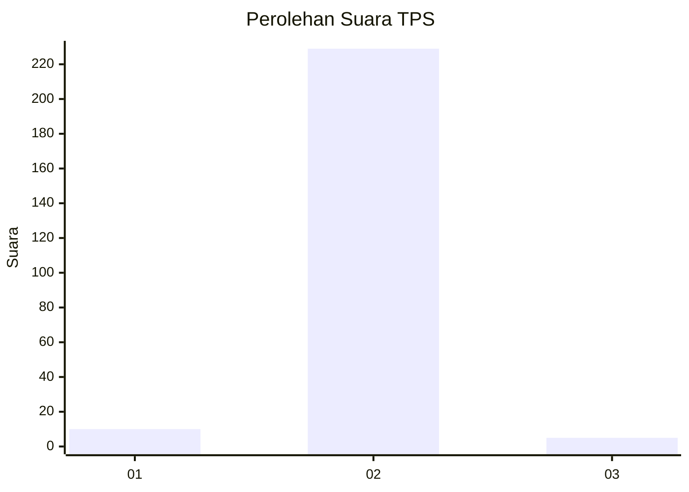
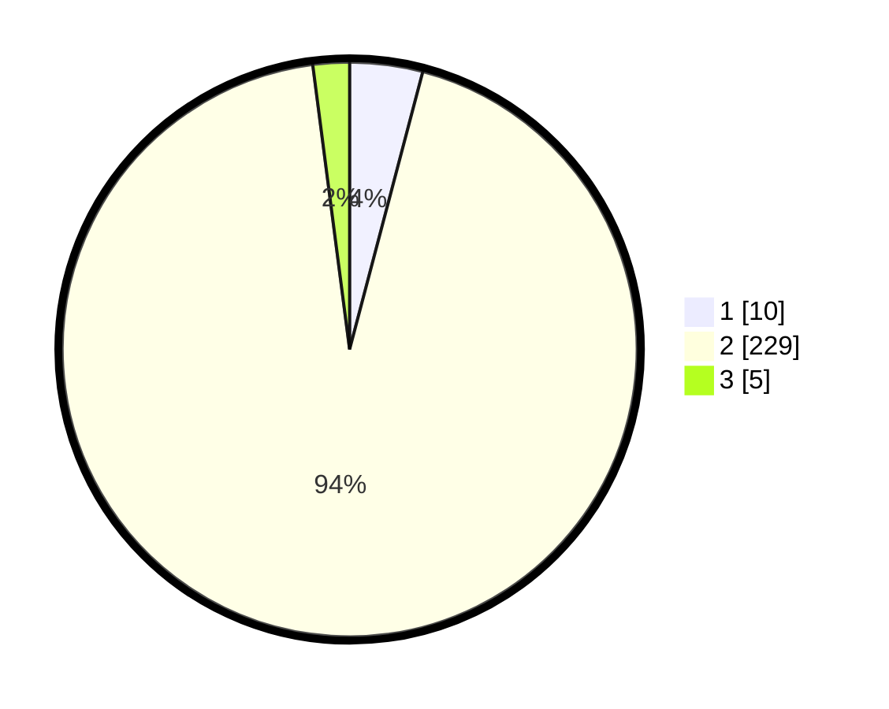

# Hasil

## Grafik

## Tabel

| No. | Nama Paslon    | Suara | Suara (raw) | Persentase |
|:--- |:-------------- | -----:| -----------:| ----------:|
| 1   | ANIES MUHAIMIN | 10    | [10][p-1]   | 4,10       |
| 2   | PRABOWO GIBRAN | 229   | [229][p-2]  | 93,85      |
| 3   | GANJAR MAHFUD  | 5     | [5][p-3]    | 2,05       |

[p-1]: https://github.com/gigit-pemilu/pemilu-2024/blob/main/pilpres/hitung-suara/sub/35-jawa-timur/sub/26-bangkalan/sub/05-arosbaya/sub/2005-glagga/sub/009-tps/sub/paslon-1.txt
[p-2]: https://github.com/gigit-pemilu/pemilu-2024/blob/main/pilpres/hitung-suara/sub/35-jawa-timur/sub/26-bangkalan/sub/05-arosbaya/sub/2005-glagga/sub/009-tps/sub/paslon-2.txt
[p-3]: https://github.com/gigit-pemilu/pemilu-2024/blob/main/pilpres/hitung-suara/sub/35-jawa-timur/sub/26-bangkalan/sub/05-arosbaya/sub/2005-glagga/sub/009-tps/sub/paslon-3.txt

## Foto C Plano

https://sirekap-obj-formc.kpu.go.id/35de/pemilu/ppwp/35/26/05/20/05/3526052005009-20240215-060448--2260c560-6421-4aae-8b96-ff17b3b70079.jpg

https://sirekap-obj-formc.kpu.go.id/35de/pemilu/ppwp/35/26/05/20/05/3526052005009-20240215-012327--e90353ee-6b60-485c-98d3-f847e8cd6a09.jpg

https://sirekap-obj-formc.kpu.go.id/35de/pemilu/ppwp/35/26/05/20/05/3526052005009-20240215-012455--128fb38b-3664-4d1d-9336-2c929e97a43e.jpg

## Metadata

| Key        | Value               |
| ---------- | ------------------- |
| Time Stamp | 2024-02-21 21:00:04 |

