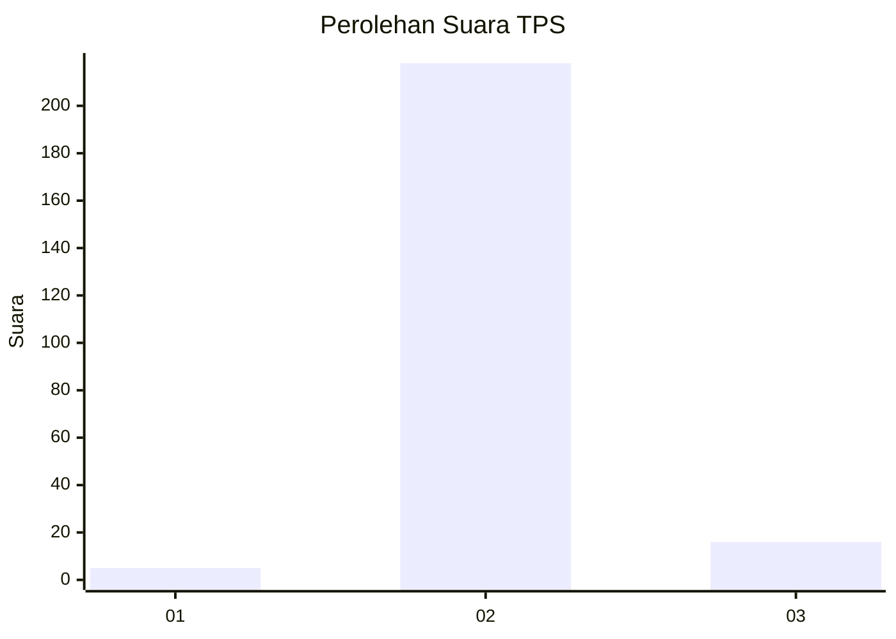
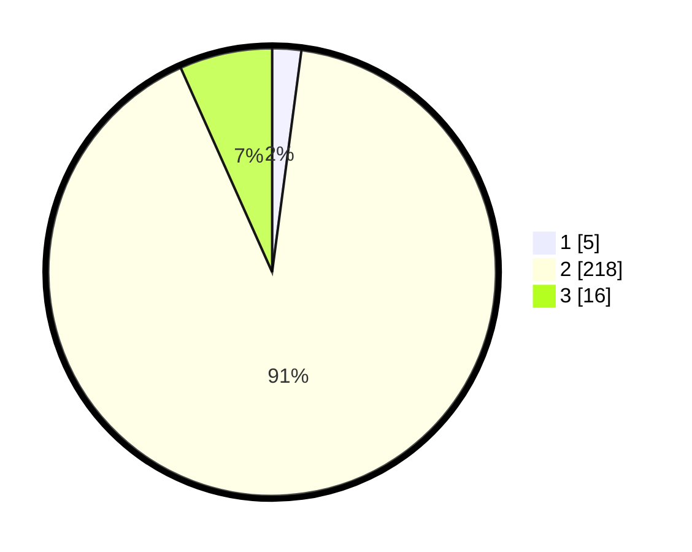

# Hasil

## Grafik

## Tabel

| No. | Nama Paslon    | Suara | Suara (raw) | Persentase |
|:--- |:-------------- | -----:| -----------:| ----------:|
| 1   | ANIES MUHAIMIN | 5     | [5][p-1]    | 2,09       |
| 2   | PRABOWO GIBRAN | 218   | [218][p-2]  | 91,21      |
| 3   | GANJAR MAHFUD  | 16    | [16][p-3]   | 6,69       |

[p-1]: https://github.com/gigit-pemilu/pemilu-2024/blob/main/pilpres/hitung-suara/sub/35-jawa-timur/sub/26-bangkalan/sub/05-arosbaya/sub/2005-glagga/sub/010-tps/sub/paslon-1.txt
[p-2]: https://github.com/gigit-pemilu/pemilu-2024/blob/main/pilpres/hitung-suara/sub/35-jawa-timur/sub/26-bangkalan/sub/05-arosbaya/sub/2005-glagga/sub/010-tps/sub/paslon-2.txt
[p-3]: https://github.com/gigit-pemilu/pemilu-2024/blob/main/pilpres/hitung-suara/sub/35-jawa-timur/sub/26-bangkalan/sub/05-arosbaya/sub/2005-glagga/sub/010-tps/sub/paslon-3.txt

## Foto C Plano

https://sirekap-obj-formc.kpu.go.id/360b/pemilu/ppwp/35/26/05/20/05/3526052005010-20240214-220927--60fa1fe9-e2d0-49d3-ab78-8ac883d80fbd.jpg

https://sirekap-obj-formc.kpu.go.id/360b/pemilu/ppwp/35/26/05/20/05/3526052005010-20240214-221303--143077e7-76b0-4139-b88f-dc4f3d3cd448.jpg

https://sirekap-obj-formc.kpu.go.id/360b/pemilu/ppwp/35/26/05/20/05/3526052005010-20240214-190822--9aff396e-9b27-44d8-afd7-bbfb35fe87f5.jpg

## Metadata

| Key        | Value               |
| ---------- | ------------------- |
| Time Stamp | 2024-02-21 21:00:04 |

