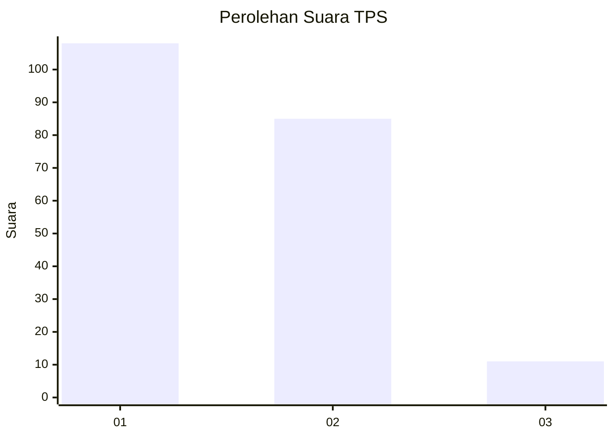
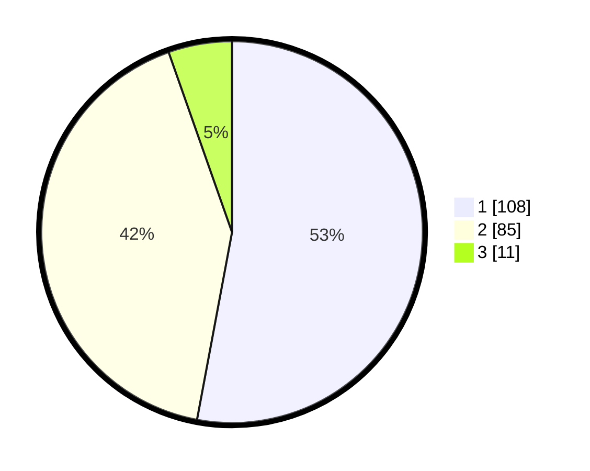

# Hasil

## Grafik

## Tabel

| No. | Nama Paslon    | Suara | Suara (raw) | Persentase |
|:--- |:-------------- | -----:| -----------:| ----------:|
| 1   | ANIES MUHAIMIN | 108   | [108][p-1]  | 52,94      |
| 2   | PRABOWO GIBRAN | 85    | [85][p-2]   | 41,67      |
| 3   | GANJAR MAHFUD  | 11    | [11][p-3]   | 5,39       |

[p-1]: https://github.com/gigit-pemilu/pemilu-2024-35-jawa-timur/blob/main/pilpres/hitung-suara/sub/35-jawa-timur/sub/26-bangkalan/sub/05-arosbaya/sub/2005-glagga/sub/012-tps/sub/paslon-1.txt
[p-2]: https://github.com/gigit-pemilu/pemilu-2024-35-jawa-timur/blob/main/pilpres/hitung-suara/sub/35-jawa-timur/sub/26-bangkalan/sub/05-arosbaya/sub/2005-glagga/sub/012-tps/sub/paslon-2.txt
[p-3]: https://github.com/gigit-pemilu/pemilu-2024-35-jawa-timur/blob/main/pilpres/hitung-suara/sub/35-jawa-timur/sub/26-bangkalan/sub/05-arosbaya/sub/2005-glagga/sub/012-tps/sub/paslon-3.txt

## Foto C Plano

https://sirekap-obj-formc.kpu.go.id/fb94/pemilu/ppwp/35/26/05/20/05/3526052005012-20240215-001307--47a6d029-2b83-4de2-9b62-935fe806f72f.jpg

https://sirekap-obj-formc.kpu.go.id/fb94/pemilu/ppwp/35/26/05/20/05/3526052005012-20240215-001309--b767d784-ce20-419c-a455-4a864fd4c02c.jpg

https://sirekap-obj-formc.kpu.go.id/fb94/pemilu/ppwp/35/26/05/20/05/3526052005012-20240215-001307--826a9518-907a-4ad1-8fd9-bfb6aa017343.jpg

## Metadata

| Key        | Value               |
| ---------- | ------------------- |
| Time Stamp | 2024-02-19 06:16:00 |

