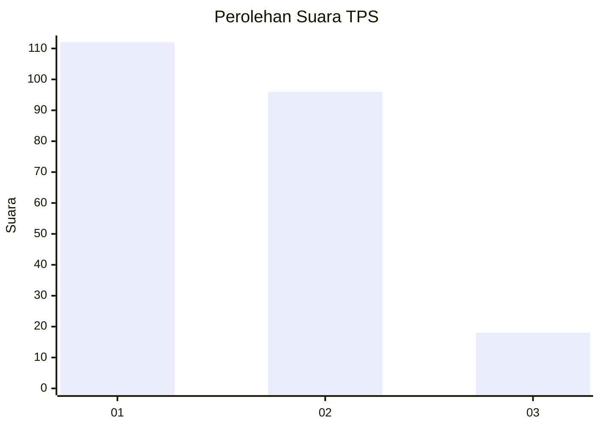
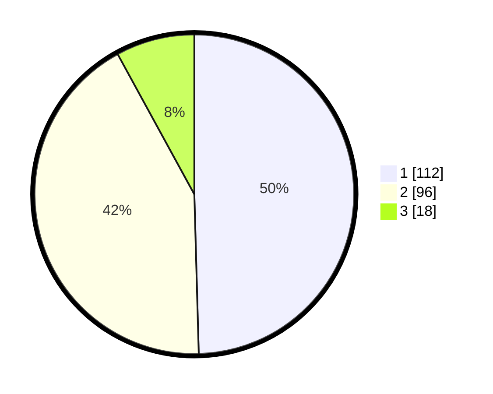

# Hasil

## Grafik

## Tabel

| No. | Nama Paslon    | Suara | Suara (raw) | Persentase |
|:--- |:-------------- | -----:| -----------:| ----------:|
| 1   | ANIES MUHAIMIN | 112   | [112][p-1]  | 49,56      |
| 2   | PRABOWO GIBRAN | 96    | [96][p-2]   | 42,48      |
| 3   | GANJAR MAHFUD  | 18    | [18][p-3]   | 7,96       |

[p-1]: https://github.com/gigit-pemilu/pemilu-2024-35-jawa-timur/blob/main/pilpres/hitung-suara/sub/35-jawa-timur/sub/26-bangkalan/sub/05-arosbaya/sub/2005-glagga/sub/013-tps/sub/paslon-1.txt
[p-2]: https://github.com/gigit-pemilu/pemilu-2024-35-jawa-timur/blob/main/pilpres/hitung-suara/sub/35-jawa-timur/sub/26-bangkalan/sub/05-arosbaya/sub/2005-glagga/sub/013-tps/sub/paslon-2.txt
[p-3]: https://github.com/gigit-pemilu/pemilu-2024-35-jawa-timur/blob/main/pilpres/hitung-suara/sub/35-jawa-timur/sub/26-bangkalan/sub/05-arosbaya/sub/2005-glagga/sub/013-tps/sub/paslon-3.txt

## Foto C Plano

https://sirekap-obj-formc.kpu.go.id/920a/pemilu/ppwp/35/26/05/20/05/3526052005013-20240214-203634--2c21ea2c-e5f2-4f5d-a0a2-fffae34ba5ec.jpg

https://sirekap-obj-formc.kpu.go.id/920a/pemilu/ppwp/35/26/05/20/05/3526052005013-20240214-203716--8c16f16e-a6f6-4e27-b8de-6004eef27619.jpg

https://sirekap-obj-formc.kpu.go.id/920a/pemilu/ppwp/35/26/05/20/05/3526052005013-20240214-203802--80ea428d-68f6-48d2-ac3d-3243c4ea88c5.jpg

## Metadata

| Key        | Value               |
| ---------- | ------------------- |
| Time Stamp | 2024-02-21 21:00:04 |

