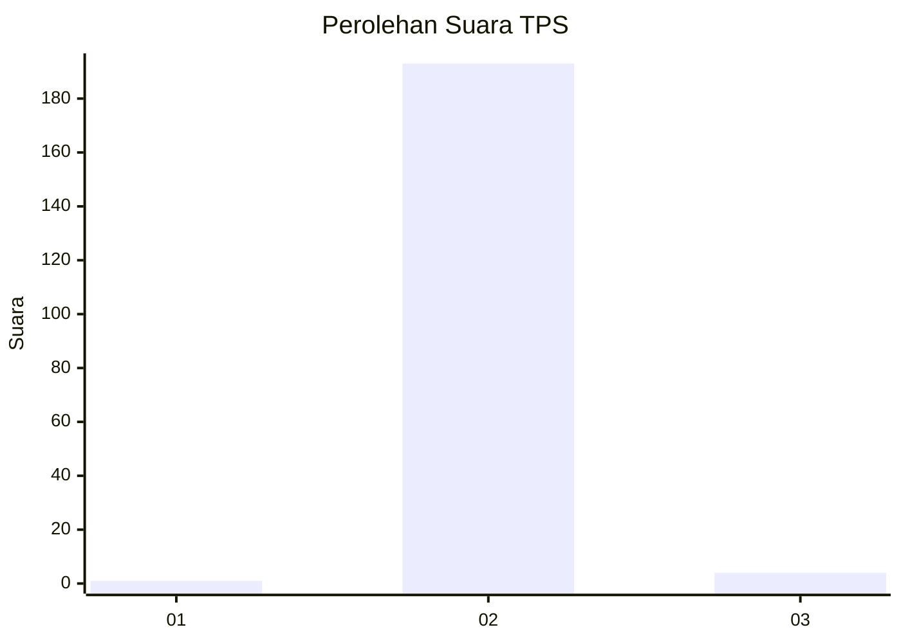
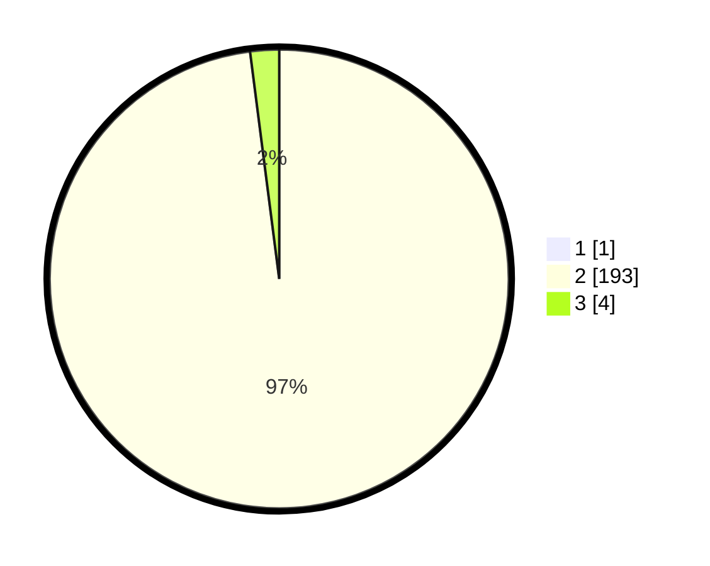

# Hasil

## Grafik

## Tabel

| No. | Nama Paslon    | Suara | Suara (raw) | Persentase |
|:--- |:-------------- | -----:| -----------:| ----------:|
| 1   | ANIES MUHAIMIN | 1     | [1][p-1]    | 0,51       |
| 2   | PRABOWO GIBRAN | 193   | [193][p-2]  | 97,47      |
| 3   | GANJAR MAHFUD  | 4     | [4][p-3]    | 2,02       |

[p-1]: https://github.com/gigit-pemilu/pemilu-2024-35-jawa-timur/blob/main/pilpres/hitung-suara/sub/35-jawa-timur/sub/26-bangkalan/sub/05-arosbaya/sub/2006-pandan-lanjang/sub/001-tps/sub/paslon-1.txt
[p-2]: https://github.com/gigit-pemilu/pemilu-2024-35-jawa-timur/blob/main/pilpres/hitung-suara/sub/35-jawa-timur/sub/26-bangkalan/sub/05-arosbaya/sub/2006-pandan-lanjang/sub/001-tps/sub/paslon-2.txt
[p-3]: https://github.com/gigit-pemilu/pemilu-2024-35-jawa-timur/blob/main/pilpres/hitung-suara/sub/35-jawa-timur/sub/26-bangkalan/sub/05-arosbaya/sub/2006-pandan-lanjang/sub/001-tps/sub/paslon-3.txt

## Foto C Plano

https://sirekap-obj-formc.kpu.go.id/5b9d/pemilu/ppwp/35/26/05/20/06/3526052006001-20240215-002413--ddf720a1-1704-4170-9a9b-4b281a0a3a04.jpg

https://sirekap-obj-formc.kpu.go.id/5b9d/pemilu/ppwp/35/26/05/20/06/3526052006001-20240215-003014--0fdaf1b4-cc1c-449d-938c-328d1d57ce3e.jpg

https://sirekap-obj-formc.kpu.go.id/5b9d/pemilu/ppwp/35/26/05/20/06/3526052006001-20240215-003114--0d6c6329-b9c3-4d49-b8bb-555ec1fd0009.jpg

## Metadata

| Key        | Value               |
| ---------- | ------------------- |
| Time Stamp | 2024-02-19 06:16:00 |

