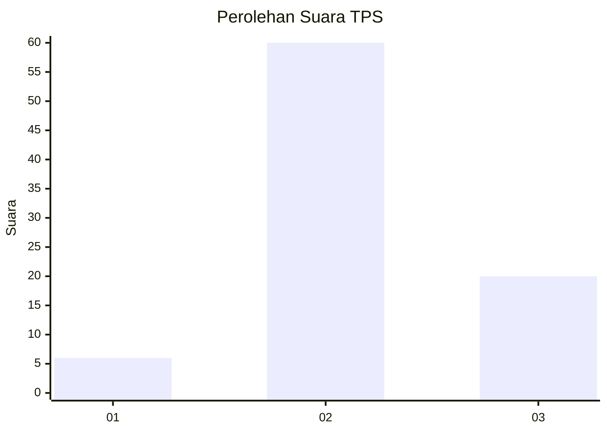
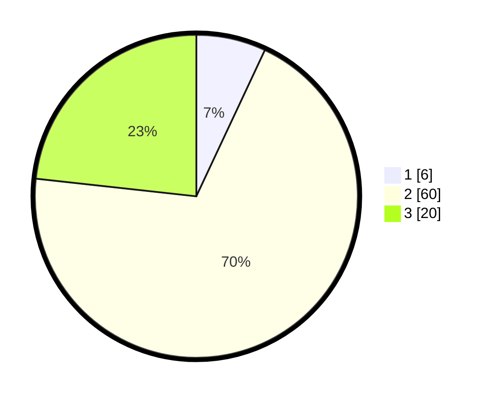

# Hasil

## Grafik

## Tabel

| No. | Nama Paslon    | Suara | Suara (raw) | Persentase |
|:--- |:-------------- | -----:| -----------:| ----------:|
| 1   | ANIES MUHAIMIN | 6     | [6][p-1]    | 6,98       |
| 2   | PRABOWO GIBRAN | 60    | [60][p-2]   | 69,77      |
| 3   | GANJAR MAHFUD  | 20    | [20][p-3]   | 23,26      |

[p-1]: https://github.com/gigit-pemilu/pemilu-2024/blob/main/pilpres/hitung-suara/sub/35-jawa-timur/sub/26-bangkalan/sub/05-arosbaya/sub/2006-pandan-lanjang/sub/003-tps/sub/paslon-1.txt
[p-2]: https://github.com/gigit-pemilu/pemilu-2024/blob/main/pilpres/hitung-suara/sub/35-jawa-timur/sub/26-bangkalan/sub/05-arosbaya/sub/2006-pandan-lanjang/sub/003-tps/sub/paslon-2.txt
[p-3]: https://github.com/gigit-pemilu/pemilu-2024/blob/main/pilpres/hitung-suara/sub/35-jawa-timur/sub/26-bangkalan/sub/05-arosbaya/sub/2006-pandan-lanjang/sub/003-tps/sub/paslon-3.txt

## Foto C Plano

https://sirekap-obj-formc.kpu.go.id/4786/pemilu/ppwp/35/26/05/20/06/3526052006003-20240214-221945--9dbcd29d-43da-446a-8ea0-b13ef7ca529f.jpg

https://sirekap-obj-formc.kpu.go.id/4786/pemilu/ppwp/35/26/05/20/06/3526052006003-20240214-222040--3d8d2ebb-7e60-4be4-8120-ebee4aac7f39.jpg

## Metadata

| Key        | Value               |
| ---------- | ------------------- |
| Time Stamp | 2024-02-25 12:00:00 |

