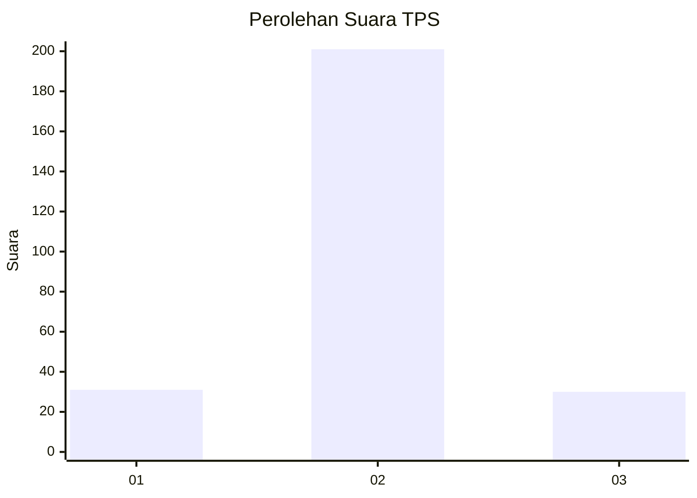
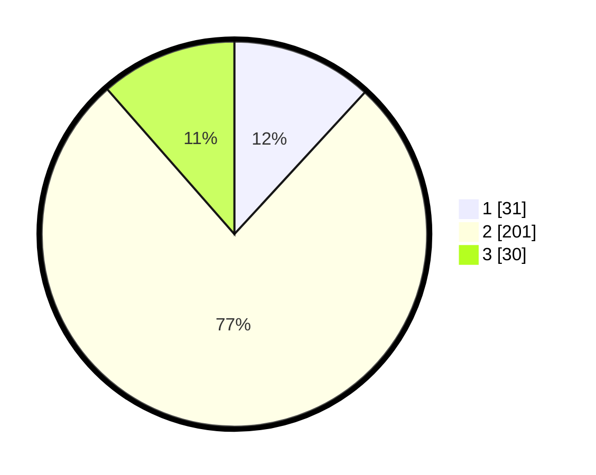

# Hasil

## Grafik

## Tabel

| No. | Nama Paslon    | Suara | Suara (raw) | Persentase |
|:--- |:-------------- | -----:| -----------:| ----------:|
| 1   | ANIES MUHAIMIN | 31    | [31][p-1]   | 11,83      |
| 2   | PRABOWO GIBRAN | 201   | [201][p-2]  | 76,72      |
| 3   | GANJAR MAHFUD  | 30    | [30][p-3]   | 11,45      |

[p-1]: https://github.com/gigit-pemilu/pemilu-2024/blob/main/pilpres/hitung-suara/sub/35-jawa-timur/sub/26-bangkalan/sub/05-arosbaya/sub/2009-karang-duwak/sub/003-tps/sub/paslon-1.txt
[p-2]: https://github.com/gigit-pemilu/pemilu-2024/blob/main/pilpres/hitung-suara/sub/35-jawa-timur/sub/26-bangkalan/sub/05-arosbaya/sub/2009-karang-duwak/sub/003-tps/sub/paslon-2.txt
[p-3]: https://github.com/gigit-pemilu/pemilu-2024/blob/main/pilpres/hitung-suara/sub/35-jawa-timur/sub/26-bangkalan/sub/05-arosbaya/sub/2009-karang-duwak/sub/003-tps/sub/paslon-3.txt

## Foto C Plano

https://sirekap-obj-formc.kpu.go.id/bc49/pemilu/ppwp/35/26/05/20/09/3526052009003-20240215-003924--6f70a202-6880-422a-bfa3-22f841dea2f0.jpg

https://sirekap-obj-formc.kpu.go.id/bc49/pemilu/ppwp/35/26/05/20/09/3526052009003-20240215-004051--cefde348-4ce4-42ac-bb49-c7184fa8194e.jpg

https://sirekap-obj-formc.kpu.go.id/bc49/pemilu/ppwp/35/26/05/20/09/3526052009003-20240215-004138--4745976c-c3bf-4225-a251-5330c1fbacc5.jpg

## Metadata

| Key        | Value               |
| ---------- | ------------------- |
| Time Stamp | 2024-02-21 21:00:04 |

