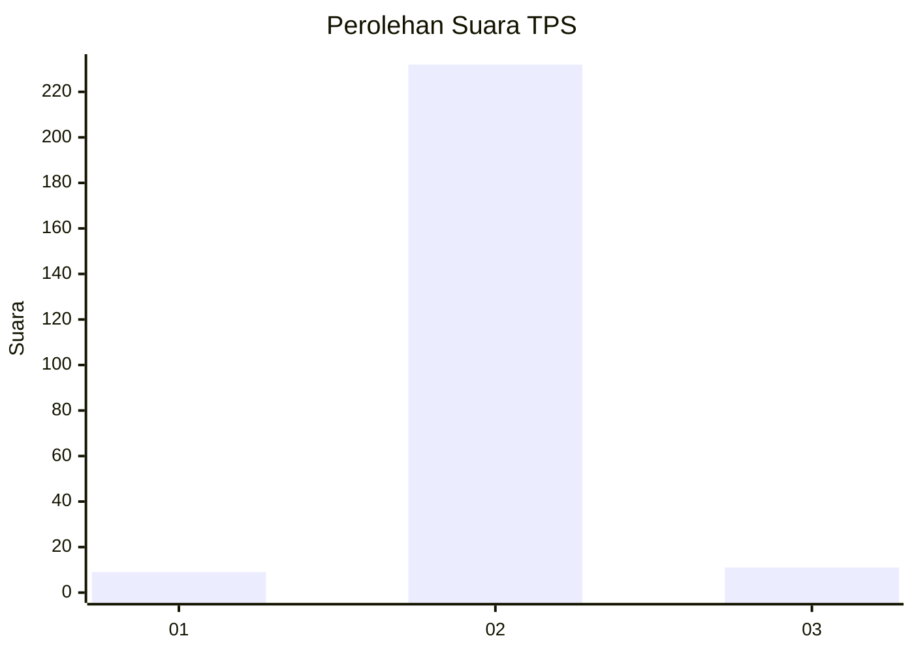
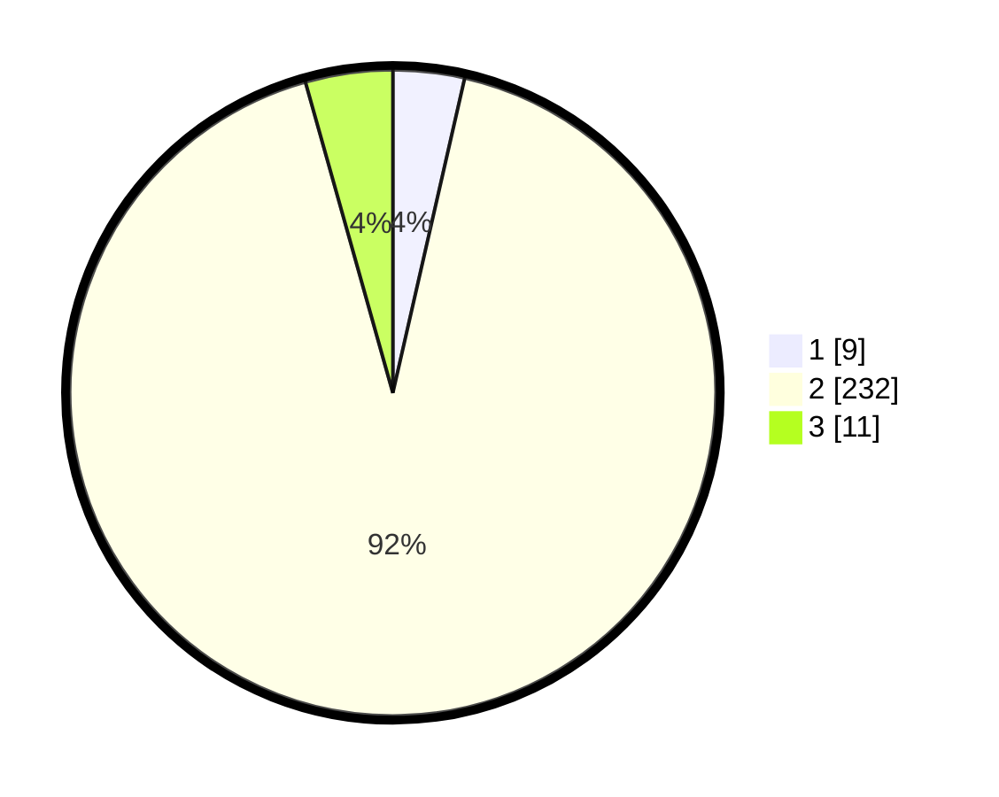

# Hasil

## Grafik

## Tabel

| No. | Nama Paslon    | Suara | Suara (raw) | Persentase |
|:--- |:-------------- | -----:| -----------:| ----------:|
| 1   | ANIES MUHAIMIN | 9     | [9][p-1]    | 3,57       |
| 2   | PRABOWO GIBRAN | 232   | [232][p-2]  | 92,06      |
| 3   | GANJAR MAHFUD  | 11    | [11][p-3]   | 4,37       |

[p-1]: https://github.com/gigit-pemilu/pemilu-2024/blob/main/pilpres/hitung-suara/sub/35-jawa-timur/sub/26-bangkalan/sub/05-arosbaya/sub/2009-karang-duwak/sub/004-tps/sub/paslon-1.txt
[p-2]: https://github.com/gigit-pemilu/pemilu-2024/blob/main/pilpres/hitung-suara/sub/35-jawa-timur/sub/26-bangkalan/sub/05-arosbaya/sub/2009-karang-duwak/sub/004-tps/sub/paslon-2.txt
[p-3]: https://github.com/gigit-pemilu/pemilu-2024/blob/main/pilpres/hitung-suara/sub/35-jawa-timur/sub/26-bangkalan/sub/05-arosbaya/sub/2009-karang-duwak/sub/004-tps/sub/paslon-3.txt

## Foto C Plano

https://sirekap-obj-formc.kpu.go.id/1ac8/pemilu/ppwp/35/26/05/20/09/3526052009004-20240215-001523--ab886f53-5239-42b0-bba9-c6806c880453.jpg

https://sirekap-obj-formc.kpu.go.id/1ac8/pemilu/ppwp/35/26/05/20/09/3526052009004-20240215-001646--239dae44-be7c-4049-bf95-0a20aa807f2f.jpg

https://sirekap-obj-formc.kpu.go.id/1ac8/pemilu/ppwp/35/26/05/20/09/3526052009004-20240215-001733--9968416e-be6f-443e-bae9-a0cc93f63083.jpg

## Metadata

| Key        | Value               |
| ---------- | ------------------- |
| Time Stamp | 2024-02-21 21:00:04 |

