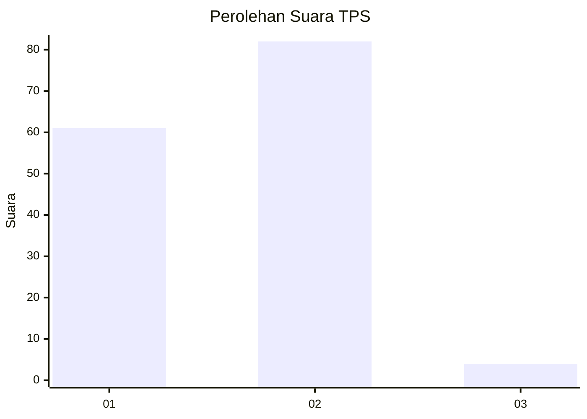
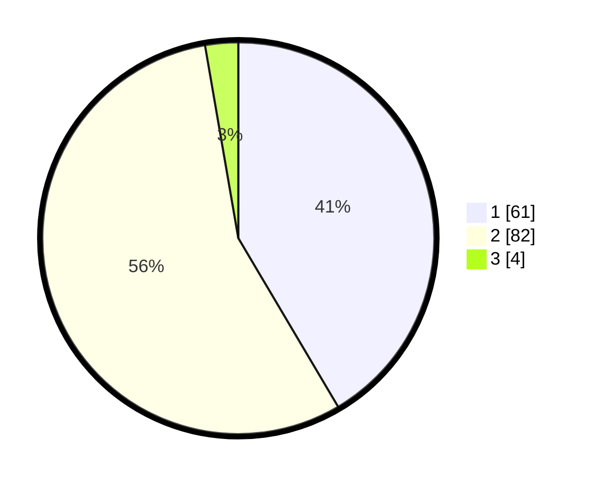

# Hasil

## Grafik

## Tabel

| No. | Nama Paslon    | Suara | Suara (raw) | Persentase |
|:--- |:-------------- | -----:| -----------:| ----------:|
| 1   | ANIES MUHAIMIN | 61    | [61][p-1]   | 41,50      |
| 2   | PRABOWO GIBRAN | 82    | [82][p-2]   | 55,78      |
| 3   | GANJAR MAHFUD  | 4     | [4][p-3]    | 2,72       |

[p-1]: https://github.com/gigit-pemilu/pemilu-2024/blob/main/pilpres/hitung-suara/sub/35-jawa-timur/sub/26-bangkalan/sub/05-arosbaya/sub/2016-makam-agung/sub/001-tps/sub/paslon-1.txt
[p-2]: https://github.com/gigit-pemilu/pemilu-2024/blob/main/pilpres/hitung-suara/sub/35-jawa-timur/sub/26-bangkalan/sub/05-arosbaya/sub/2016-makam-agung/sub/001-tps/sub/paslon-2.txt
[p-3]: https://github.com/gigit-pemilu/pemilu-2024/blob/main/pilpres/hitung-suara/sub/35-jawa-timur/sub/26-bangkalan/sub/05-arosbaya/sub/2016-makam-agung/sub/001-tps/sub/paslon-3.txt

## Foto C Plano

https://sirekap-obj-formc.kpu.go.id/897d/pemilu/ppwp/35/26/05/20/16/3526052016001-20240214-225038--6ac46a14-7ac5-4f76-a98b-b3eff604e7a2.jpg

https://sirekap-obj-formc.kpu.go.id/897d/pemilu/ppwp/35/26/05/20/16/3526052016001-20240214-212004--0dc48f27-2360-4fcf-9cfb-fd0f528fafd0.jpg

https://sirekap-obj-formc.kpu.go.id/897d/pemilu/ppwp/35/26/05/20/16/3526052016001-20240214-212143--4e992e0e-fe34-4eef-b616-8fda755e54b3.jpg

## Metadata

| Key        | Value               |
| ---------- | ------------------- |
| Time Stamp | 2024-02-19 06:16:00 |

