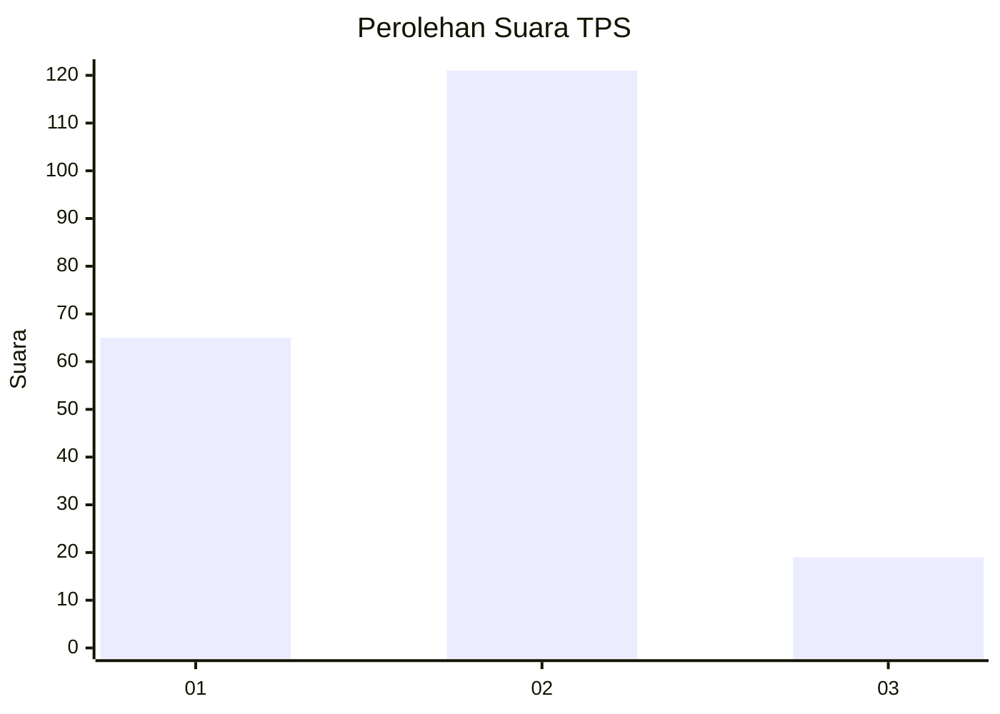
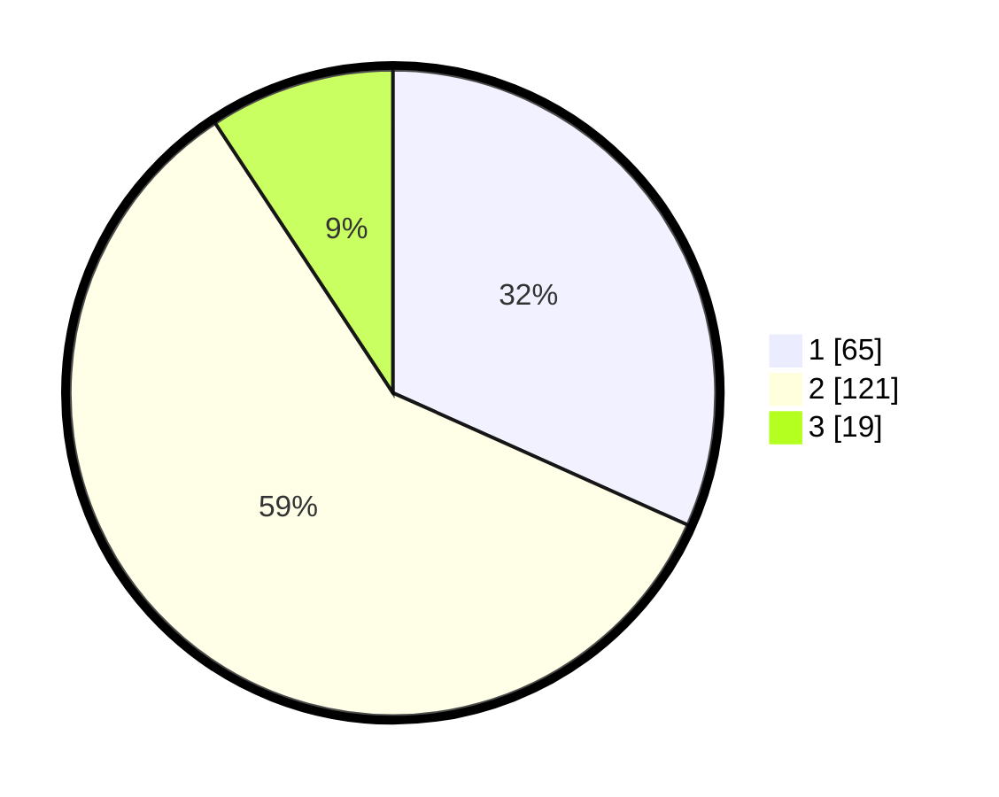

# Hasil

## Grafik

## Tabel

| No. | Nama Paslon    | Suara | Suara (raw) | Persentase |
|:--- |:-------------- | -----:| -----------:| ----------:|
| 1   | ANIES MUHAIMIN | 65    | [65][p-1]   | 31,71      |
| 2   | PRABOWO GIBRAN | 121   | [121][p-2]  | 59,02      |
| 3   | GANJAR MAHFUD  | 19    | [19][p-3]   | 9,27       |

[p-1]: https://github.com/gigit-pemilu/pemilu-2024/blob/main/pilpres/hitung-suara/sub/35-jawa-timur/sub/26-bangkalan/sub/05-arosbaya/sub/2017-dlemer/sub/001-tps/sub/paslon-1.txt
[p-2]: https://github.com/gigit-pemilu/pemilu-2024/blob/main/pilpres/hitung-suara/sub/35-jawa-timur/sub/26-bangkalan/sub/05-arosbaya/sub/2017-dlemer/sub/001-tps/sub/paslon-2.txt
[p-3]: https://github.com/gigit-pemilu/pemilu-2024/blob/main/pilpres/hitung-suara/sub/35-jawa-timur/sub/26-bangkalan/sub/05-arosbaya/sub/2017-dlemer/sub/001-tps/sub/paslon-3.txt

## Foto C Plano

https://sirekap-obj-formc.kpu.go.id/cc9d/pemilu/ppwp/35/26/05/20/17/3526052017001-20240214-193934--dba1b228-f0f1-4454-a70e-8df2466df10f.jpg

https://sirekap-obj-formc.kpu.go.id/cc9d/pemilu/ppwp/35/26/05/20/17/3526052017001-20240214-194225--c74cb38f-8f7c-4040-91e3-eb29952ab4b6.jpg

https://sirekap-obj-formc.kpu.go.id/cc9d/pemilu/ppwp/35/26/05/20/17/3526052017001-20240214-194359--fff2d20a-7fc4-4bf4-8039-8b626a621144.jpg

## Metadata

| Key        | Value               |
| ---------- | ------------------- |
| Time Stamp | 2024-02-21 21:00:04 |

