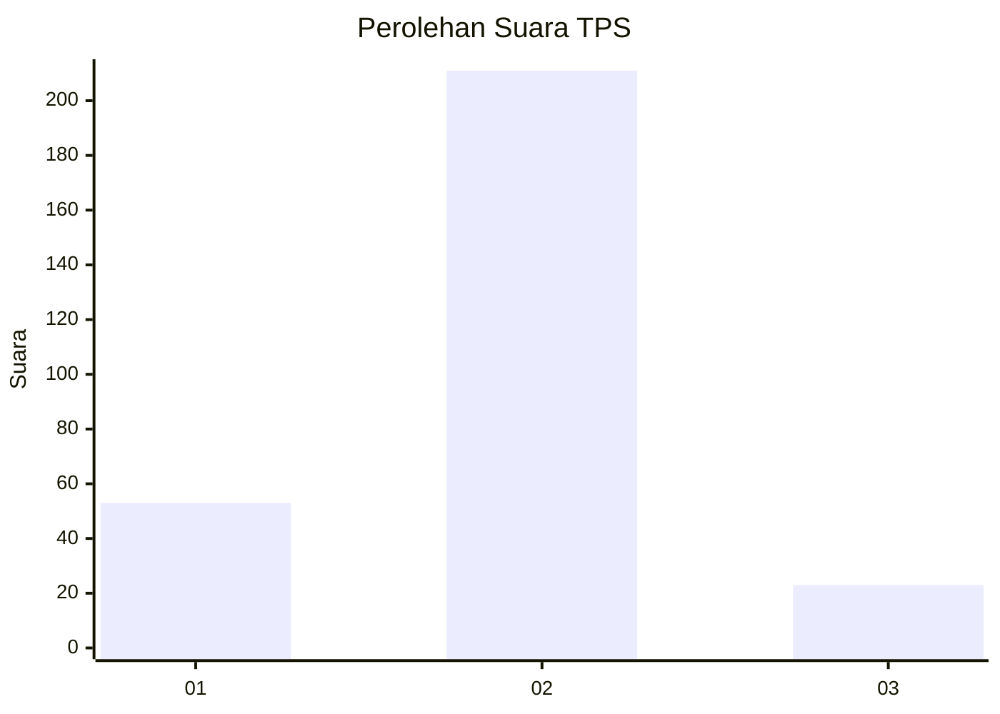
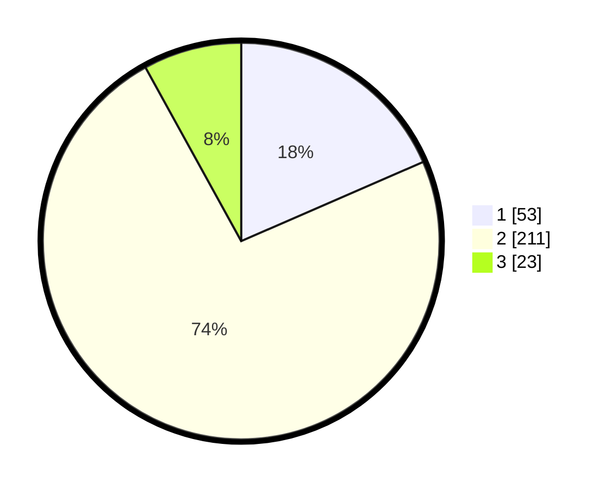

# Hasil

## Grafik

## Tabel

| No. | Nama Paslon    | Suara | Suara (raw) | Persentase |
|:--- |:-------------- | -----:| -----------:| ----------:|
| 1   | ANIES MUHAIMIN | 53    | [53][p-1]   | 18,47      |
| 2   | PRABOWO GIBRAN | 211   | [211][p-2]  | 73,52      |
| 3   | GANJAR MAHFUD  | 23    | [23][p-3]   | 8,01       |

[p-1]: https://github.com/gigit-pemilu/pemilu-2024/blob/main/pilpres/hitung-suara/sub/35-jawa-timur/sub/26-bangkalan/sub/06-geger/sub/2001-kombangan/sub/007-tps/sub/paslon-1.txt
[p-2]: https://github.com/gigit-pemilu/pemilu-2024/blob/main/pilpres/hitung-suara/sub/35-jawa-timur/sub/26-bangkalan/sub/06-geger/sub/2001-kombangan/sub/007-tps/sub/paslon-2.txt
[p-3]: https://github.com/gigit-pemilu/pemilu-2024/blob/main/pilpres/hitung-suara/sub/35-jawa-timur/sub/26-bangkalan/sub/06-geger/sub/2001-kombangan/sub/007-tps/sub/paslon-3.txt

## Foto C Plano

https://sirekap-obj-formc.kpu.go.id/b58a/pemilu/ppwp/35/26/06/20/01/3526062001007-20240215-094636--dc55611c-db5e-4eee-8d7c-dab055b84cbc.jpg

https://sirekap-obj-formc.kpu.go.id/b58a/pemilu/ppwp/35/26/06/20/01/3526062001007-20240215-091346--1092a016-ed7b-40c7-b016-1f0214639dad.jpg

https://sirekap-obj-formc.kpu.go.id/b58a/pemilu/ppwp/35/26/06/20/01/3526062001007-20240215-091326--c6ef78e4-1310-4884-97ef-6080e3c4a893.jpg

## Metadata

| Key        | Value               |
| ---------- | ------------------- |
| Time Stamp | 2024-02-21 21:00:04 |

