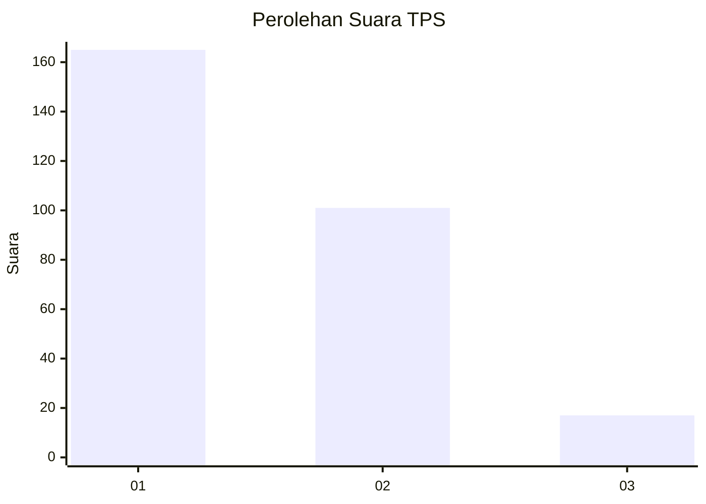
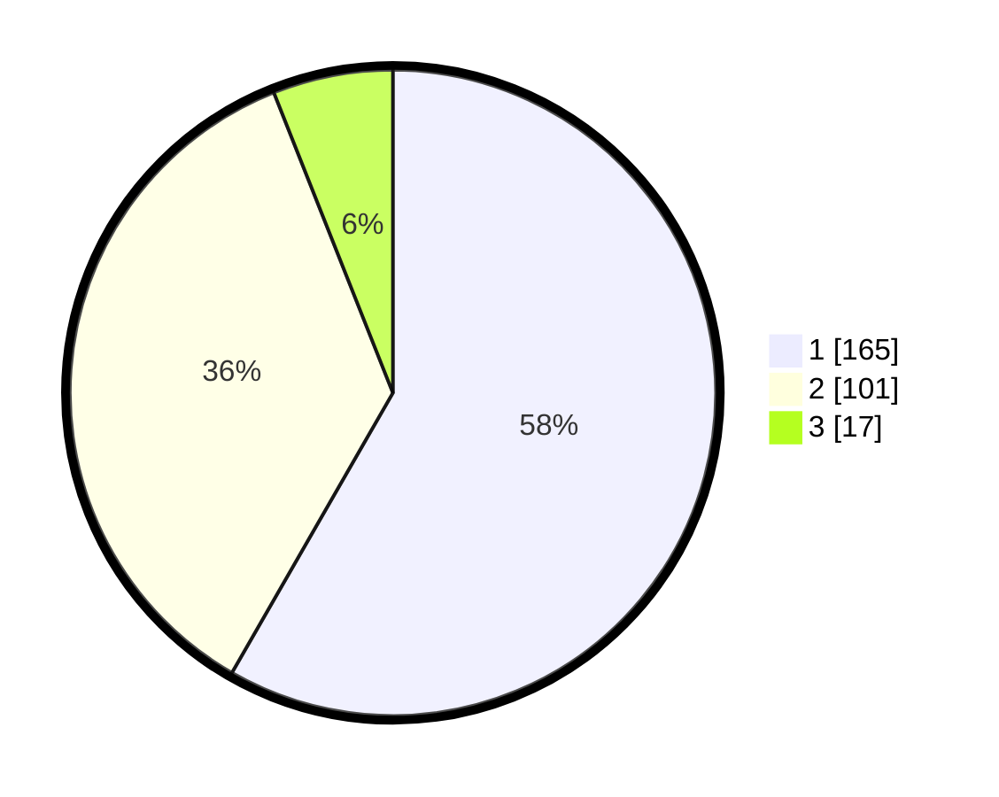

# Hasil

## Grafik

## Tabel

| No. | Nama Paslon    | Suara | Suara (raw) | Persentase |
|:--- |:-------------- | -----:| -----------:| ----------:|
| 1   | ANIES MUHAIMIN | 165   | [165][p-1]  | 58,30      |
| 2   | PRABOWO GIBRAN | 101   | [101][p-2]  | 35,69      |
| 3   | GANJAR MAHFUD  | 17    | [17][p-3]   | 6,01       |

[p-1]: https://github.com/gigit-pemilu/pemilu-2024-35-jawa-timur/blob/main/pilpres/hitung-suara/sub/35-jawa-timur/sub/26-bangkalan/sub/06-geger/sub/2001-kombangan/sub/008-tps/sub/paslon-1.txt
[p-2]: https://github.com/gigit-pemilu/pemilu-2024-35-jawa-timur/blob/main/pilpres/hitung-suara/sub/35-jawa-timur/sub/26-bangkalan/sub/06-geger/sub/2001-kombangan/sub/008-tps/sub/paslon-2.txt
[p-3]: https://github.com/gigit-pemilu/pemilu-2024-35-jawa-timur/blob/main/pilpres/hitung-suara/sub/35-jawa-timur/sub/26-bangkalan/sub/06-geger/sub/2001-kombangan/sub/008-tps/sub/paslon-3.txt

## Foto C Plano

https://sirekap-obj-formc.kpu.go.id/27ac/pemilu/ppwp/35/26/06/20/01/3526062001008-20240215-083115--2c688a6b-bbde-4218-bab8-b95e86fe4fc7.jpg

https://sirekap-obj-formc.kpu.go.id/27ac/pemilu/ppwp/35/26/06/20/01/3526062001008-20240215-083150--b8bf9701-c34d-4f86-bca1-18363cf481e9.jpg

https://sirekap-obj-formc.kpu.go.id/27ac/pemilu/ppwp/35/26/06/20/01/3526062001008-20240215-083249--1f35672c-5b1c-455c-ae8f-432f71c60614.jpg

## Metadata

| Key        | Value               |
| ---------- | ------------------- |
| Time Stamp | 2024-02-19 06:16:00 |

