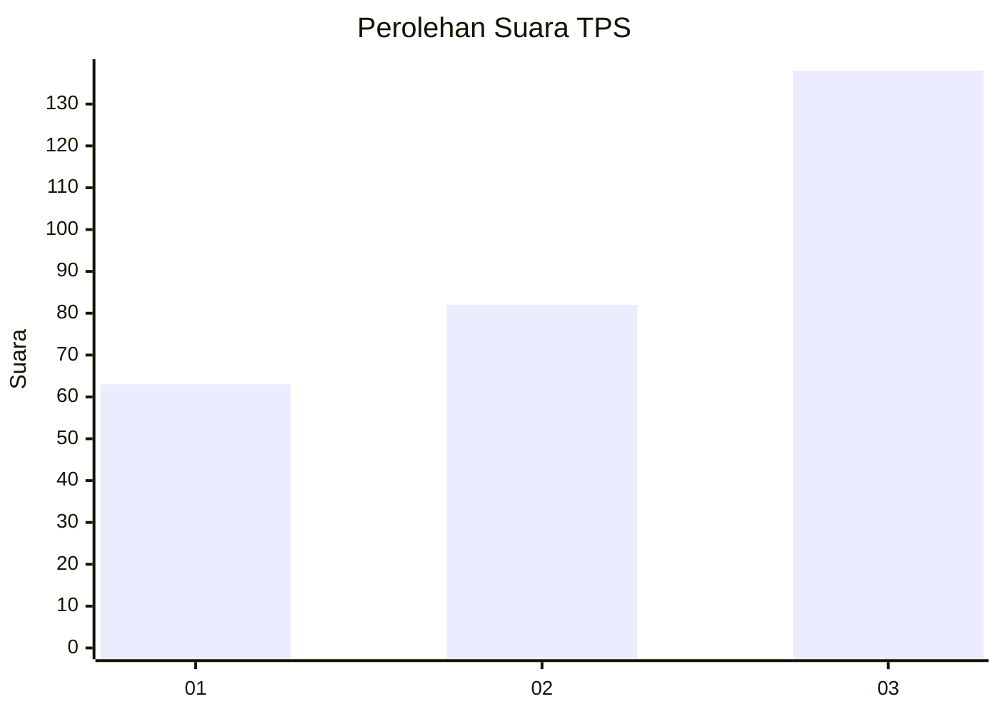
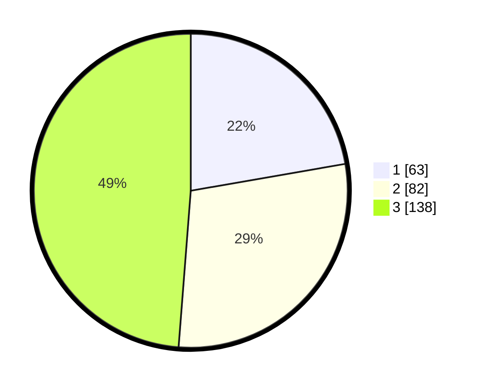

# Hasil

## Grafik

## Tabel

| No. | Nama Paslon    | Suara | Suara (raw) | Persentase |
|:--- |:-------------- | -----:| -----------:| ----------:|
| 1   | ANIES MUHAIMIN | 63    | [63][p-1]   | 22,26      |
| 2   | PRABOWO GIBRAN | 82    | [82][p-2]   | 28,98      |
| 3   | GANJAR MAHFUD  | 138   | [138][p-3]  | 48,76      |

[p-1]: https://github.com/gigit-pemilu/pemilu-2024/blob/main/pilpres/hitung-suara/sub/35-jawa-timur/sub/26-bangkalan/sub/06-geger/sub/2001-kombangan/sub/009-tps/sub/paslon-1.txt
[p-2]: https://github.com/gigit-pemilu/pemilu-2024/blob/main/pilpres/hitung-suara/sub/35-jawa-timur/sub/26-bangkalan/sub/06-geger/sub/2001-kombangan/sub/009-tps/sub/paslon-2.txt
[p-3]: https://github.com/gigit-pemilu/pemilu-2024/blob/main/pilpres/hitung-suara/sub/35-jawa-timur/sub/26-bangkalan/sub/06-geger/sub/2001-kombangan/sub/009-tps/sub/paslon-3.txt

## Foto C Plano

https://sirekap-obj-formc.kpu.go.id/0f82/pemilu/ppwp/35/26/06/20/01/3526062001009-20240214-220848--7e3526d5-4b71-4cc5-a85e-9c09c94726eb.jpg

https://sirekap-obj-formc.kpu.go.id/0f82/pemilu/ppwp/35/26/06/20/01/3526062001009-20240214-221323--3a416d46-b934-43dc-bc5d-2e614fbeb5c9.jpg

https://sirekap-obj-formc.kpu.go.id/0f82/pemilu/ppwp/35/26/06/20/01/3526062001009-20240214-221421--ac646d8e-cc61-4a2a-a91d-fdeb5aa245e3.jpg

## Metadata

| Key        | Value               |
| ---------- | ------------------- |
| Time Stamp | 2024-02-25 21:00:00 |

