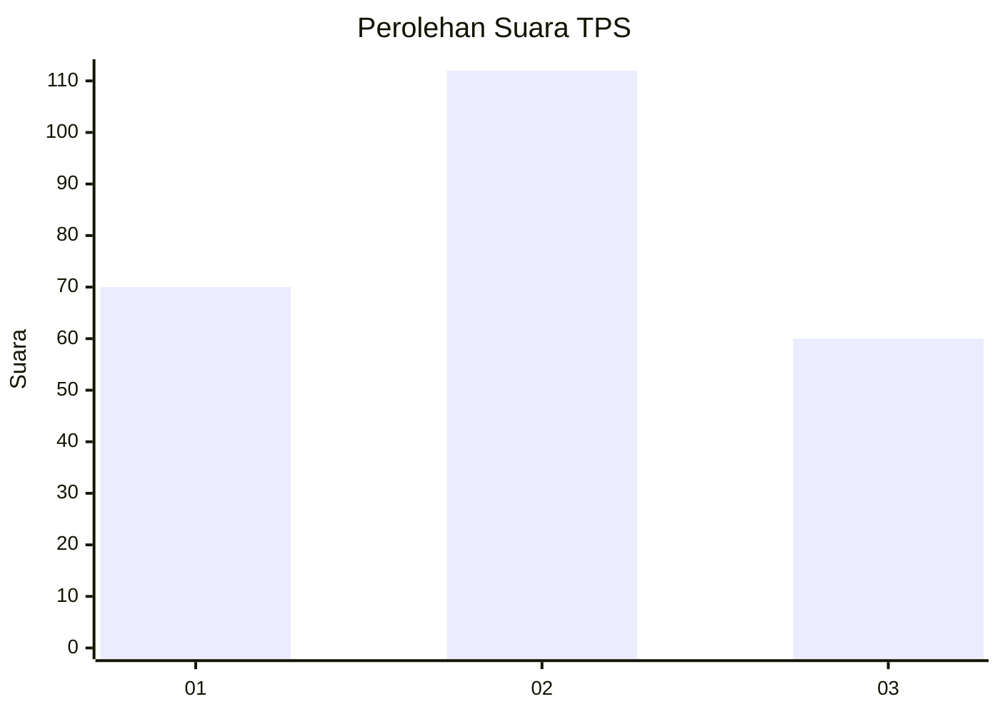
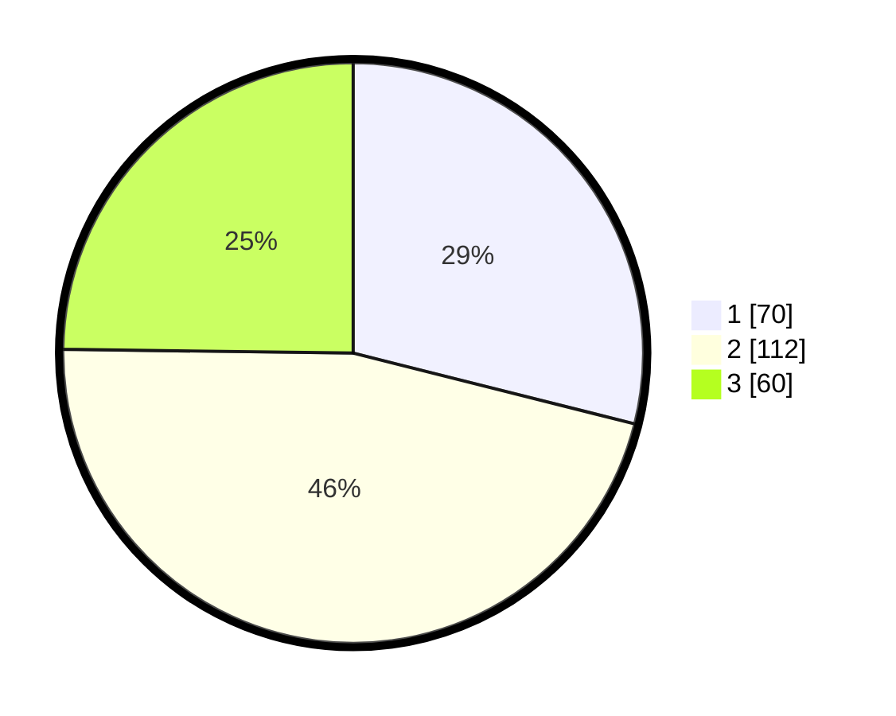

# Hasil

## Grafik

## Tabel

| No. | Nama Paslon    | Suara | Suara (raw) | Persentase |
|:--- |:-------------- | -----:| -----------:| ----------:|
| 1   | ANIES MUHAIMIN | 70    | [70][p-1]   | 28,93      |
| 2   | PRABOWO GIBRAN | 112   | [112][p-2]  | 46,28      |
| 3   | GANJAR MAHFUD  | 60    | [60][p-3]   | 24,79      |

[p-1]: https://github.com/gigit-pemilu/pemilu-2024/blob/main/pilpres/hitung-suara/sub/35-jawa-timur/sub/26-bangkalan/sub/06-geger/sub/2001-kombangan/sub/011-tps/sub/paslon-1.txt
[p-2]: https://github.com/gigit-pemilu/pemilu-2024/blob/main/pilpres/hitung-suara/sub/35-jawa-timur/sub/26-bangkalan/sub/06-geger/sub/2001-kombangan/sub/011-tps/sub/paslon-2.txt
[p-3]: https://github.com/gigit-pemilu/pemilu-2024/blob/main/pilpres/hitung-suara/sub/35-jawa-timur/sub/26-bangkalan/sub/06-geger/sub/2001-kombangan/sub/011-tps/sub/paslon-3.txt

## Foto C Plano

https://sirekap-obj-formc.kpu.go.id/8e24/pemilu/ppwp/35/26/06/20/01/3526062001011-20240214-190642--885b4ab3-cbff-436a-906a-a70a29918dbd.jpg

https://sirekap-obj-formc.kpu.go.id/8e24/pemilu/ppwp/35/26/06/20/01/3526062001011-20240214-190616--ebe9b049-18a4-4978-b543-ce94e6c17111.jpg

https://sirekap-obj-formc.kpu.go.id/8e24/pemilu/ppwp/35/26/06/20/01/3526062001011-20240214-190606--de4a3c17-587f-400a-b0ab-5d4b389421a3.jpg

## Metadata

| Key        | Value               |
| ---------- | ------------------- |
| Time Stamp | 2024-02-19 06:16:00 |

