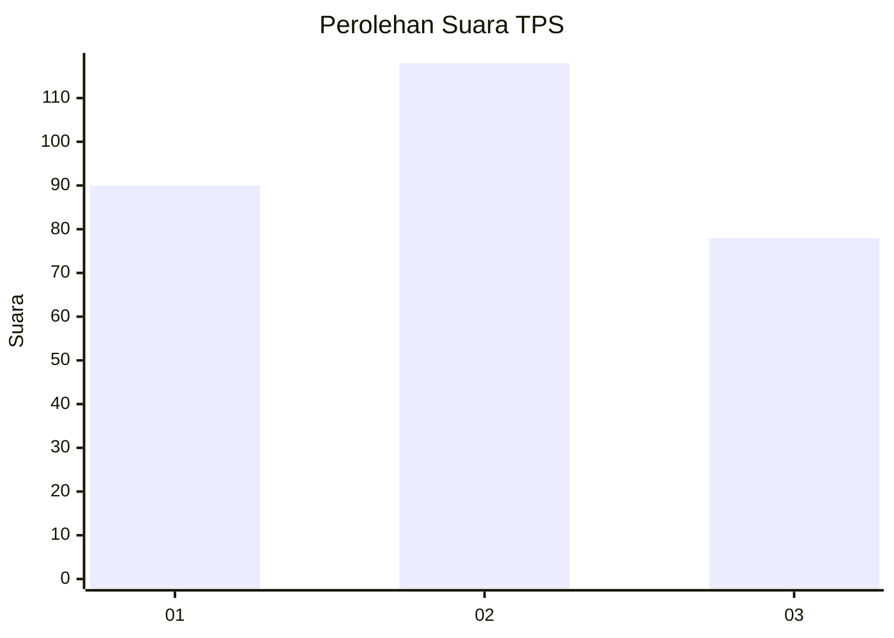
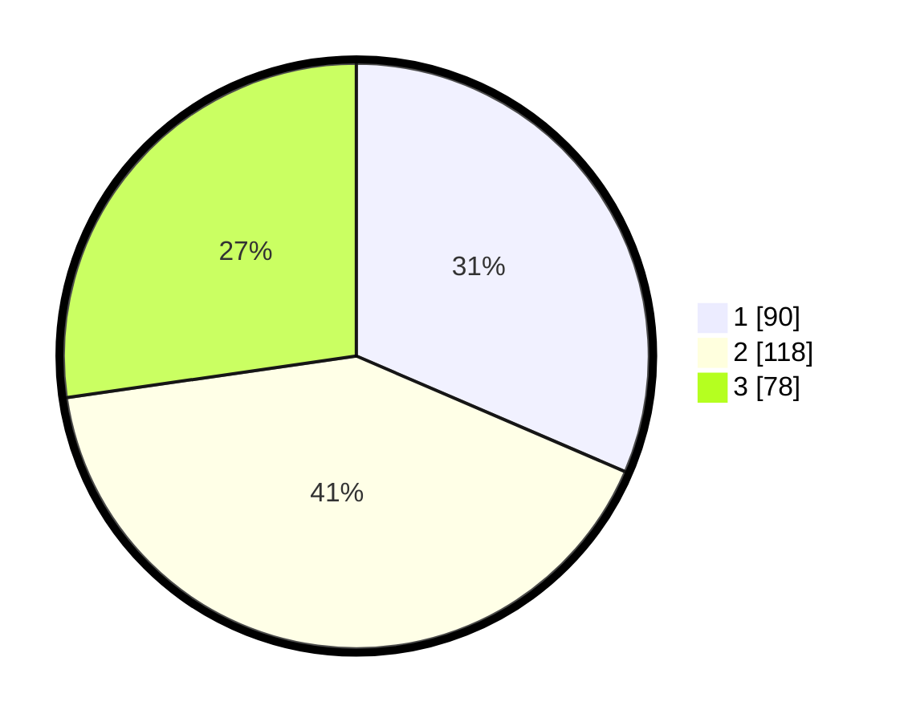

# Hasil

## Grafik

## Tabel

| No. | Nama Paslon    | Suara | Suara (raw) | Persentase |
|:--- |:-------------- | -----:| -----------:| ----------:|
| 1   | ANIES MUHAIMIN | 90    | [90][p-1]   | 31,47      |
| 2   | PRABOWO GIBRAN | 118   | [118][p-2]  | 41,26      |
| 3   | GANJAR MAHFUD  | 78    | [78][p-3]   | 27,27      |

[p-1]: https://github.com/gigit-pemilu/pemilu-2024/blob/main/pilpres/hitung-suara/sub/35-jawa-timur/sub/26-bangkalan/sub/06-geger/sub/2001-kombangan/sub/015-tps/sub/paslon-1.txt
[p-2]: https://github.com/gigit-pemilu/pemilu-2024/blob/main/pilpres/hitung-suara/sub/35-jawa-timur/sub/26-bangkalan/sub/06-geger/sub/2001-kombangan/sub/015-tps/sub/paslon-2.txt
[p-3]: https://github.com/gigit-pemilu/pemilu-2024/blob/main/pilpres/hitung-suara/sub/35-jawa-timur/sub/26-bangkalan/sub/06-geger/sub/2001-kombangan/sub/015-tps/sub/paslon-3.txt

## Foto C Plano

https://sirekap-obj-formc.kpu.go.id/9c5b/pemilu/ppwp/35/26/06/20/01/3526062001015-20240214-191311--84aa6625-aac3-48ab-b8db-ac0cf12195d5.jpg

https://sirekap-obj-formc.kpu.go.id/9c5b/pemilu/ppwp/35/26/06/20/01/3526062001015-20240214-190358--a1ba078f-9f26-42b1-9248-20e3e959da47.jpg

https://sirekap-obj-formc.kpu.go.id/9c5b/pemilu/ppwp/35/26/06/20/01/3526062001015-20240214-190408--e891cfa7-451e-4b09-a579-7353d8b66c7e.jpg

## Metadata

| Key        | Value               |
| ---------- | ------------------- |
| Time Stamp | 2024-02-19 06:16:00 |

