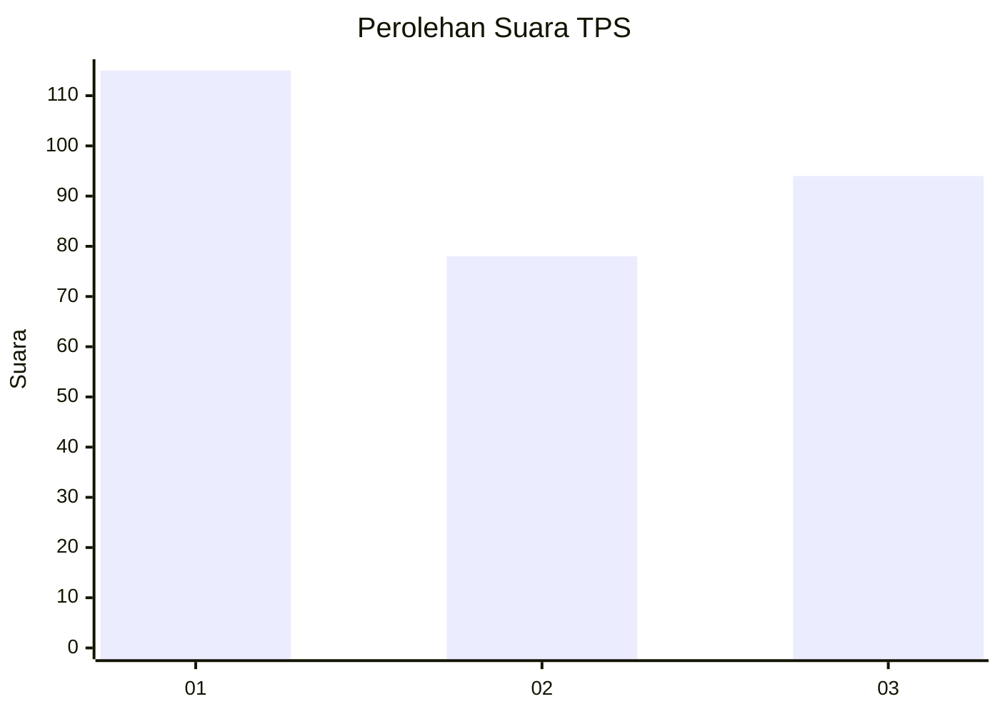
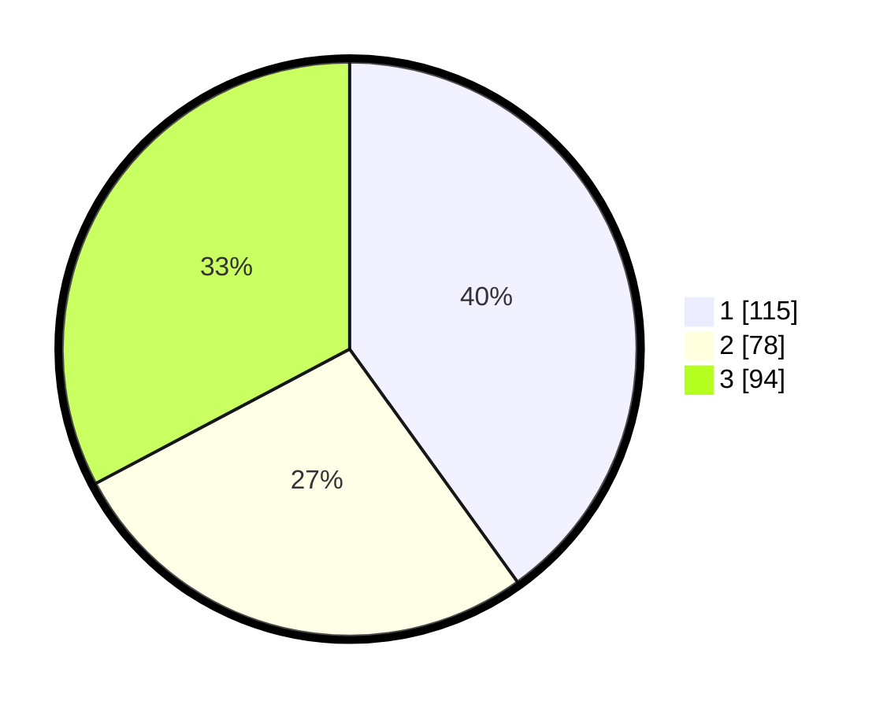

# Hasil

## Grafik

## Tabel

| No. | Nama Paslon    | Suara | Suara (raw) | Persentase |
|:--- |:-------------- | -----:| -----------:| ----------:|
| 1   | ANIES MUHAIMIN | 115   | [115][p-1]  | 40,07      |
| 2   | PRABOWO GIBRAN | 78    | [78][p-2]   | 27,18      |
| 3   | GANJAR MAHFUD  | 94    | [94][p-3]   | 32,75      |

[p-1]: https://github.com/gigit-pemilu/pemilu-2024/blob/main/pilpres/hitung-suara/sub/35-jawa-timur/sub/26-bangkalan/sub/06-geger/sub/2001-kombangan/sub/017-tps/sub/paslon-1.txt
[p-2]: https://github.com/gigit-pemilu/pemilu-2024/blob/main/pilpres/hitung-suara/sub/35-jawa-timur/sub/26-bangkalan/sub/06-geger/sub/2001-kombangan/sub/017-tps/sub/paslon-2.txt
[p-3]: https://github.com/gigit-pemilu/pemilu-2024/blob/main/pilpres/hitung-suara/sub/35-jawa-timur/sub/26-bangkalan/sub/06-geger/sub/2001-kombangan/sub/017-tps/sub/paslon-3.txt

## Foto C Plano

https://sirekap-obj-formc.kpu.go.id/8bf5/pemilu/ppwp/35/26/06/20/01/3526062001017-20240214-204359--f1ea191e-d7a1-4f68-9d5b-f48a28bd6748.jpg

https://sirekap-obj-formc.kpu.go.id/8bf5/pemilu/ppwp/35/26/06/20/01/3526062001017-20240214-205409--e2280071-efc5-4783-b1c8-633269632ca8.jpg

https://sirekap-obj-formc.kpu.go.id/8bf5/pemilu/ppwp/35/26/06/20/01/3526062001017-20240214-201546--a4518b91-057e-4927-b0cb-933b60118a68.jpg

## Metadata

| Key        | Value               |
| ---------- | ------------------- |
| Time Stamp | 2024-02-15 15:00:29 |

