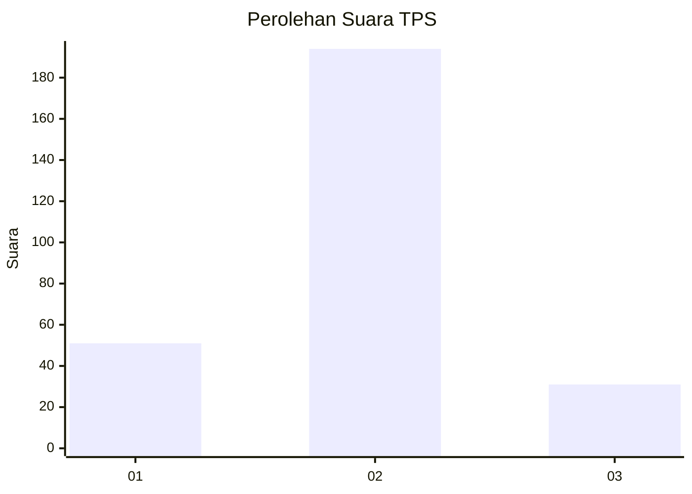
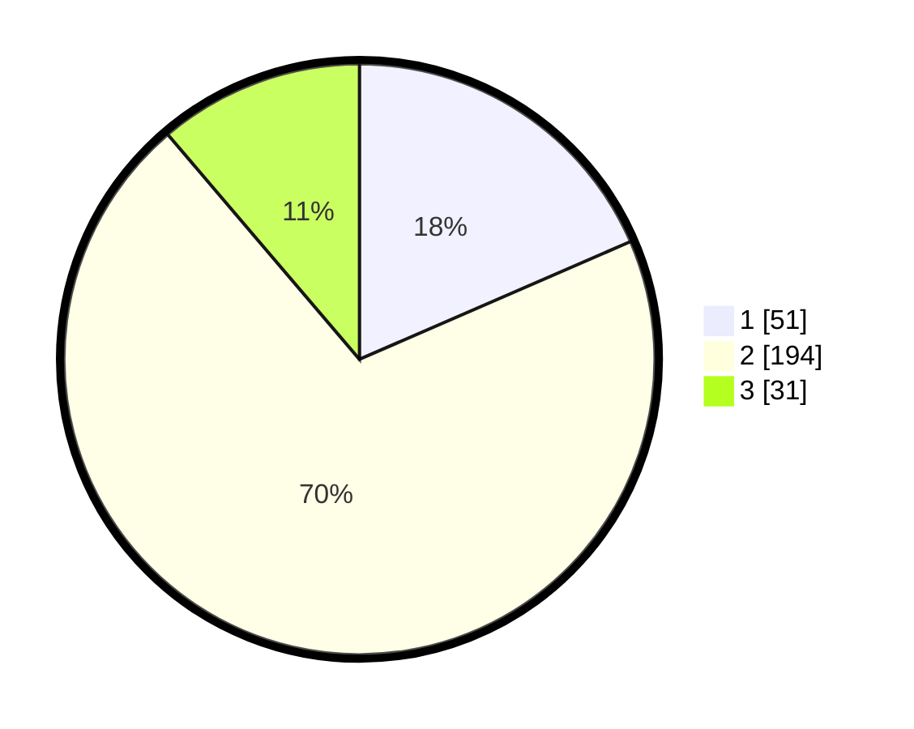

# Hasil

## Grafik

## Tabel

| No. | Nama Paslon    | Suara | Suara (raw) | Persentase |
|:--- |:-------------- | -----:| -----------:| ----------:|
| 1   | ANIES MUHAIMIN | 51    | [51][p-1]   | 18,48      |
| 2   | PRABOWO GIBRAN | 194   | [194][p-2]  | 70,29      |
| 3   | GANJAR MAHFUD  | 31    | [31][p-3]   | 11,23      |

[p-1]: https://github.com/gigit-pemilu/pemilu-2024-35-jawa-timur/blob/main/pilpres/hitung-suara/sub/35-jawa-timur/sub/26-bangkalan/sub/06-geger/sub/2001-kombangan/sub/018-tps/sub/paslon-1.txt
[p-2]: https://github.com/gigit-pemilu/pemilu-2024-35-jawa-timur/blob/main/pilpres/hitung-suara/sub/35-jawa-timur/sub/26-bangkalan/sub/06-geger/sub/2001-kombangan/sub/018-tps/sub/paslon-2.txt
[p-3]: https://github.com/gigit-pemilu/pemilu-2024-35-jawa-timur/blob/main/pilpres/hitung-suara/sub/35-jawa-timur/sub/26-bangkalan/sub/06-geger/sub/2001-kombangan/sub/018-tps/sub/paslon-3.txt

## Foto C Plano

https://sirekap-obj-formc.kpu.go.id/d41b/pemilu/ppwp/35/26/06/20/01/3526062001018-20240215-074955--61a51cf3-6e2f-421a-baf1-7d9c2472d114.jpg

https://sirekap-obj-formc.kpu.go.id/d41b/pemilu/ppwp/35/26/06/20/01/3526062001018-20240215-075240--5d3db2ca-5e76-474b-8b56-c6f86e722914.jpg

https://sirekap-obj-formc.kpu.go.id/d41b/pemilu/ppwp/35/26/06/20/01/3526062001018-20240214-214744--0d457771-78f3-4dbe-a38d-2b099e3ecc24.jpg

## Metadata

| Key        | Value               |
| ---------- | ------------------- |
| Time Stamp | 2024-02-21 21:00:04 |

