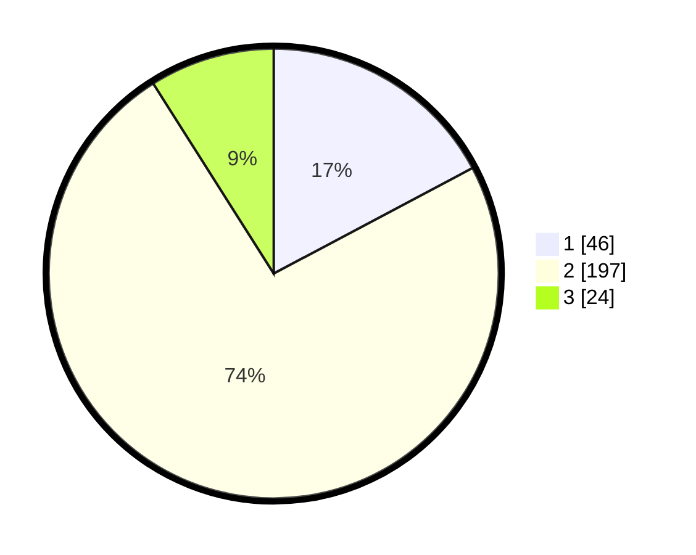

# Hasil

## Grafik

## Tabel

| No. | Nama Paslon    | Suara | Suara (raw) | Persentase |
|:--- |:-------------- | -----:| -----------:| ----------:|
| 1   | ANIES MUHAIMIN | 46    | [46][p-1]   | 17,23      |
| 2   | PRABOWO GIBRAN | 197   | [197][p-2]  | 73,78      |
| 3   | GANJAR MAHFUD  | 24    | [24][p-3]   | 8,99       |

[p-1]: https://github.com/gigit-pemilu/pemilu-2024/blob/main/pilpres/hitung-suara/sub/35-jawa-timur/sub/26-bangkalan/sub/06-geger/sub/2001-kombangan/sub/019-tps/sub/paslon-1.txt
[p-2]: https://github.com/gigit-pemilu/pemilu-2024/blob/main/pilpres/hitung-suara/sub/35-jawa-timur/sub/26-bangkalan/sub/06-geger/sub/2001-kombangan/sub/019-tps/sub/paslon-2.txt
[p-3]: https://github.com/gigit-pemilu/pemilu-2024/blob/main/pilpres/hitung-suara/sub/35-jawa-timur/sub/26-bangkalan/sub/06-geger/sub/2001-kombangan/sub/019-tps/sub/paslon-3.txt

## Foto C Plano

https://sirekap-obj-formc.kpu.go.id/13a4/pemilu/ppwp/35/26/06/20/01/3526062001019-20240221-231643--16a700fe-0b82-4379-8b1f-adac8837a37c.jpg

https://sirekap-obj-formc.kpu.go.id/13a4/pemilu/ppwp/35/26/06/20/01/3526062001019-20240214-193232--5acb2e78-9aee-4eb8-b661-62ba381cc18d.jpg

https://sirekap-obj-formc.kpu.go.id/13a4/pemilu/ppwp/35/26/06/20/01/3526062001019-20240214-193323--2f08d149-f9a3-4edc-9226-2e9be60f9808.jpg

## Metadata

| Key        | Value               |
| ---------- | ------------------- |
| Time Stamp | 2024-02-22 00:00:00 |

