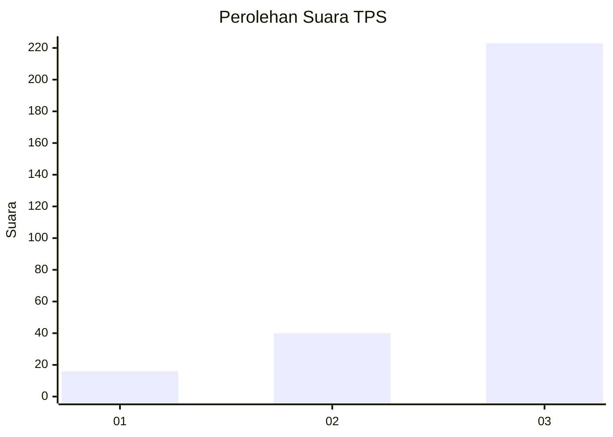
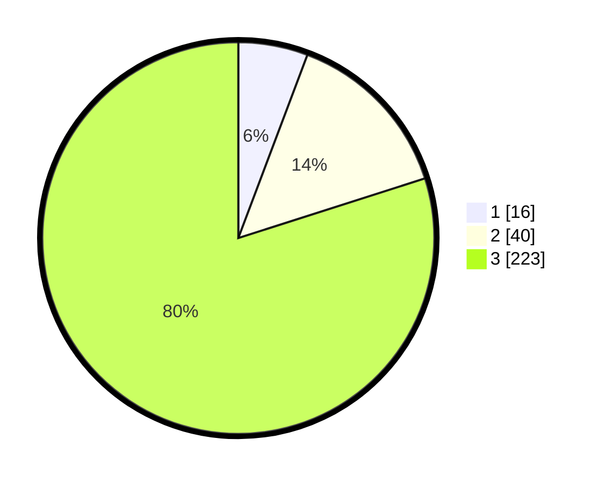

# Hasil

## Grafik

## Tabel

| No. | Nama Paslon    | Suara | Suara (raw) | Persentase |
|:--- |:-------------- | -----:| -----------:| ----------:|
| 1   | ANIES MUHAIMIN | 16    | [16][p-1]   | 5,73       |
| 2   | PRABOWO GIBRAN | 40    | [40][p-2]   | 14,34      |
| 3   | GANJAR MAHFUD  | 223   | [223][p-3]  | 79,93      |

[p-1]: https://github.com/gigit-pemilu/pemilu-2024-35-jawa-timur/blob/main/pilpres/hitung-suara/sub/35-jawa-timur/sub/26-bangkalan/sub/06-geger/sub/2003-katol-barat/sub/001-tps/sub/paslon-1.txt
[p-2]: https://github.com/gigit-pemilu/pemilu-2024-35-jawa-timur/blob/main/pilpres/hitung-suara/sub/35-jawa-timur/sub/26-bangkalan/sub/06-geger/sub/2003-katol-barat/sub/001-tps/sub/paslon-2.txt
[p-3]: https://github.com/gigit-pemilu/pemilu-2024-35-jawa-timur/blob/main/pilpres/hitung-suara/sub/35-jawa-timur/sub/26-bangkalan/sub/06-geger/sub/2003-katol-barat/sub/001-tps/sub/paslon-3.txt

## Foto C Plano

https://sirekap-obj-formc.kpu.go.id/a6a6/pemilu/ppwp/35/26/06/20/03/3526062003001-20240215-094616--9b5d70b3-a219-4435-89f0-ae1079a70cb7.jpg

https://sirekap-obj-formc.kpu.go.id/a6a6/pemilu/ppwp/35/26/06/20/03/3526062003001-20240215-094607--a2cd2626-57f2-415c-8b1a-7f08baf4e365.jpg

https://sirekap-obj-formc.kpu.go.id/a6a6/pemilu/ppwp/35/26/06/20/03/3526062003001-20240215-094412--ef6930b1-ed2c-4448-a5f4-eb2dd3e77966.jpg

## Metadata

| Key        | Value               |
| ---------- | ------------------- |
| Time Stamp | 2024-02-19 06:16:00 |

