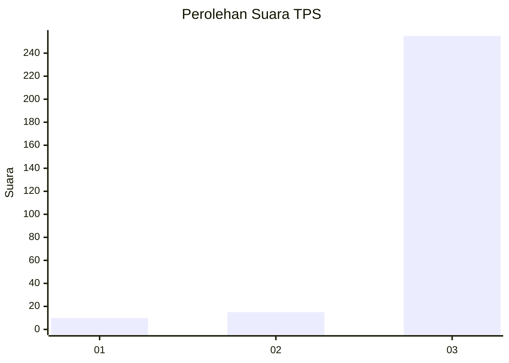
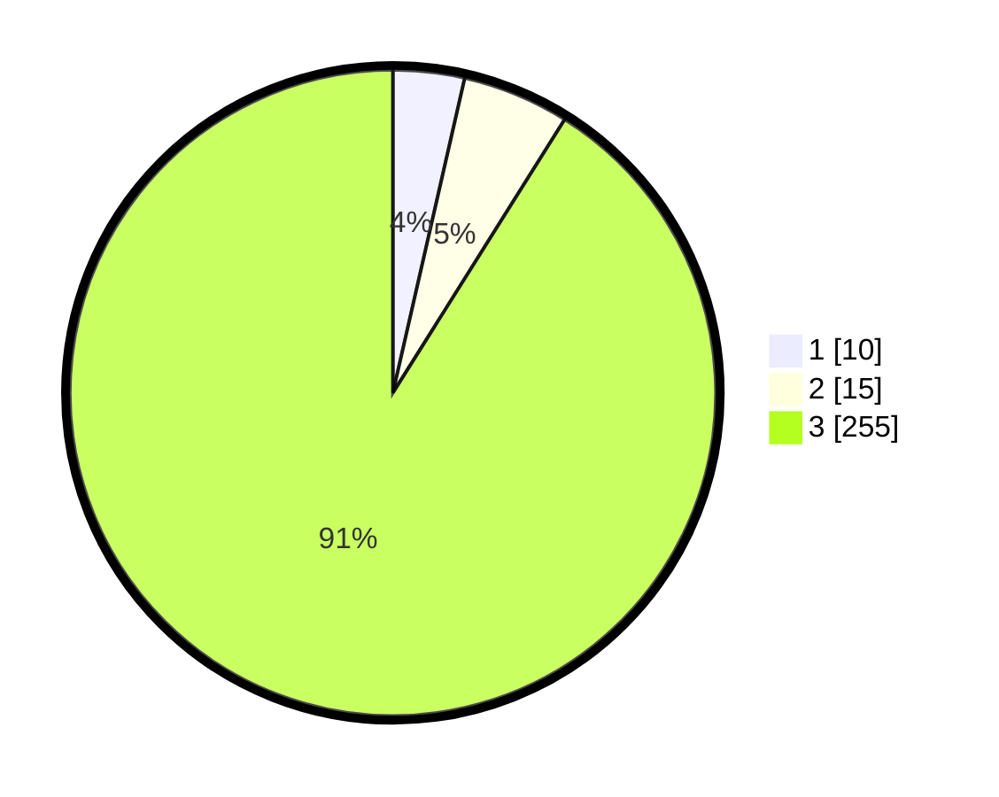

# Hasil

## Grafik

## Tabel

| No. | Nama Paslon    | Suara | Suara (raw) | Persentase |
|:--- |:-------------- | -----:| -----------:| ----------:|
| 1   | ANIES MUHAIMIN | 10    | [10][p-1]   | 3,57       |
| 2   | PRABOWO GIBRAN | 15    | [15][p-2]   | 5,36       |
| 3   | GANJAR MAHFUD  | 255   | [255][p-3]  | 91,07      |

[p-1]: https://github.com/gigit-pemilu/pemilu-2024/blob/main/pilpres/hitung-suara/sub/35-jawa-timur/sub/26-bangkalan/sub/06-geger/sub/2003-katol-barat/sub/002-tps/sub/paslon-1.txt
[p-2]: https://github.com/gigit-pemilu/pemilu-2024/blob/main/pilpres/hitung-suara/sub/35-jawa-timur/sub/26-bangkalan/sub/06-geger/sub/2003-katol-barat/sub/002-tps/sub/paslon-2.txt
[p-3]: https://github.com/gigit-pemilu/pemilu-2024/blob/main/pilpres/hitung-suara/sub/35-jawa-timur/sub/26-bangkalan/sub/06-geger/sub/2003-katol-barat/sub/002-tps/sub/paslon-3.txt

## Foto C Plano

https://sirekap-obj-formc.kpu.go.id/bd3c/pemilu/ppwp/35/26/06/20/03/3526062003002-20240215-094802--082ca891-49cd-47ea-8283-137021ae5da2.jpg

https://sirekap-obj-formc.kpu.go.id/bd3c/pemilu/ppwp/35/26/06/20/03/3526062003002-20240215-094924--c190a553-3f10-4d66-a2cd-659c14951246.jpg

https://sirekap-obj-formc.kpu.go.id/bd3c/pemilu/ppwp/35/26/06/20/03/3526062003002-20240215-095222--3818dcf6-a4ef-4779-9533-93a80e6e307c.jpg

## Metadata

| Key        | Value               |
| ---------- | ------------------- |
| Time Stamp | 2024-02-21 21:00:04 |

