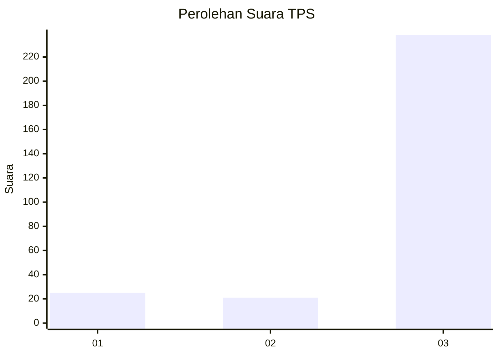
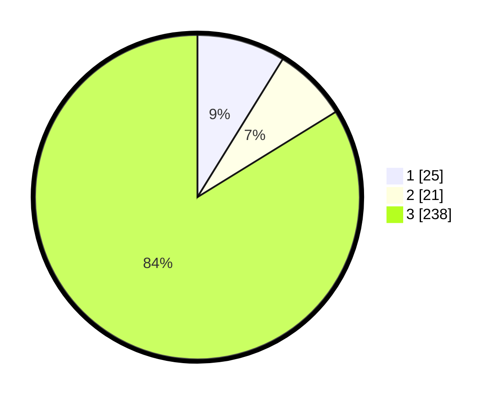

# Hasil

## Grafik

## Tabel

| No. | Nama Paslon    | Suara | Suara (raw) | Persentase |
|:--- |:-------------- | -----:| -----------:| ----------:|
| 1   | ANIES MUHAIMIN | 25    | [25][p-1]   | 8,80       |
| 2   | PRABOWO GIBRAN | 21    | [21][p-2]   | 7,39       |
| 3   | GANJAR MAHFUD  | 238   | [238][p-3]  | 83,80      |

[p-1]: https://github.com/gigit-pemilu/pemilu-2024/blob/main/pilpres/hitung-suara/sub/35-jawa-timur/sub/26-bangkalan/sub/06-geger/sub/2003-katol-barat/sub/004-tps/sub/paslon-1.txt
[p-2]: https://github.com/gigit-pemilu/pemilu-2024/blob/main/pilpres/hitung-suara/sub/35-jawa-timur/sub/26-bangkalan/sub/06-geger/sub/2003-katol-barat/sub/004-tps/sub/paslon-2.txt
[p-3]: https://github.com/gigit-pemilu/pemilu-2024/blob/main/pilpres/hitung-suara/sub/35-jawa-timur/sub/26-bangkalan/sub/06-geger/sub/2003-katol-barat/sub/004-tps/sub/paslon-3.txt

## Foto C Plano

https://sirekap-obj-formc.kpu.go.id/49f3/pemilu/ppwp/35/26/06/20/03/3526062003004-20240215-182931--d42ec23a-177b-462c-b037-b6a1d747b020.jpg

https://sirekap-obj-formc.kpu.go.id/49f3/pemilu/ppwp/35/26/06/20/03/3526062003004-20240215-160640--5b26dd80-5bd6-4734-a5f6-f89463d8d56b.jpg

https://sirekap-obj-formc.kpu.go.id/49f3/pemilu/ppwp/35/26/06/20/03/3526062003004-20240215-183309--2fd09676-9116-4f25-b33d-93686722c876.jpg

## Metadata

| Key        | Value               |
| ---------- | ------------------- |
| Time Stamp | 2024-02-16 10:30:29 |

