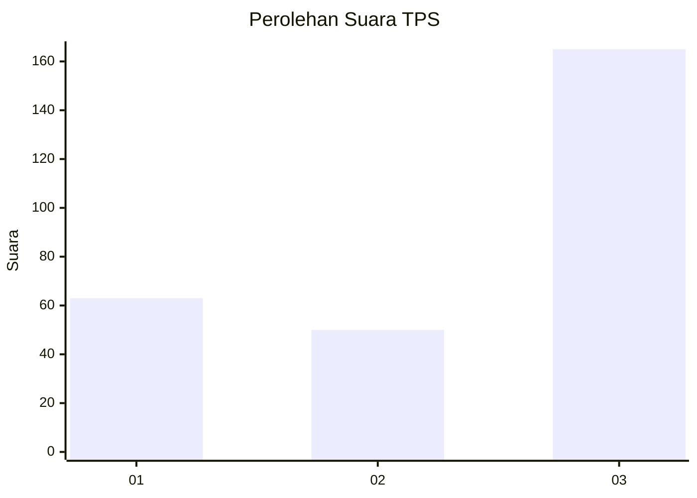
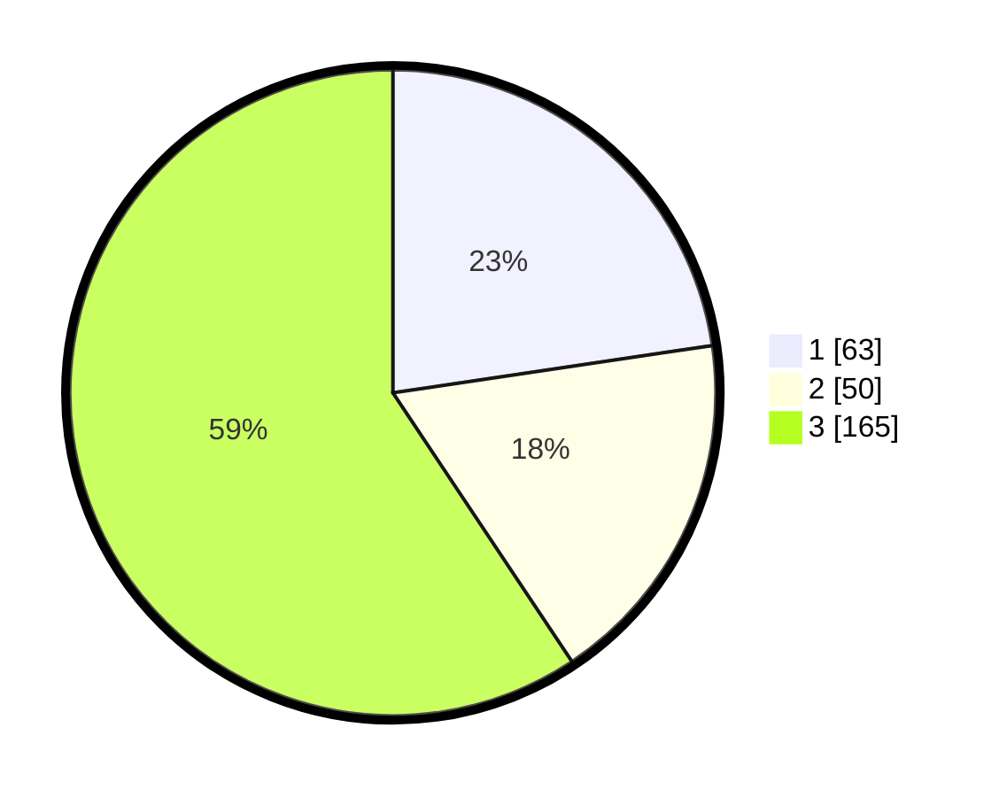

# Hasil

## Grafik

## Tabel

| No. | Nama Paslon    | Suara | Suara (raw) | Persentase |
|:--- |:-------------- | -----:| -----------:| ----------:|
| 1   | ANIES MUHAIMIN | 63    | [63][p-1]   | 22,66      |
| 2   | PRABOWO GIBRAN | 50    | [50][p-2]   | 17,99      |
| 3   | GANJAR MAHFUD  | 165   | [165][p-3]  | 59,35      |

[p-1]: https://github.com/gigit-pemilu/pemilu-2024/blob/main/pilpres/hitung-suara/sub/35-jawa-timur/sub/26-bangkalan/sub/06-geger/sub/2003-katol-barat/sub/006-tps/sub/paslon-1.txt
[p-2]: https://github.com/gigit-pemilu/pemilu-2024/blob/main/pilpres/hitung-suara/sub/35-jawa-timur/sub/26-bangkalan/sub/06-geger/sub/2003-katol-barat/sub/006-tps/sub/paslon-2.txt
[p-3]: https://github.com/gigit-pemilu/pemilu-2024/blob/main/pilpres/hitung-suara/sub/35-jawa-timur/sub/26-bangkalan/sub/06-geger/sub/2003-katol-barat/sub/006-tps/sub/paslon-3.txt

## Foto C Plano

https://sirekap-obj-formc.kpu.go.id/27f6/pemilu/ppwp/35/26/06/20/03/3526062003006-20240215-061316--ba4ab1e7-4f68-40e6-8a1b-9dd97118a4a4.jpg

https://sirekap-obj-formc.kpu.go.id/27f6/pemilu/ppwp/35/26/06/20/03/3526062003006-20240215-061503--786b86ab-904f-42a6-83b3-2e476441d0cf.jpg

https://sirekap-obj-formc.kpu.go.id/27f6/pemilu/ppwp/35/26/06/20/03/3526062003006-20240215-061614--fc12b6e6-d52a-4ef7-8d6c-557ae0c7a443.jpg

## Metadata

| Key        | Value               |
| ---------- | ------------------- |
| Time Stamp | 2024-02-19 06:16:00 |

