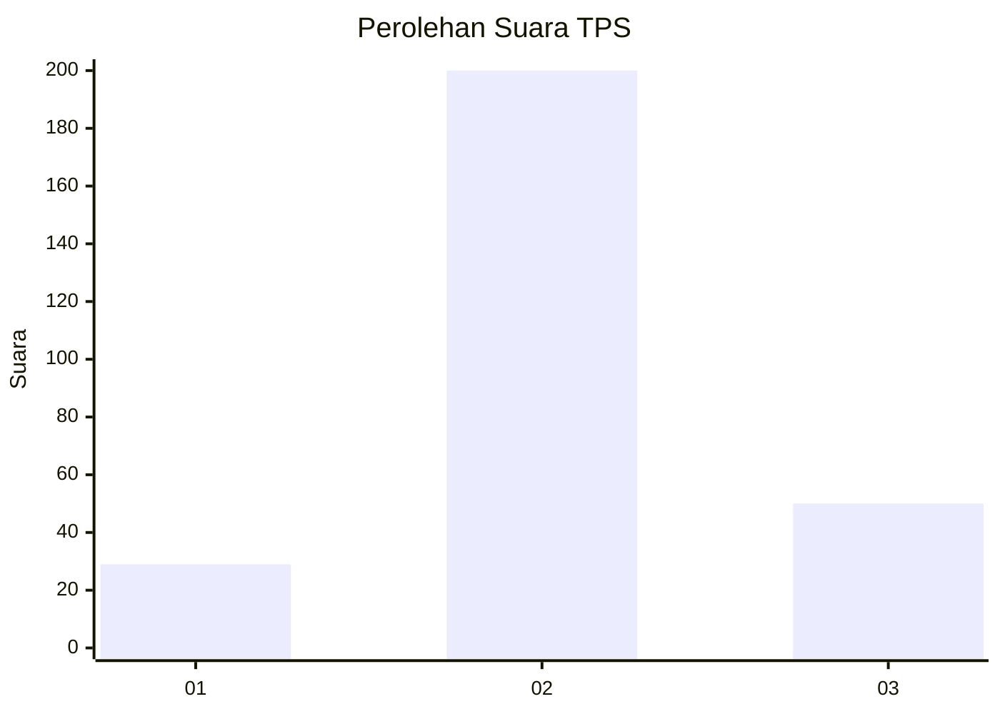
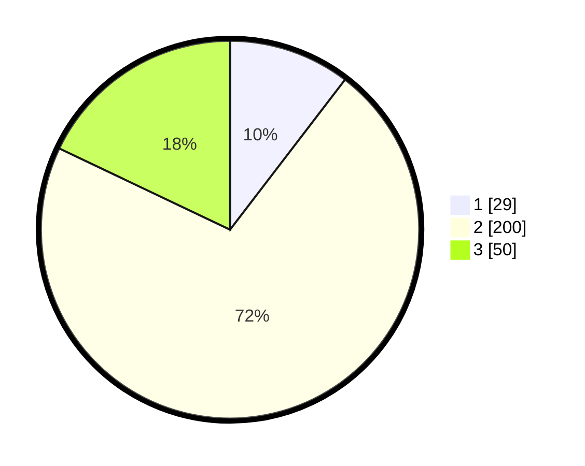

# Hasil

## Grafik

## Tabel

| No. | Nama Paslon    | Suara | Suara (raw) | Persentase |
|:--- |:-------------- | -----:| -----------:| ----------:|
| 1   | ANIES MUHAIMIN | 29    | [29][p-1]   | 10,39      |
| 2   | PRABOWO GIBRAN | 200   | [200][p-2]  | 71,68      |
| 3   | GANJAR MAHFUD  | 50    | [50][p-3]   | 17,92      |

[p-1]: https://github.com/gigit-pemilu/pemilu-2024-35-jawa-timur/blob/main/pilpres/hitung-suara/sub/35-jawa-timur/sub/26-bangkalan/sub/06-geger/sub/2003-katol-barat/sub/008-tps/sub/paslon-1.txt
[p-2]: https://github.com/gigit-pemilu/pemilu-2024-35-jawa-timur/blob/main/pilpres/hitung-suara/sub/35-jawa-timur/sub/26-bangkalan/sub/06-geger/sub/2003-katol-barat/sub/008-tps/sub/paslon-2.txt
[p-3]: https://github.com/gigit-pemilu/pemilu-2024-35-jawa-timur/blob/main/pilpres/hitung-suara/sub/35-jawa-timur/sub/26-bangkalan/sub/06-geger/sub/2003-katol-barat/sub/008-tps/sub/paslon-3.txt

## Foto C Plano

https://sirekap-obj-formc.kpu.go.id/8fbf/pemilu/ppwp/35/26/06/20/03/3526062003008-20240215-124123--308af10b-47df-4d97-81ff-de594eaf8dd3.jpg

https://sirekap-obj-formc.kpu.go.id/8fbf/pemilu/ppwp/35/26/06/20/03/3526062003008-20240215-124501--57f4a197-692f-4fa9-85c1-590046f39d0e.jpg

https://sirekap-obj-formc.kpu.go.id/8fbf/pemilu/ppwp/35/26/06/20/03/3526062003008-20240215-125010--cf99e590-3d47-423f-97ed-f3278b0e38b7.jpg

## Metadata

| Key        | Value               |
| ---------- | ------------------- |
| Time Stamp | 2024-02-21 15:00:00 |

