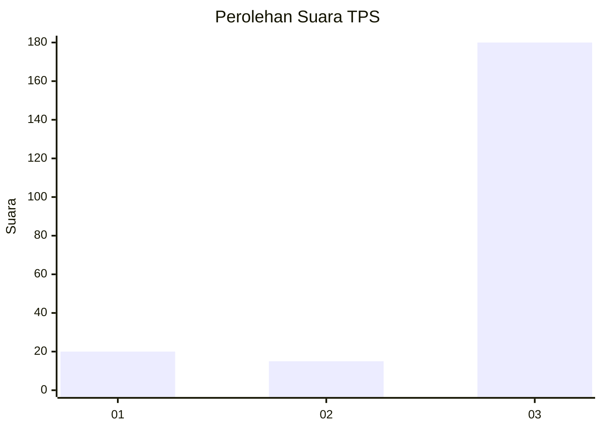
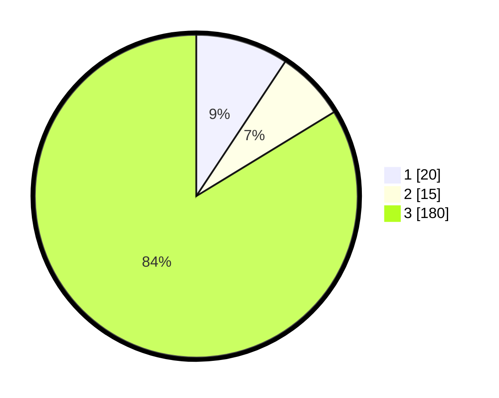

# Hasil

## Grafik

## Tabel

| No. | Nama Paslon    | Suara | Suara (raw) | Persentase |
|:--- |:-------------- | -----:| -----------:| ----------:|
| 1   | ANIES MUHAIMIN | 20    | [20][p-1]   | 9,30       |
| 2   | PRABOWO GIBRAN | 15    | [15][p-2]   | 6,98       |
| 3   | GANJAR MAHFUD  | 180   | [180][p-3]  | 83,72      |

[p-1]: https://github.com/gigit-pemilu/pemilu-2024-35-jawa-timur/blob/main/pilpres/hitung-suara/sub/35-jawa-timur/sub/26-bangkalan/sub/06-geger/sub/2003-katol-barat/sub/012-tps/sub/paslon-1.txt
[p-2]: https://github.com/gigit-pemilu/pemilu-2024-35-jawa-timur/blob/main/pilpres/hitung-suara/sub/35-jawa-timur/sub/26-bangkalan/sub/06-geger/sub/2003-katol-barat/sub/012-tps/sub/paslon-2.txt
[p-3]: https://github.com/gigit-pemilu/pemilu-2024-35-jawa-timur/blob/main/pilpres/hitung-suara/sub/35-jawa-timur/sub/26-bangkalan/sub/06-geger/sub/2003-katol-barat/sub/012-tps/sub/paslon-3.txt

## Foto C Plano

https://sirekap-obj-formc.kpu.go.id/e6e4/pemilu/ppwp/35/26/06/20/03/3526062003012-20240215-162541--07ca4a35-7257-49fb-8997-a9bd43c8c2f4.jpg

https://sirekap-obj-formc.kpu.go.id/e6e4/pemilu/ppwp/35/26/06/20/03/3526062003012-20240215-162649--95a8071c-0bc8-49cf-ba8d-d2d0f6893aa9.jpg

https://sirekap-obj-formc.kpu.go.id/e6e4/pemilu/ppwp/35/26/06/20/03/3526062003012-20240215-162740--b1cb2109-92cc-4fbb-9790-4d3e34c9ffe0.jpg

## Metadata

| Key        | Value               |
| ---------- | ------------------- |
| Time Stamp | 2024-02-21 15:00:00 |

