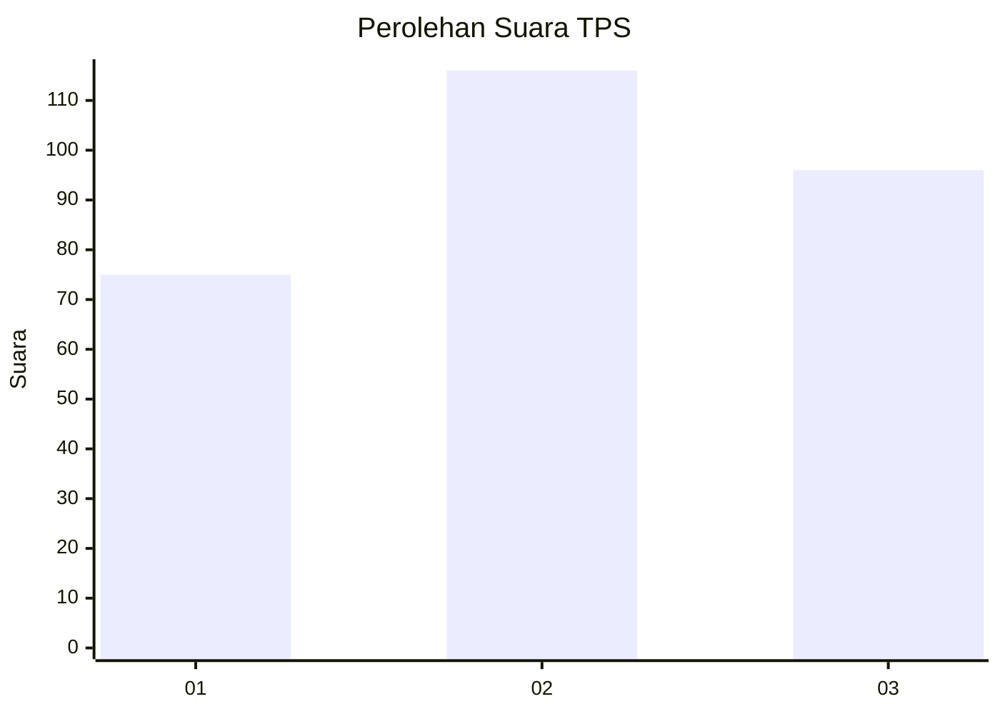
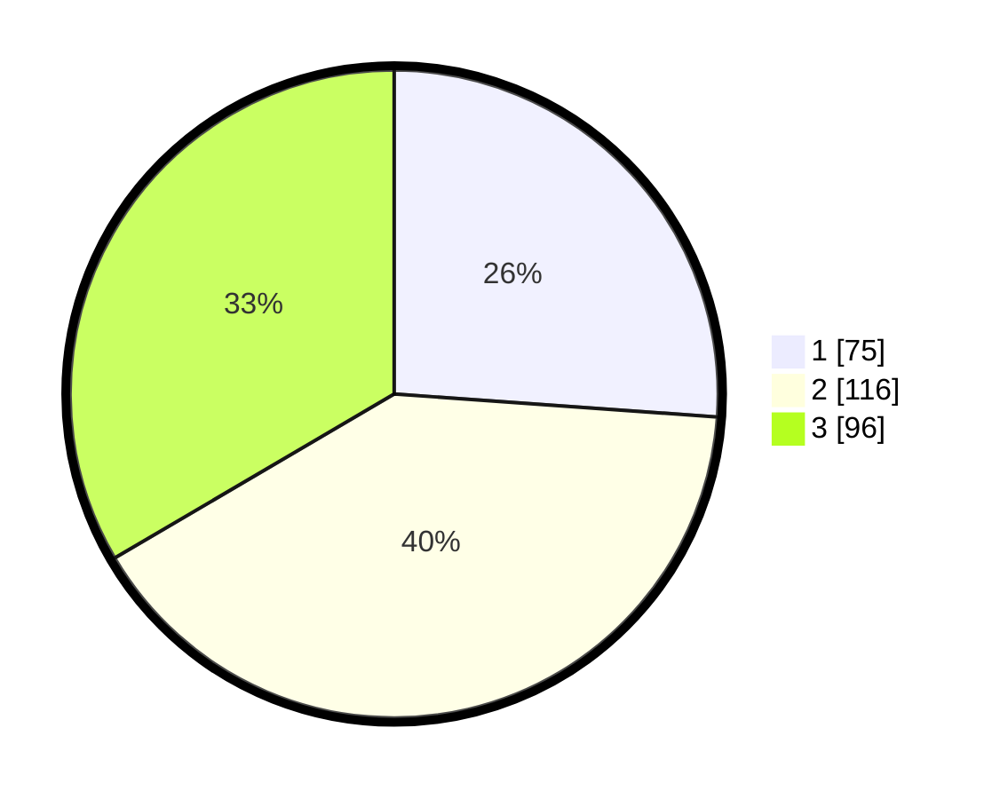

# Hasil

## Grafik

## Tabel

| No. | Nama Paslon    | Suara | Suara (raw) | Persentase |
|:--- |:-------------- | -----:| -----------:| ----------:|
| 1   | ANIES MUHAIMIN | 75    | [75][p-1]   | 26,13      |
| 2   | PRABOWO GIBRAN | 116   | [116][p-2]  | 40,42      |
| 3   | GANJAR MAHFUD  | 96    | [96][p-3]   | 33,45      |

[p-1]: https://github.com/gigit-pemilu/pemilu-2024/blob/main/pilpres/hitung-suara/sub/35-jawa-timur/sub/26-bangkalan/sub/06-geger/sub/2003-katol-barat/sub/014-tps/sub/paslon-1.txt
[p-2]: https://github.com/gigit-pemilu/pemilu-2024/blob/main/pilpres/hitung-suara/sub/35-jawa-timur/sub/26-bangkalan/sub/06-geger/sub/2003-katol-barat/sub/014-tps/sub/paslon-2.txt
[p-3]: https://github.com/gigit-pemilu/pemilu-2024/blob/main/pilpres/hitung-suara/sub/35-jawa-timur/sub/26-bangkalan/sub/06-geger/sub/2003-katol-barat/sub/014-tps/sub/paslon-3.txt

## Foto C Plano

https://sirekap-obj-formc.kpu.go.id/25f1/pemilu/ppwp/35/26/06/20/03/3526062003014-20240215-114852--ca2788ce-c177-44a2-8f74-4aabad76af73.jpg

https://sirekap-obj-formc.kpu.go.id/25f1/pemilu/ppwp/35/26/06/20/03/3526062003014-20240215-115229--031557e7-72b2-44c2-a3bb-c5317123473d.jpg

https://sirekap-obj-formc.kpu.go.id/25f1/pemilu/ppwp/35/26/06/20/03/3526062003014-20240215-115648--edddacf9-0e26-4f91-a561-f6011786f591.jpg

## Metadata

| Key        | Value               |
| ---------- | ------------------- |
| Time Stamp | 2024-02-19 06:16:00 |

