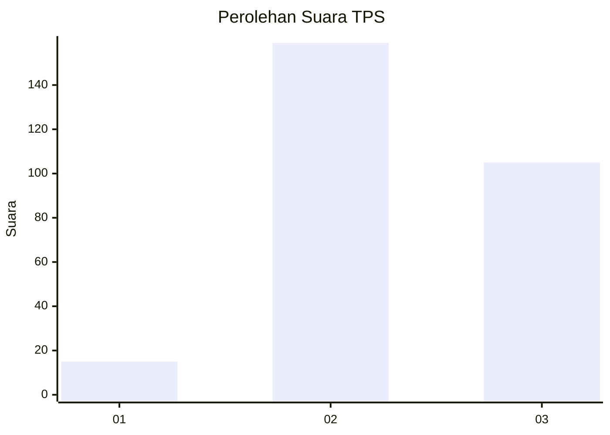
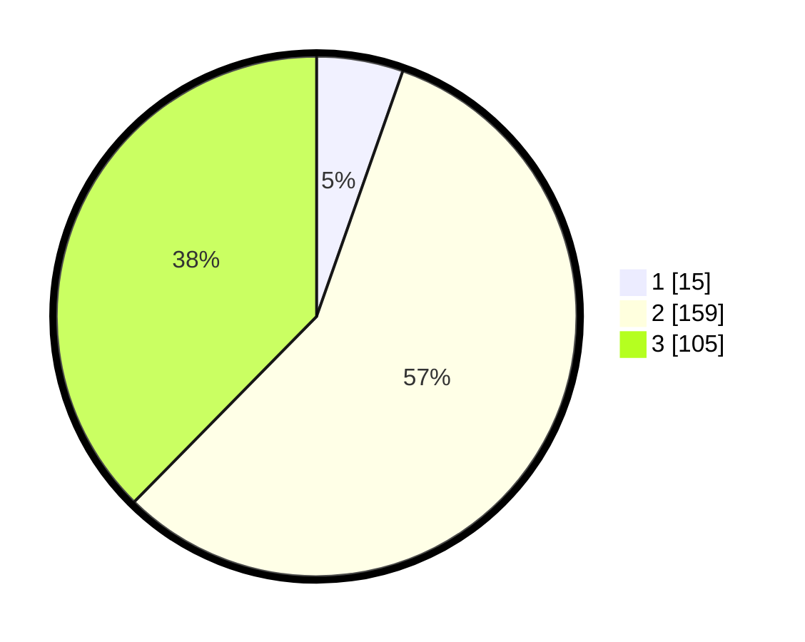

# Hasil

## Grafik

## Tabel

| No. | Nama Paslon    | Suara | Suara (raw) | Persentase |
|:--- |:-------------- | -----:| -----------:| ----------:|
| 1   | ANIES MUHAIMIN | 15    | [15][p-1]   | 5,38       |
| 2   | PRABOWO GIBRAN | 159   | [159][p-2]  | 56,99      |
| 3   | GANJAR MAHFUD  | 105   | [105][p-3]  | 37,63      |

[p-1]: https://github.com/gigit-pemilu/pemilu-2024-35-jawa-timur/blob/main/pilpres/hitung-suara/sub/35-jawa-timur/sub/26-bangkalan/sub/06-geger/sub/2003-katol-barat/sub/015-tps/sub/paslon-1.txt
[p-2]: https://github.com/gigit-pemilu/pemilu-2024-35-jawa-timur/blob/main/pilpres/hitung-suara/sub/35-jawa-timur/sub/26-bangkalan/sub/06-geger/sub/2003-katol-barat/sub/015-tps/sub/paslon-2.txt
[p-3]: https://github.com/gigit-pemilu/pemilu-2024-35-jawa-timur/blob/main/pilpres/hitung-suara/sub/35-jawa-timur/sub/26-bangkalan/sub/06-geger/sub/2003-katol-barat/sub/015-tps/sub/paslon-3.txt

## Foto C Plano

https://sirekap-obj-formc.kpu.go.id/b5bc/pemilu/ppwp/35/26/06/20/03/3526062003015-20240215-110701--afbb18e1-136a-4929-98d3-f455e5a98f30.jpg

https://sirekap-obj-formc.kpu.go.id/b5bc/pemilu/ppwp/35/26/06/20/03/3526062003015-20240215-111139--98efbf4b-c0f7-44c8-bb30-325e8392b109.jpg

https://sirekap-obj-formc.kpu.go.id/b5bc/pemilu/ppwp/35/26/06/20/03/3526062003015-20240215-161657--eddc3c7f-70e1-4134-b4d5-d5c15c280ffe.jpg

## Metadata

| Key        | Value               |
| ---------- | ------------------- |
| Time Stamp | 2024-02-15 18:30:25 |

