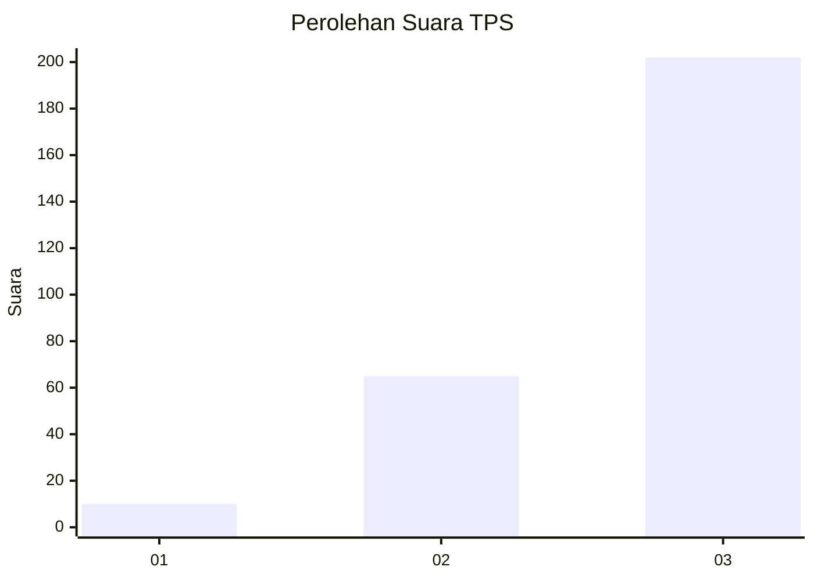
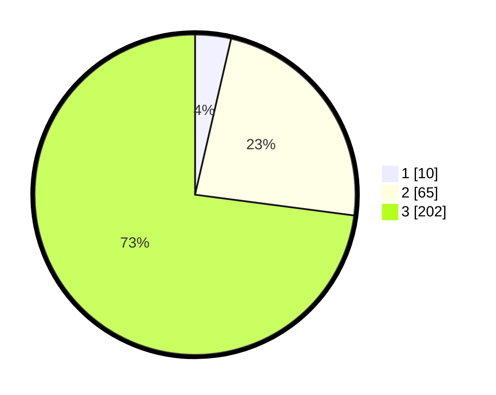

# Hasil

## Grafik

## Tabel

| No. | Nama Paslon    | Suara | Suara (raw) | Persentase |
|:--- |:-------------- | -----:| -----------:| ----------:|
| 1   | ANIES MUHAIMIN | 10    | [10][p-1]   | 3,61       |
| 2   | PRABOWO GIBRAN | 65    | [65][p-2]   | 23,47      |
| 3   | GANJAR MAHFUD  | 202   | [202][p-3]  | 72,92      |

[p-1]: https://github.com/gigit-pemilu/pemilu-2024-35-jawa-timur/blob/main/pilpres/hitung-suara/sub/35-jawa-timur/sub/26-bangkalan/sub/06-geger/sub/2005-lerpak/sub/007-tps/sub/paslon-1.txt
[p-2]: https://github.com/gigit-pemilu/pemilu-2024-35-jawa-timur/blob/main/pilpres/hitung-suara/sub/35-jawa-timur/sub/26-bangkalan/sub/06-geger/sub/2005-lerpak/sub/007-tps/sub/paslon-2.txt
[p-3]: https://github.com/gigit-pemilu/pemilu-2024-35-jawa-timur/blob/main/pilpres/hitung-suara/sub/35-jawa-timur/sub/26-bangkalan/sub/06-geger/sub/2005-lerpak/sub/007-tps/sub/paslon-3.txt

## Foto C Plano

https://sirekap-obj-formc.kpu.go.id/d030/pemilu/ppwp/35/26/06/20/05/3526062005007-20240215-132334--75cdcf83-bf81-4072-8963-64d8155ca229.jpg

https://sirekap-obj-formc.kpu.go.id/d030/pemilu/ppwp/35/26/06/20/05/3526062005007-20240215-132513--31dfc7f6-dec1-4642-928d-1e3848891412.jpg

https://sirekap-obj-formc.kpu.go.id/d030/pemilu/ppwp/35/26/06/20/05/3526062005007-20240215-132658--a2c40c87-4fe0-4ae4-bdcc-10dfb2c8e995.jpg

## Metadata

| Key        | Value               |
| ---------- | ------------------- |
| Time Stamp | 2024-02-19 06:16:00 |

