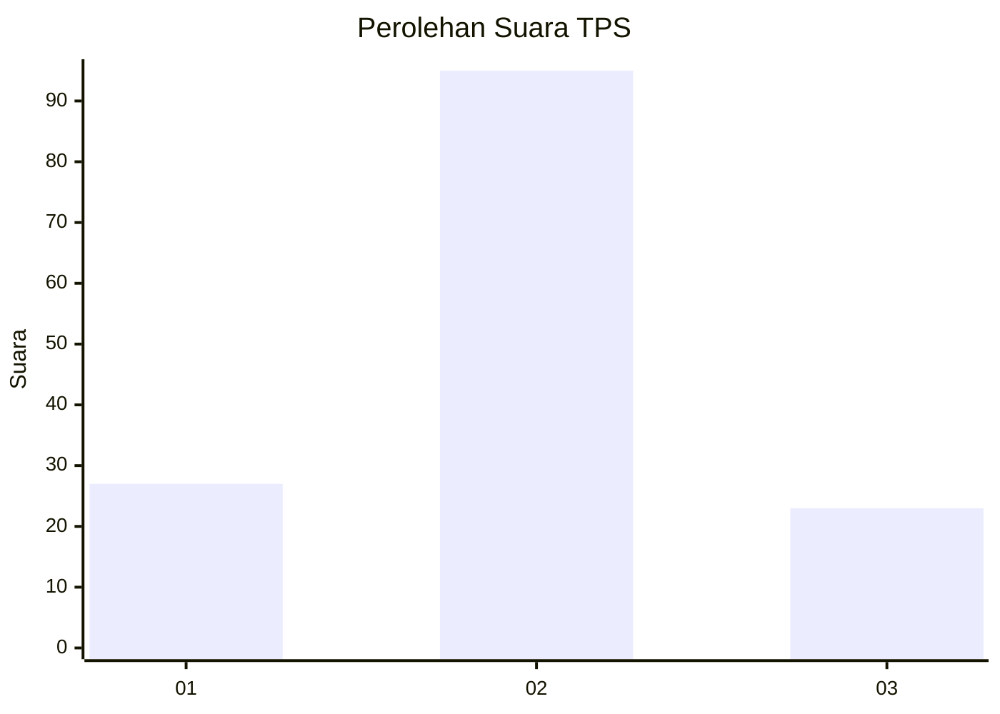
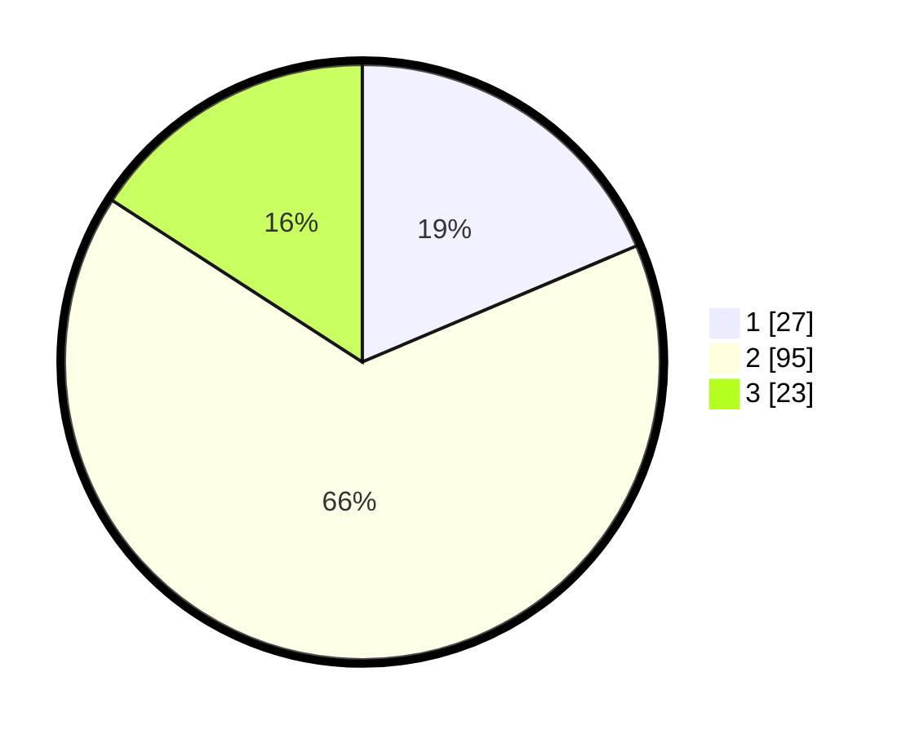

# Hasil

## Grafik

## Tabel

| No. | Nama Paslon    | Suara | Suara (raw) | Persentase |
|:--- |:-------------- | -----:| -----------:| ----------:|
| 1   | ANIES MUHAIMIN | 27    | [27][p-1]   | 18,62      |
| 2   | PRABOWO GIBRAN | 95    | [95][p-2]   | 65,52      |
| 3   | GANJAR MAHFUD  | 23    | [23][p-3]   | 15,86      |

[p-1]: https://github.com/gigit-pemilu/pemilu-2024-35-jawa-timur/blob/main/pilpres/hitung-suara/sub/35-jawa-timur/sub/26-bangkalan/sub/06-geger/sub/2005-lerpak/sub/012-tps/sub/paslon-1.txt
[p-2]: https://github.com/gigit-pemilu/pemilu-2024-35-jawa-timur/blob/main/pilpres/hitung-suara/sub/35-jawa-timur/sub/26-bangkalan/sub/06-geger/sub/2005-lerpak/sub/012-tps/sub/paslon-2.txt
[p-3]: https://github.com/gigit-pemilu/pemilu-2024-35-jawa-timur/blob/main/pilpres/hitung-suara/sub/35-jawa-timur/sub/26-bangkalan/sub/06-geger/sub/2005-lerpak/sub/012-tps/sub/paslon-3.txt

## Foto C Plano

https://sirekap-obj-formc.kpu.go.id/dbec/pemilu/ppwp/35/26/06/20/05/3526062005012-20240214-141424--5fa3c433-2a4b-44a1-8f9b-a6f2970036c7.jpg

https://sirekap-obj-formc.kpu.go.id/dbec/pemilu/ppwp/35/26/06/20/05/3526062005012-20240214-141450--82678bf5-9b4f-45be-bdde-ffb2877aa788.jpg

https://sirekap-obj-formc.kpu.go.id/dbec/pemilu/ppwp/35/26/06/20/05/3526062005012-20240214-141942--8d36cf62-83b5-497d-ad0c-15da5fc63e94.jpg

## Metadata

| Key        | Value               |
| ---------- | ------------------- |
| Time Stamp | 2024-02-21 21:00:04 |

