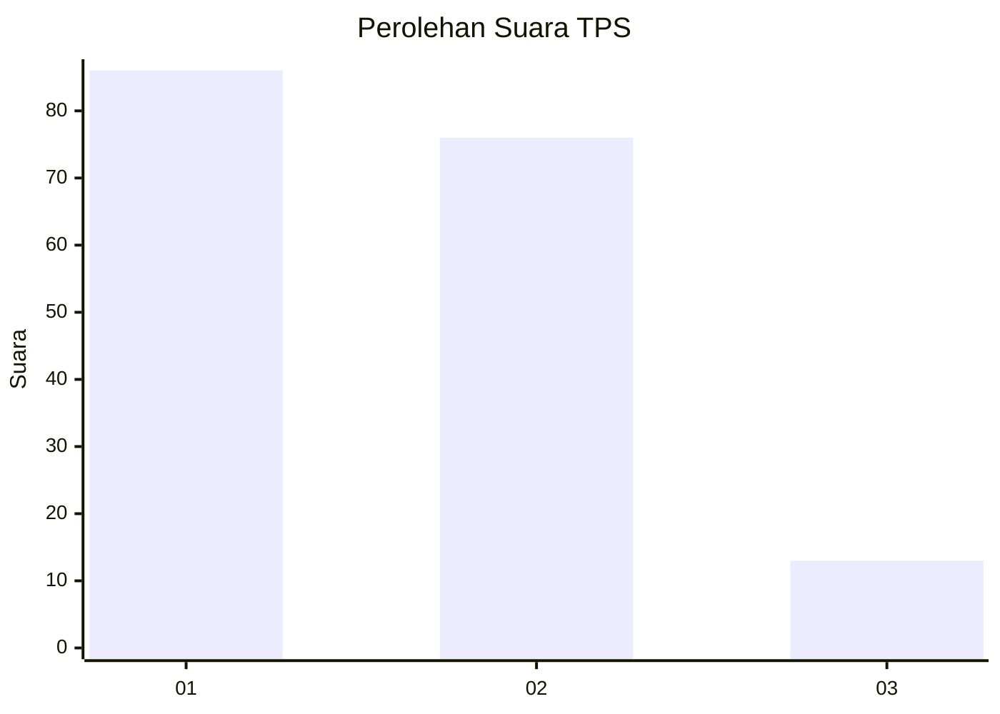
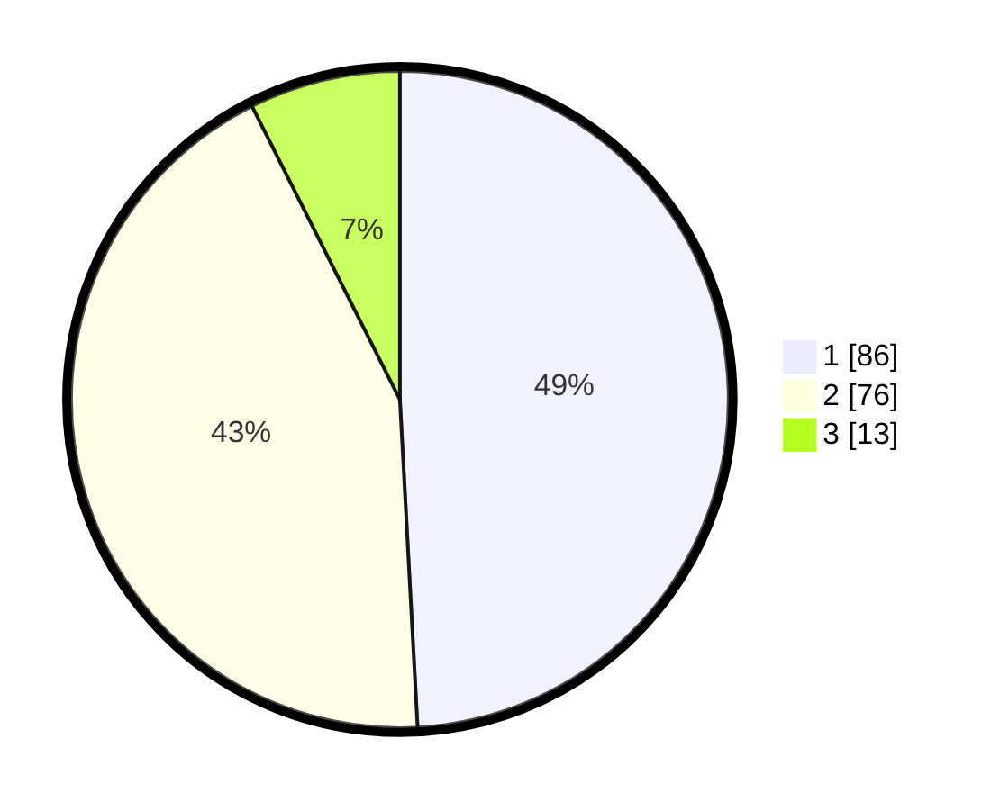

# Hasil

## Grafik

## Tabel

| No. | Nama Paslon    | Suara | Suara (raw) | Persentase |
|:--- |:-------------- | -----:| -----------:| ----------:|
| 1   | ANIES MUHAIMIN | 86    | [86][p-1]   | 49,14      |
| 2   | PRABOWO GIBRAN | 76    | [76][p-2]   | 43,43      |
| 3   | GANJAR MAHFUD  | 13    | [13][p-3]   | 7,43       |

[p-1]: https://github.com/gigit-pemilu/pemilu-2024/blob/main/pilpres/hitung-suara/sub/35-jawa-timur/sub/26-bangkalan/sub/06-geger/sub/2005-lerpak/sub/026-tps/sub/paslon-1.txt
[p-2]: https://github.com/gigit-pemilu/pemilu-2024/blob/main/pilpres/hitung-suara/sub/35-jawa-timur/sub/26-bangkalan/sub/06-geger/sub/2005-lerpak/sub/026-tps/sub/paslon-2.txt
[p-3]: https://github.com/gigit-pemilu/pemilu-2024/blob/main/pilpres/hitung-suara/sub/35-jawa-timur/sub/26-bangkalan/sub/06-geger/sub/2005-lerpak/sub/026-tps/sub/paslon-3.txt

## Foto C Plano

https://sirekap-obj-formc.kpu.go.id/d7a4/pemilu/ppwp/35/26/06/20/05/3526062005026-20240214-223601--a00d22ce-971e-4cd9-b058-4316b087763e.jpg

https://sirekap-obj-formc.kpu.go.id/d7a4/pemilu/ppwp/35/26/06/20/05/3526062005026-20240214-223805--a4e2e9f6-c539-4285-a15e-fa246ff44fa7.jpg

https://sirekap-obj-formc.kpu.go.id/d7a4/pemilu/ppwp/35/26/06/20/05/3526062005026-20240214-223851--fdffb2ae-14df-47af-829a-63dac4166d9c.jpg

## Metadata

| Key        | Value               |
| ---------- | ------------------- |
| Time Stamp | 2024-02-24 22:31:28 |

