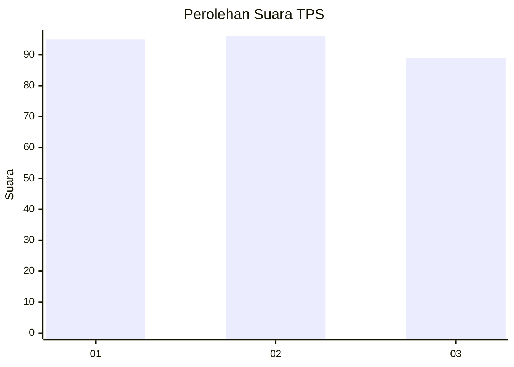
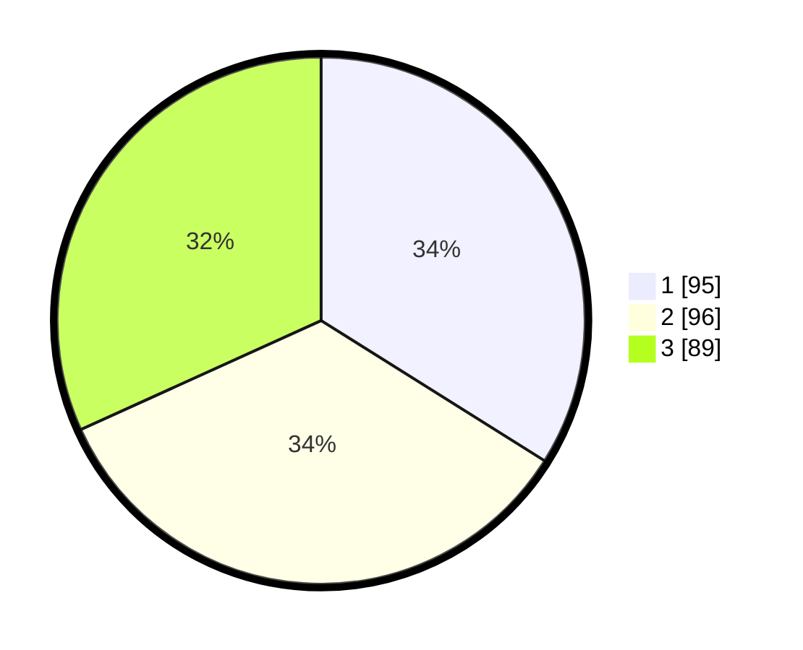

# Hasil

## Grafik

## Tabel

| No. | Nama Paslon    | Suara | Suara (raw) | Persentase |
|:--- |:-------------- | -----:| -----------:| ----------:|
| 1   | ANIES MUHAIMIN | 95    | [95][p-1]   | 33,93      |
| 2   | PRABOWO GIBRAN | 96    | [96][p-2]   | 34,29      |
| 3   | GANJAR MAHFUD  | 89    | [89][p-3]   | 31,79      |

[p-1]: https://github.com/gigit-pemilu/pemilu-2024-35-jawa-timur/blob/main/pilpres/hitung-suara/sub/35-jawa-timur/sub/26-bangkalan/sub/06-geger/sub/2006-geger/sub/002-tps/sub/paslon-1.txt
[p-2]: https://github.com/gigit-pemilu/pemilu-2024-35-jawa-timur/blob/main/pilpres/hitung-suara/sub/35-jawa-timur/sub/26-bangkalan/sub/06-geger/sub/2006-geger/sub/002-tps/sub/paslon-2.txt
[p-3]: https://github.com/gigit-pemilu/pemilu-2024-35-jawa-timur/blob/main/pilpres/hitung-suara/sub/35-jawa-timur/sub/26-bangkalan/sub/06-geger/sub/2006-geger/sub/002-tps/sub/paslon-3.txt

## Foto C Plano

https://sirekap-obj-formc.kpu.go.id/43ba/pemilu/ppwp/35/26/06/20/06/3526062006002-20240214-132306--116310dd-3a08-46b4-ae5e-1d4f2229d61b.jpg

https://sirekap-obj-formc.kpu.go.id/43ba/pemilu/ppwp/35/26/06/20/06/3526062006002-20240214-132714--4a8589bb-fda1-436e-81b0-26563f5a8842.jpg

https://sirekap-obj-formc.kpu.go.id/43ba/pemilu/ppwp/35/26/06/20/06/3526062006002-20240214-133004--4f0cb628-b20c-4e9f-93db-c81981c3f71f.jpg

## Metadata

| Key        | Value               |
| ---------- | ------------------- |
| Time Stamp | 2024-02-19 11:00:00 |

