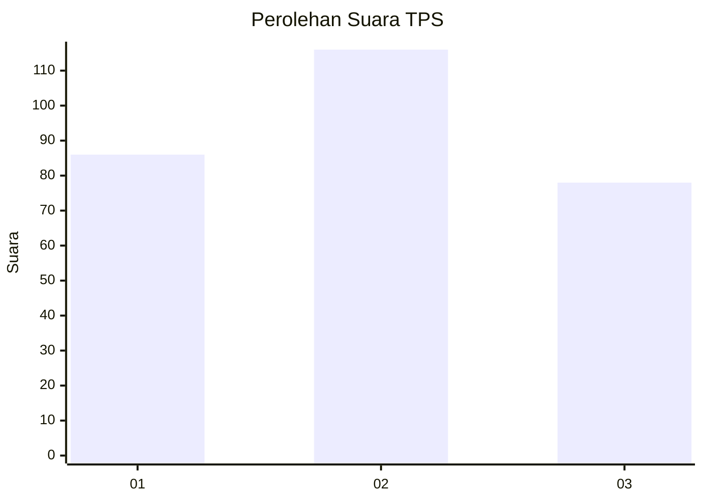
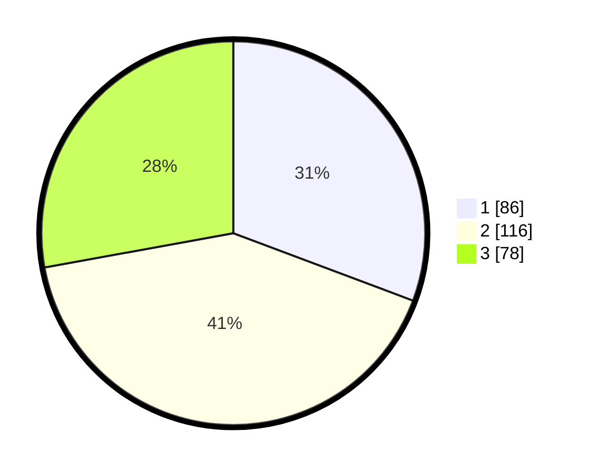

# Hasil

## Grafik

## Tabel

| No. | Nama Paslon    | Suara | Suara (raw) | Persentase |
|:--- |:-------------- | -----:| -----------:| ----------:|
| 1   | ANIES MUHAIMIN | 86    | [86][p-1]   | 30,71      |
| 2   | PRABOWO GIBRAN | 116   | [116][p-2]  | 41,43      |
| 3   | GANJAR MAHFUD  | 78    | [78][p-3]   | 27,86      |

[p-1]: https://github.com/gigit-pemilu/pemilu-2024-35-jawa-timur/blob/main/pilpres/hitung-suara/sub/35-jawa-timur/sub/26-bangkalan/sub/06-geger/sub/2006-geger/sub/005-tps/sub/paslon-1.txt
[p-2]: https://github.com/gigit-pemilu/pemilu-2024-35-jawa-timur/blob/main/pilpres/hitung-suara/sub/35-jawa-timur/sub/26-bangkalan/sub/06-geger/sub/2006-geger/sub/005-tps/sub/paslon-2.txt
[p-3]: https://github.com/gigit-pemilu/pemilu-2024-35-jawa-timur/blob/main/pilpres/hitung-suara/sub/35-jawa-timur/sub/26-bangkalan/sub/06-geger/sub/2006-geger/sub/005-tps/sub/paslon-3.txt

## Foto C Plano

https://sirekap-obj-formc.kpu.go.id/994a/pemilu/ppwp/35/26/06/20/06/3526062006005-20240215-091138--7277d9e6-5a27-4853-8c2f-69fc7d0453c1.jpg

https://sirekap-obj-formc.kpu.go.id/994a/pemilu/ppwp/35/26/06/20/06/3526062006005-20240215-091222--b6a1447f-9557-433f-9992-fcdb0ce3b192.jpg

https://sirekap-obj-formc.kpu.go.id/994a/pemilu/ppwp/35/26/06/20/06/3526062006005-20240215-091323--766a402c-c777-4ba3-b4bd-8decc0e80b6e.jpg

## Metadata

| Key        | Value               |
| ---------- | ------------------- |
| Time Stamp | 2024-02-25 22:00:00 |

