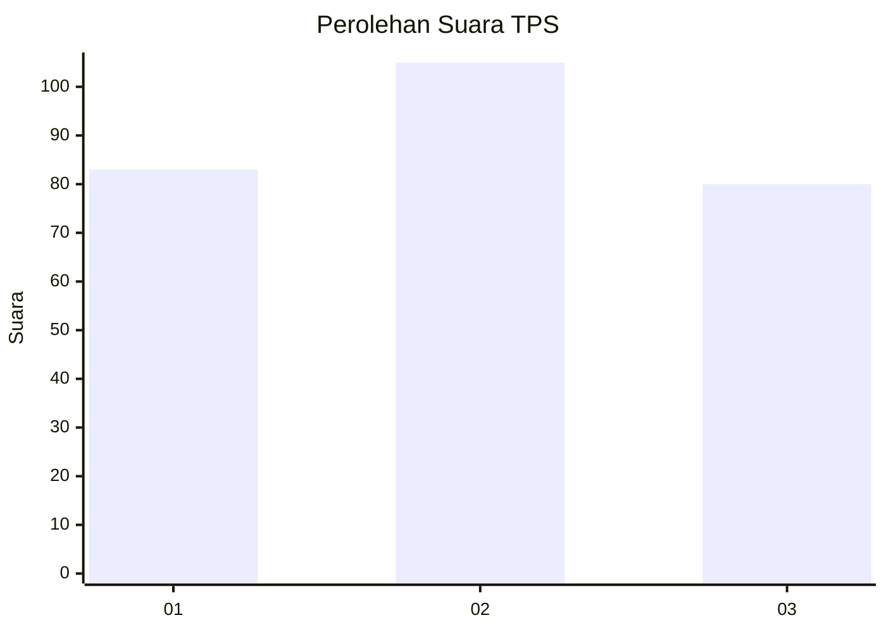
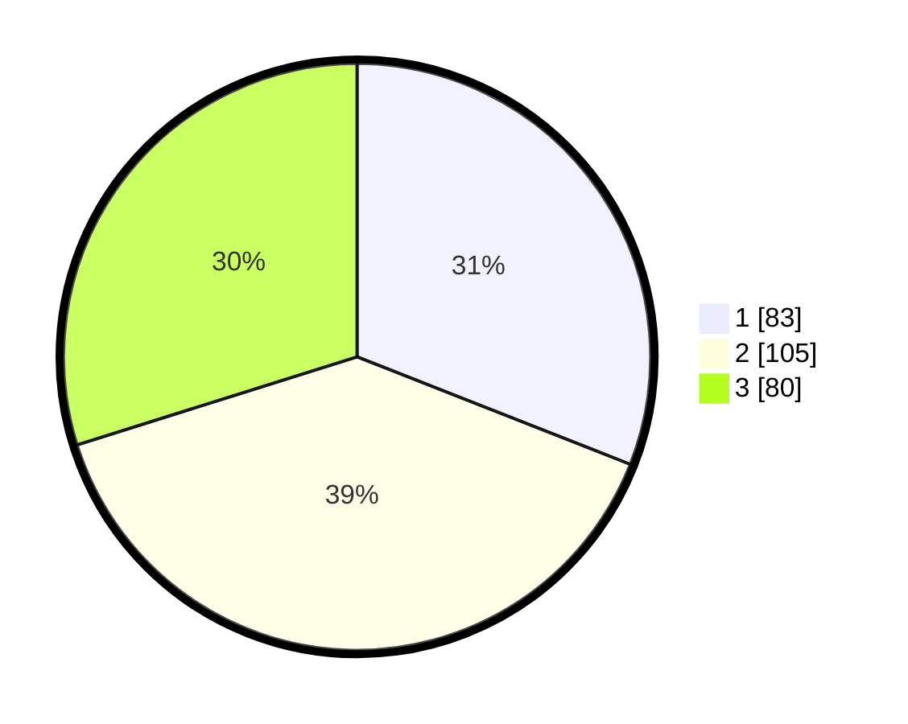

# Hasil

## Grafik

## Tabel

| No. | Nama Paslon    | Suara | Suara (raw) | Persentase |
|:--- |:-------------- | -----:| -----------:| ----------:|
| 1   | ANIES MUHAIMIN | 83    | [83][p-1]   | 30,97      |
| 2   | PRABOWO GIBRAN | 105   | [105][p-2]  | 39,18      |
| 3   | GANJAR MAHFUD  | 80    | [80][p-3]   | 29,85      |

[p-1]: https://github.com/gigit-pemilu/pemilu-2024-35-jawa-timur/blob/main/pilpres/hitung-suara/sub/35-jawa-timur/sub/26-bangkalan/sub/06-geger/sub/2006-geger/sub/006-tps/sub/paslon-1.txt
[p-2]: https://github.com/gigit-pemilu/pemilu-2024-35-jawa-timur/blob/main/pilpres/hitung-suara/sub/35-jawa-timur/sub/26-bangkalan/sub/06-geger/sub/2006-geger/sub/006-tps/sub/paslon-2.txt
[p-3]: https://github.com/gigit-pemilu/pemilu-2024-35-jawa-timur/blob/main/pilpres/hitung-suara/sub/35-jawa-timur/sub/26-bangkalan/sub/06-geger/sub/2006-geger/sub/006-tps/sub/paslon-3.txt

## Foto C Plano

https://sirekap-obj-formc.kpu.go.id/f65b/pemilu/ppwp/35/26/06/20/06/3526062006006-20240214-203533--a1c313cf-7957-422f-96ed-89fffa50432a.jpg

https://sirekap-obj-formc.kpu.go.id/f65b/pemilu/ppwp/35/26/06/20/06/3526062006006-20240214-203557--3529d467-7627-4e39-a4cd-064a2559bae8.jpg

https://sirekap-obj-formc.kpu.go.id/f65b/pemilu/ppwp/35/26/06/20/06/3526062006006-20240214-203620--cd9582de-cabe-48c8-89fe-a20ab28d5712.jpg

## Metadata

| Key        | Value               |
| ---------- | ------------------- |
| Time Stamp | 2024-02-19 06:16:00 |

