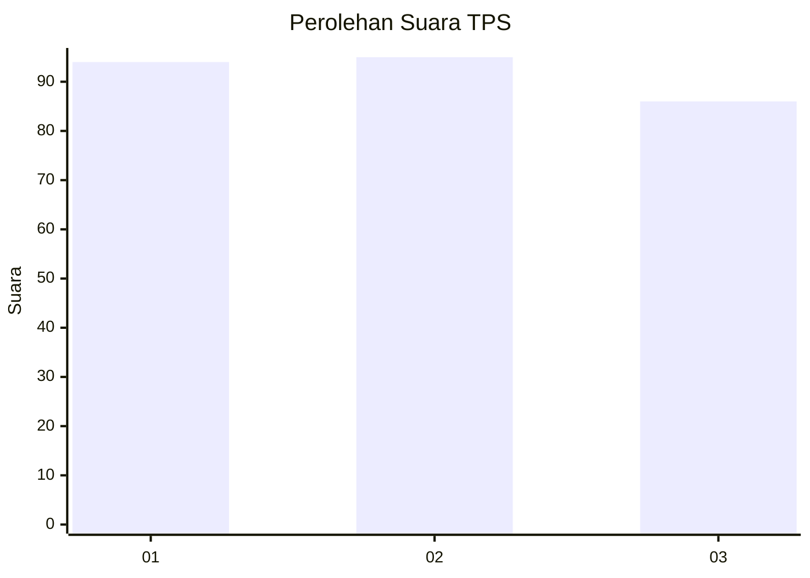
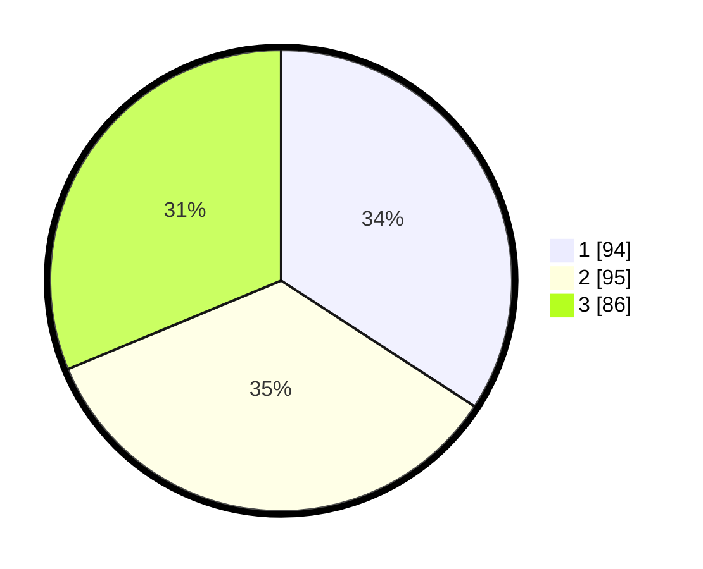

# Hasil

## Grafik

## Tabel

| No. | Nama Paslon    | Suara | Suara (raw) | Persentase |
|:--- |:-------------- | -----:| -----------:| ----------:|
| 1   | ANIES MUHAIMIN | 94    | [94][p-1]   | 34,18      |
| 2   | PRABOWO GIBRAN | 95    | [95][p-2]   | 34,55      |
| 3   | GANJAR MAHFUD  | 86    | [86][p-3]   | 31,27      |

[p-1]: https://github.com/gigit-pemilu/pemilu-2024/blob/main/pilpres/hitung-suara/sub/35-jawa-timur/sub/26-bangkalan/sub/06-geger/sub/2006-geger/sub/012-tps/sub/paslon-1.txt
[p-2]: https://github.com/gigit-pemilu/pemilu-2024/blob/main/pilpres/hitung-suara/sub/35-jawa-timur/sub/26-bangkalan/sub/06-geger/sub/2006-geger/sub/012-tps/sub/paslon-2.txt
[p-3]: https://github.com/gigit-pemilu/pemilu-2024/blob/main/pilpres/hitung-suara/sub/35-jawa-timur/sub/26-bangkalan/sub/06-geger/sub/2006-geger/sub/012-tps/sub/paslon-3.txt

## Foto C Plano

https://sirekap-obj-formc.kpu.go.id/9795/pemilu/ppwp/35/26/06/20/06/3526062006012-20240215-081133--b1604733-ae00-4d44-9e05-3793dd476b0f.jpg

https://sirekap-obj-formc.kpu.go.id/9795/pemilu/ppwp/35/26/06/20/06/3526062006012-20240215-081143--a20d5828-f534-4fae-9b59-294b16e203ef.jpg

https://sirekap-obj-formc.kpu.go.id/9795/pemilu/ppwp/35/26/06/20/06/3526062006012-20240215-081150--07e280ae-d343-4fca-a9a5-1e6410b4db26.jpg

## Metadata

| Key        | Value               |
| ---------- | ------------------- |
| Time Stamp | 2024-02-19 06:16:00 |

