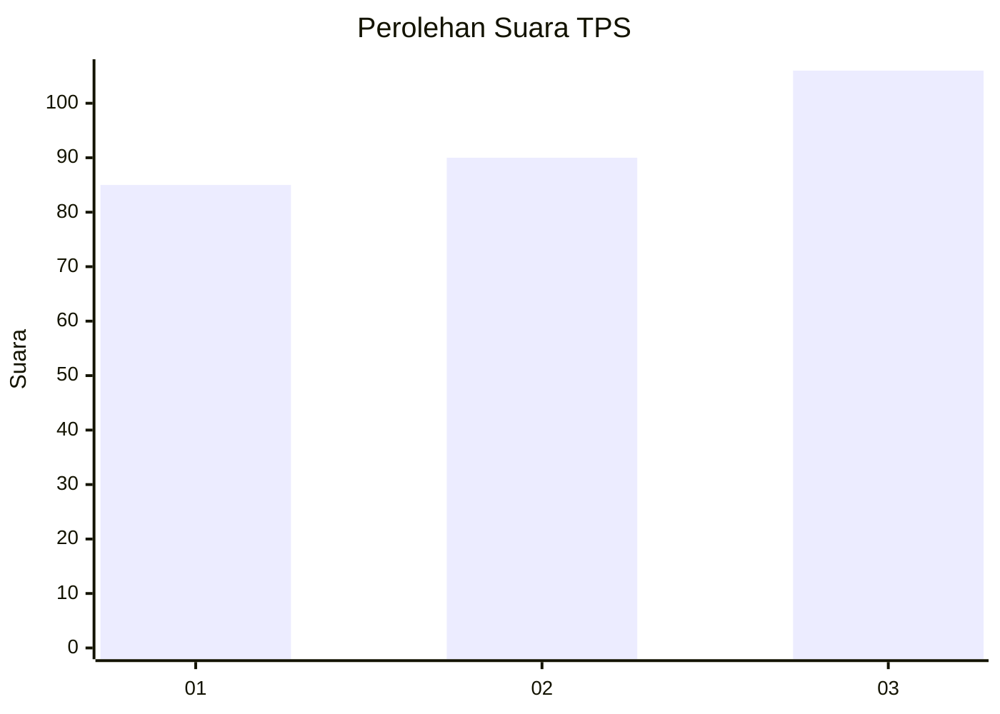
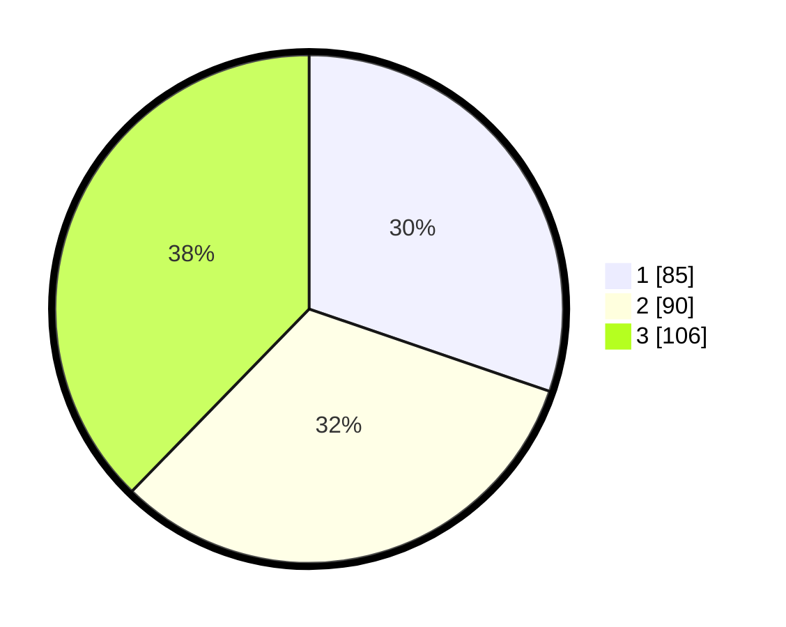

# Hasil

## Grafik

## Tabel

| No. | Nama Paslon    | Suara | Suara (raw) | Persentase |
|:--- |:-------------- | -----:| -----------:| ----------:|
| 1   | ANIES MUHAIMIN | 85    | [85][p-1]   | 30,25      |
| 2   | PRABOWO GIBRAN | 90    | [90][p-2]   | 32,03      |
| 3   | GANJAR MAHFUD  | 106   | [106][p-3]  | 37,72      |

[p-1]: https://github.com/gigit-pemilu/pemilu-2024-35-jawa-timur/blob/main/pilpres/hitung-suara/sub/35-jawa-timur/sub/26-bangkalan/sub/06-geger/sub/2006-geger/sub/014-tps/sub/paslon-1.txt
[p-2]: https://github.com/gigit-pemilu/pemilu-2024-35-jawa-timur/blob/main/pilpres/hitung-suara/sub/35-jawa-timur/sub/26-bangkalan/sub/06-geger/sub/2006-geger/sub/014-tps/sub/paslon-2.txt
[p-3]: https://github.com/gigit-pemilu/pemilu-2024-35-jawa-timur/blob/main/pilpres/hitung-suara/sub/35-jawa-timur/sub/26-bangkalan/sub/06-geger/sub/2006-geger/sub/014-tps/sub/paslon-3.txt

## Foto C Plano

https://sirekap-obj-formc.kpu.go.id/f7b5/pemilu/ppwp/35/26/06/20/06/3526062006014-20240214-215741--7bb49b40-fa50-48b5-92ee-aa49c89e66da.jpg

https://sirekap-obj-formc.kpu.go.id/f7b5/pemilu/ppwp/35/26/06/20/06/3526062006014-20240214-220012--1f351ca3-3f2c-41d9-bf89-76f69f9b5bcc.jpg

https://sirekap-obj-formc.kpu.go.id/f7b5/pemilu/ppwp/35/26/06/20/06/3526062006014-20240214-220206--5af40805-0fa9-4ade-8474-bb3371f8351f.jpg

## Metadata

| Key        | Value               |
| ---------- | ------------------- |
| Time Stamp | 2024-02-21 21:00:04 |

