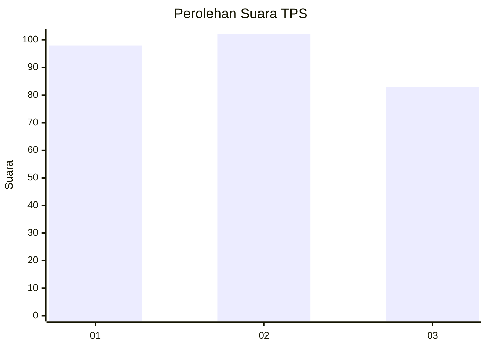
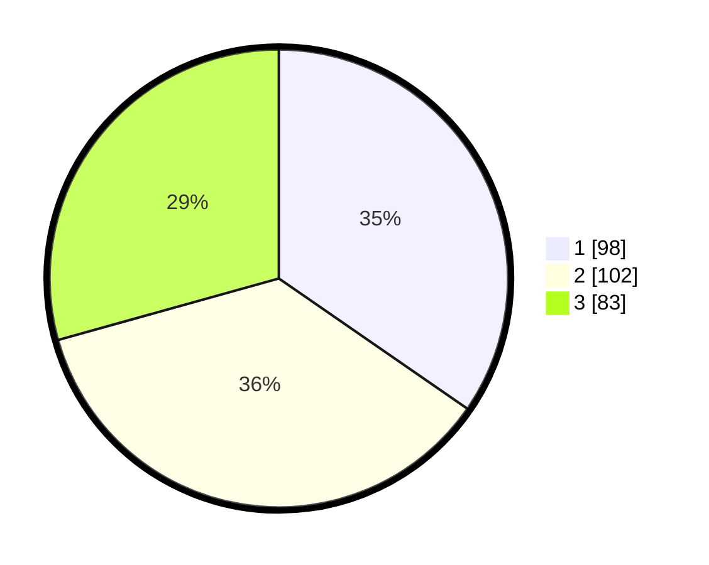

# Hasil

## Grafik

## Tabel

| No. | Nama Paslon    | Suara | Suara (raw) | Persentase |
|:--- |:-------------- | -----:| -----------:| ----------:|
| 1   | ANIES MUHAIMIN | 98    | [98][p-1]   | 34,63      |
| 2   | PRABOWO GIBRAN | 102   | [102][p-2]  | 36,04      |
| 3   | GANJAR MAHFUD  | 83    | [83][p-3]   | 29,33      |

[p-1]: https://github.com/gigit-pemilu/pemilu-2024-35-jawa-timur/blob/main/pilpres/hitung-suara/sub/35-jawa-timur/sub/26-bangkalan/sub/06-geger/sub/2006-geger/sub/015-tps/sub/paslon-1.txt
[p-2]: https://github.com/gigit-pemilu/pemilu-2024-35-jawa-timur/blob/main/pilpres/hitung-suara/sub/35-jawa-timur/sub/26-bangkalan/sub/06-geger/sub/2006-geger/sub/015-tps/sub/paslon-2.txt
[p-3]: https://github.com/gigit-pemilu/pemilu-2024-35-jawa-timur/blob/main/pilpres/hitung-suara/sub/35-jawa-timur/sub/26-bangkalan/sub/06-geger/sub/2006-geger/sub/015-tps/sub/paslon-3.txt

## Foto C Plano

https://sirekap-obj-formc.kpu.go.id/983a/pemilu/ppwp/35/26/06/20/06/3526062006015-20240215-011711--7004a22e-8aa7-48fe-89cf-4ad7cf83697d.jpg

https://sirekap-obj-formc.kpu.go.id/983a/pemilu/ppwp/35/26/06/20/06/3526062006015-20240215-011720--c26e3b81-0022-403d-b6ef-a5a040e81af3.jpg

https://sirekap-obj-formc.kpu.go.id/983a/pemilu/ppwp/35/26/06/20/06/3526062006015-20240215-011728--5c081b95-8eb1-4bed-8c42-346f44167f74.jpg

## Metadata

| Key        | Value               |
| ---------- | ------------------- |
| Time Stamp | 2024-02-19 06:16:00 |

