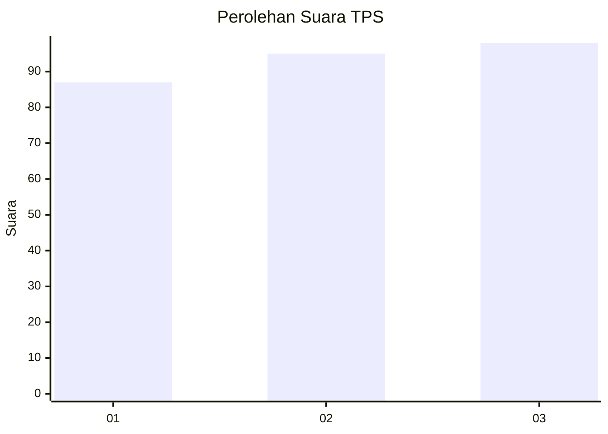
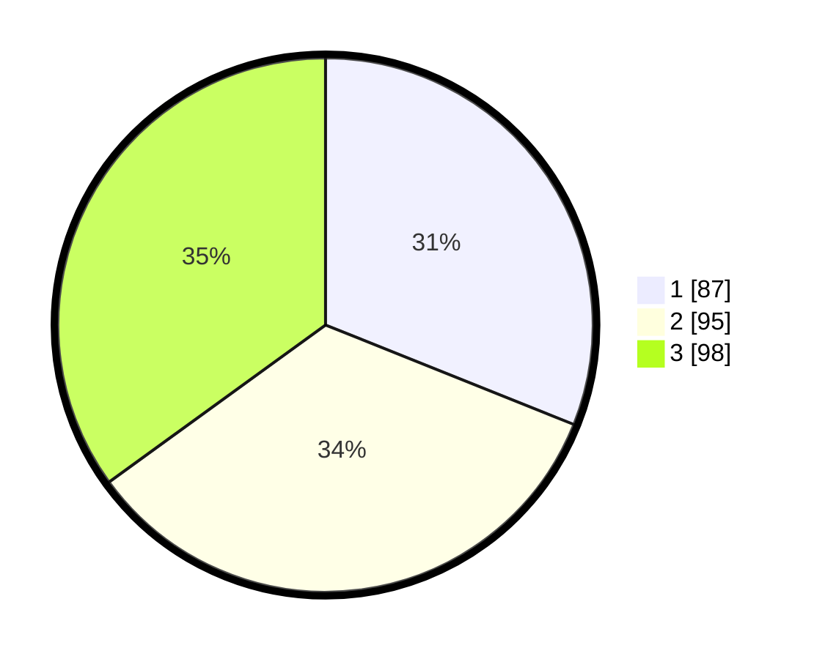

# Hasil

## Grafik

## Tabel

| No. | Nama Paslon    | Suara | Suara (raw) | Persentase |
|:--- |:-------------- | -----:| -----------:| ----------:|
| 1   | ANIES MUHAIMIN | 87    | [87][p-1]   | 31,07      |
| 2   | PRABOWO GIBRAN | 95    | [95][p-2]   | 33,93      |
| 3   | GANJAR MAHFUD  | 98    | [98][p-3]   | 35,00      |

[p-1]: https://github.com/gigit-pemilu/pemilu-2024/blob/main/pilpres/hitung-suara/sub/35-jawa-timur/sub/26-bangkalan/sub/06-geger/sub/2006-geger/sub/018-tps/sub/paslon-1.txt
[p-2]: https://github.com/gigit-pemilu/pemilu-2024/blob/main/pilpres/hitung-suara/sub/35-jawa-timur/sub/26-bangkalan/sub/06-geger/sub/2006-geger/sub/018-tps/sub/paslon-2.txt
[p-3]: https://github.com/gigit-pemilu/pemilu-2024/blob/main/pilpres/hitung-suara/sub/35-jawa-timur/sub/26-bangkalan/sub/06-geger/sub/2006-geger/sub/018-tps/sub/paslon-3.txt

## Foto C Plano

https://sirekap-obj-formc.kpu.go.id/b389/pemilu/ppwp/35/26/06/20/06/3526062006018-20240214-204050--c0b5f906-55b5-496d-8def-0a89dddd6ebb.jpg

https://sirekap-obj-formc.kpu.go.id/b389/pemilu/ppwp/35/26/06/20/06/3526062006018-20240214-204115--a1005b97-852b-4578-9b00-d41dc1f2347b.jpg

https://sirekap-obj-formc.kpu.go.id/b389/pemilu/ppwp/35/26/06/20/06/3526062006018-20240214-204126--af979c35-ae67-49ad-9c68-87fe16c46a39.jpg

## Metadata

| Key        | Value               |
| ---------- | ------------------- |
| Time Stamp | 2024-02-16 10:00:28 |

